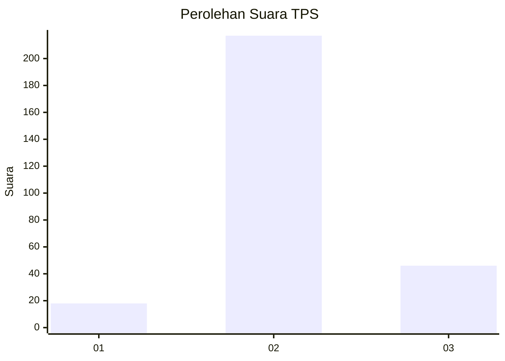
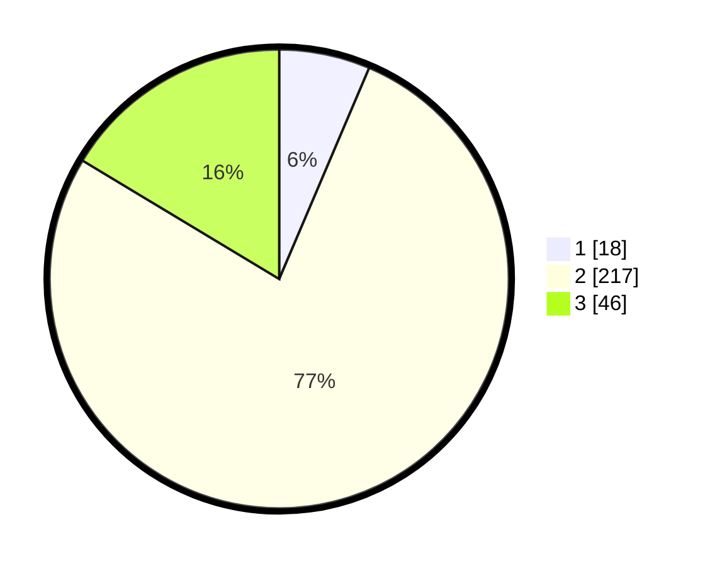

# Hasil

## Grafik

## Tabel

| No. | Nama Paslon    | Suara | Suara (raw) | Persentase |
|:--- |:-------------- | -----:| -----------:| ----------:|
| 1   | ANIES MUHAIMIN | 18    | [18][p-1]   | 6,41       |
| 2   | PRABOWO GIBRAN | 217   | [217][p-2]  | 77,22      |
| 3   | GANJAR MAHFUD  | 46    | [46][p-3]   | 16,37      |

[p-1]: https://github.com/gigit-pemilu/pemilu-2024-52-nusa-tenggara-barat/blob/main/pilpres/hitung-suara/sub/52-nusa-tenggara-barat/sub/02-lombok-tengah/sub/06-praya-timur/sub/2003-semoyang/sub/005-tps/sub/paslon-1.txt
[p-2]: https://github.com/gigit-pemilu/pemilu-2024-52-nusa-tenggara-barat/blob/main/pilpres/hitung-suara/sub/52-nusa-tenggara-barat/sub/02-lombok-tengah/sub/06-praya-timur/sub/2003-semoyang/sub/005-tps/sub/paslon-2.txt
[p-3]: https://github.com/gigit-pemilu/pemilu-2024-52-nusa-tenggara-barat/blob/main/pilpres/hitung-suara/sub/52-nusa-tenggara-barat/sub/02-lombok-tengah/sub/06-praya-timur/sub/2003-semoyang/sub/005-tps/sub/paslon-3.txt

## Foto C Plano

https://sirekap-obj-formc.kpu.go.id/5255/pemilu/ppwp/52/02/06/20/03/5202062003005-20240214-222606--3fa698c1-6882-4f38-acbd-1cd0961daf7d.jpg

https://sirekap-obj-formc.kpu.go.id/5255/pemilu/ppwp/52/02/06/20/03/5202062003005-20240217-045302--a5877faa-db40-434e-b517-0b6c992d0f72.jpg

https://sirekap-obj-formc.kpu.go.id/5255/pemilu/ppwp/52/02/06/20/03/5202062003005-20240217-045302--76366cf1-8602-4809-923c-a6ca2d51b88e.jpg

## Metadata

| Key        | Value               |
| ---------- | ------------------- |
| Time Stamp | 2024-02-21 23:00:00 |

