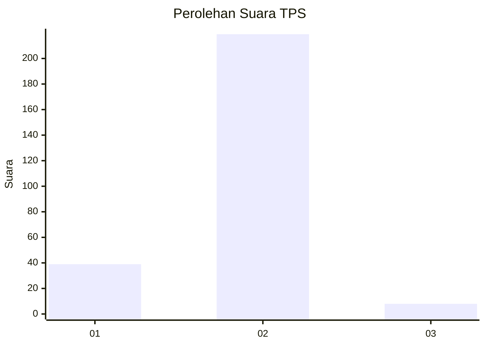
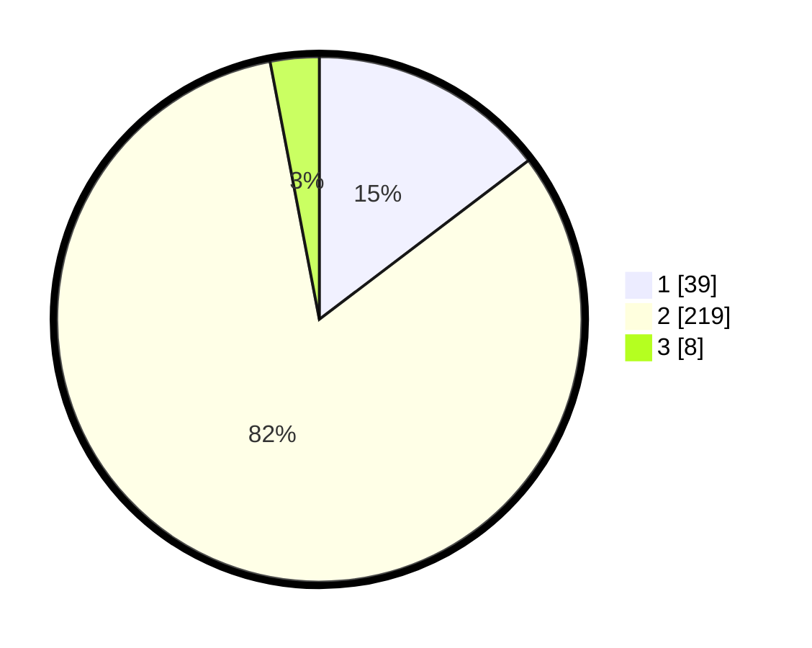

# Hasil

## Grafik

## Tabel

| No. | Nama Paslon    | Suara | Suara (raw) | Persentase |
|:--- |:-------------- | -----:| -----------:| ----------:|
| 1   | ANIES MUHAIMIN | 39    | [39][p-1]   | 14,66      |
| 2   | PRABOWO GIBRAN | 219   | [219][p-2]  | 82,33      |
| 3   | GANJAR MAHFUD  | 8     | [8][p-3]    | 3,01       |

[p-1]: https://github.com/gigit-pemilu/pemilu-2024-52-nusa-tenggara-barat/blob/main/pilpres/hitung-suara/sub/52-nusa-tenggara-barat/sub/02-lombok-tengah/sub/06-praya-timur/sub/2010-kidang/sub/011-tps/sub/paslon-1.txt
[p-2]: https://github.com/gigit-pemilu/pemilu-2024-52-nusa-tenggara-barat/blob/main/pilpres/hitung-suara/sub/52-nusa-tenggara-barat/sub/02-lombok-tengah/sub/06-praya-timur/sub/2010-kidang/sub/011-tps/sub/paslon-2.txt
[p-3]: https://github.com/gigit-pemilu/pemilu-2024-52-nusa-tenggara-barat/blob/main/pilpres/hitung-suara/sub/52-nusa-tenggara-barat/sub/02-lombok-tengah/sub/06-praya-timur/sub/2010-kidang/sub/011-tps/sub/paslon-3.txt

## Foto C Plano

https://sirekap-obj-formc.kpu.go.id/3e07/pemilu/ppwp/52/02/06/20/10/5202062010011-20240215-084518--a8ff58d5-fef7-49e4-abdd-aad23a76cb87.jpg

https://sirekap-obj-formc.kpu.go.id/3e07/pemilu/ppwp/52/02/06/20/10/5202062010011-20240215-083645--36465f65-9ad3-4a29-829e-e29aab7c83a9.jpg

https://sirekap-obj-formc.kpu.go.id/3e07/pemilu/ppwp/52/02/06/20/10/5202062010011-20240215-084342--92649a43-d029-4be5-ac79-6ee76366231e.jpg

## Metadata

| Key        | Value               |
| ---------- | ------------------- |
| Time Stamp | 2024-02-19 06:16:00 |

