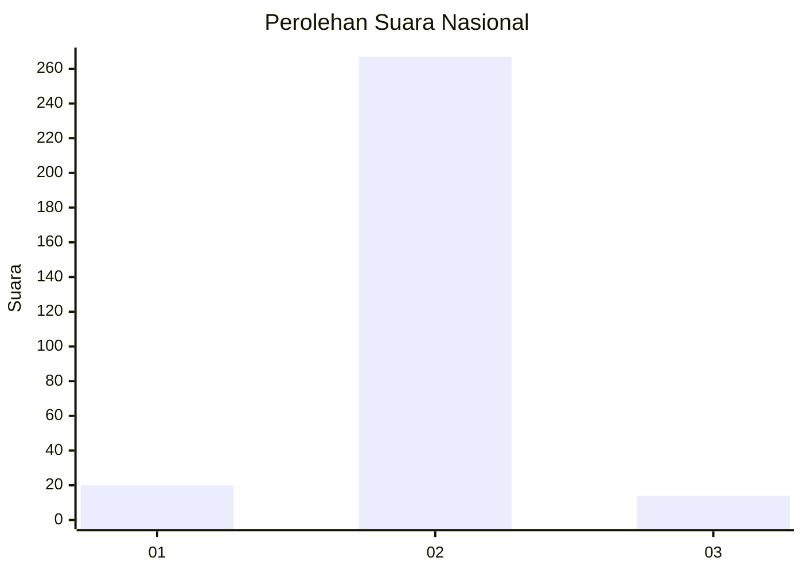
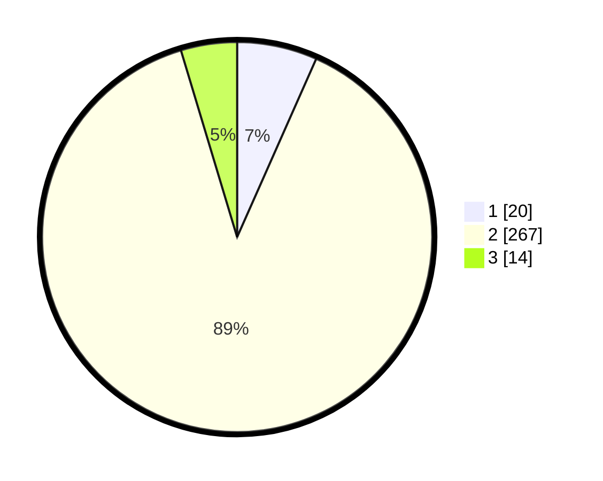

# Hasil

## Grafik

## Tabel

| No. | Nama Paslon    | Suara | Suara (raw) | Persentase |
|:--- |:-------------- | -----:| -----------:| ----------:|
| 1   | ANIES MUHAIMIN | 20    | [20][p-1]   | 6,64       |
| 2   | PRABOWO GIBRAN | 267   | [267][p-2]  | 88,70      |
| 3   | GANJAR MAHFUD  | 14    | [14][p-3]   | 4,65       |

[p-1]: https://github.com/gigit-pemilu/pemilu-2024/blob/main/pilpres/hitung-suara/sub/52-nusa-tenggara-barat/sub/02-lombok-tengah/sub/06-praya-timur/sub/2012-beleke-lebe-sane/sub/009-tps/sub/paslon-1.txt
[p-2]: https://github.com/gigit-pemilu/pemilu-2024/blob/main/pilpres/hitung-suara/sub/52-nusa-tenggara-barat/sub/02-lombok-tengah/sub/06-praya-timur/sub/2012-beleke-lebe-sane/sub/009-tps/sub/paslon-2.txt
[p-3]: https://github.com/gigit-pemilu/pemilu-2024/blob/main/pilpres/hitung-suara/sub/52-nusa-tenggara-barat/sub/02-lombok-tengah/sub/06-praya-timur/sub/2012-beleke-lebe-sane/sub/009-tps/sub/paslon-3.txt

## Foto C Plano

https://sirekap-obj-formc.kpu.go.id/c2fc/pemilu/ppwp/52/02/06/20/12/5202062012009-20240215-011750--a6c2e70a-f1e2-42a4-b7b9-199e2c060019.jpg

https://sirekap-obj-formc.kpu.go.id/c2fc/pemilu/ppwp/52/02/06/20/12/5202062012009-20240215-011911--685ee344-0aa7-46b5-a3f2-b838d9a7067a.jpg

https://sirekap-obj-formc.kpu.go.id/c2fc/pemilu/ppwp/52/02/06/20/12/5202062012009-20240215-012016--5510707b-10aa-4b2f-b385-422c74bb6fe8.jpg

## Metadata

| Key        | Value               |
| ---------- | ------------------- |
| Time Stamp | 2024-02-15 07:00:44 |

