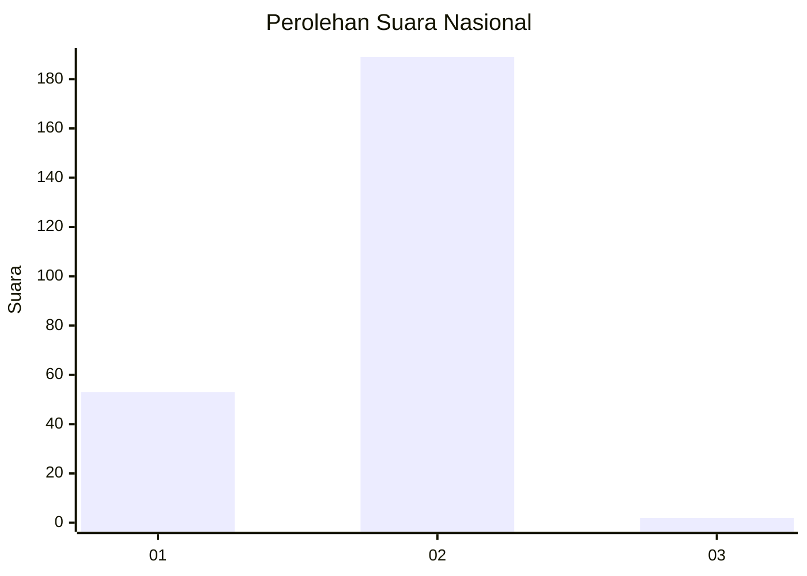
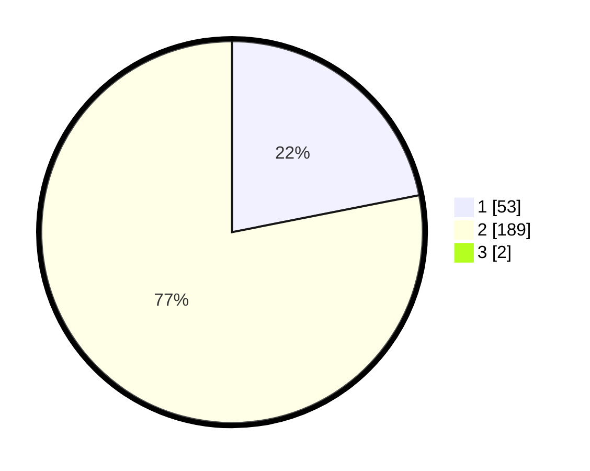

# Hasil

## Grafik

## Tabel

| No. | Nama Paslon    | Suara | Suara (raw) | Persentase |
|:--- |:-------------- | -----:| -----------:| ----------:|
| 1   | ANIES MUHAIMIN | 53    | [53][p-1]   | 21,72      |
| 2   | PRABOWO GIBRAN | 189   | [189][p-2]  | 77,46      |
| 3   | GANJAR MAHFUD  | 2     | [2][p-3]    | 0,82       |

[p-1]: https://github.com/gigit-pemilu/pemilu-2024/blob/main/pilpres/hitung-suara/sub/52-nusa-tenggara-barat/sub/02-lombok-tengah/sub/07-janapria/sub/2001-lekor/sub/004-tps/sub/paslon-1.txt
[p-2]: https://github.com/gigit-pemilu/pemilu-2024/blob/main/pilpres/hitung-suara/sub/52-nusa-tenggara-barat/sub/02-lombok-tengah/sub/07-janapria/sub/2001-lekor/sub/004-tps/sub/paslon-2.txt
[p-3]: https://github.com/gigit-pemilu/pemilu-2024/blob/main/pilpres/hitung-suara/sub/52-nusa-tenggara-barat/sub/02-lombok-tengah/sub/07-janapria/sub/2001-lekor/sub/004-tps/sub/paslon-3.txt

## Foto C Plano

https://sirekap-obj-formc.kpu.go.id/f72b/pemilu/ppwp/52/02/07/20/01/5202072001004-20240228-101316--63e3d19b-1128-4f43-a611-55a900561f1e.jpg

https://sirekap-obj-formc.kpu.go.id/f72b/pemilu/ppwp/52/02/07/20/01/5202072001004-20240228-101904--e473e6cd-a25f-414a-9b7e-ba57bed5d9ef.jpg

https://sirekap-obj-formc.kpu.go.id/f72b/pemilu/ppwp/52/02/07/20/01/5202072001004-20240228-101956--33d9334d-6c44-4d1e-bdf8-308ff673e211.jpg

## Metadata

| Key        | Value               |
| ---------- | ------------------- |
| Time Stamp | 2024-02-28 11:00:00 |

## DATA PEMILIH TETAP

Jumlah pemilih dalam DPT: **0**.
 * L: **144**.
 * P: **0**.

## DATA PENGGUNA HAK PILIH

Jumlah pengguna hak pilih dalam DPT: **0**.
 * L: **112**.
 * P: **100**.

Jumlah pengguna hak pilih dalam DPTb: **529**.
 * L: **87**.
 * P: **775**.

Jumlah pengguna hak pilih dalam DPK: **7**.
 * L: **5**.
 * P: **773**.

Jumlah pengguna hak pilih: **232**.
 * L: **137**.
 * P: **177**.

## JUMLAH SUARA SAH DAN TIDAK SAH

JUMLAH SELURUH SUARA SAH: **244**.

JUMLAH SUARA TIDAK SAH: **3**.

JUMLAH SELURUH SUARA SAH DAN SUARA TIDAK SAH: **245**.

