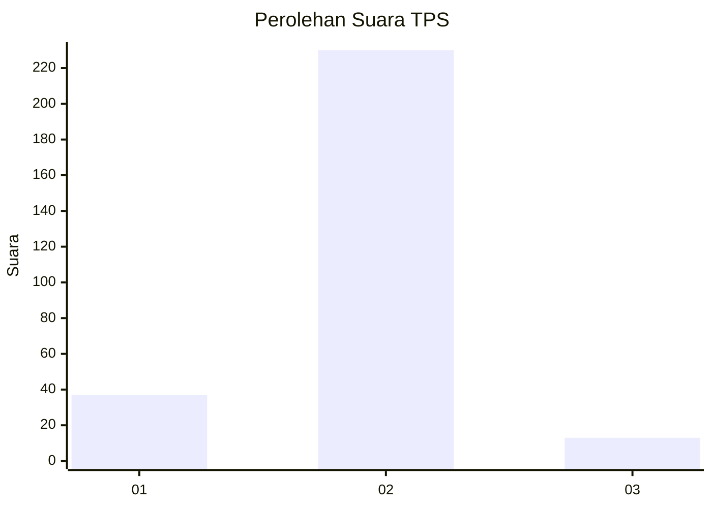
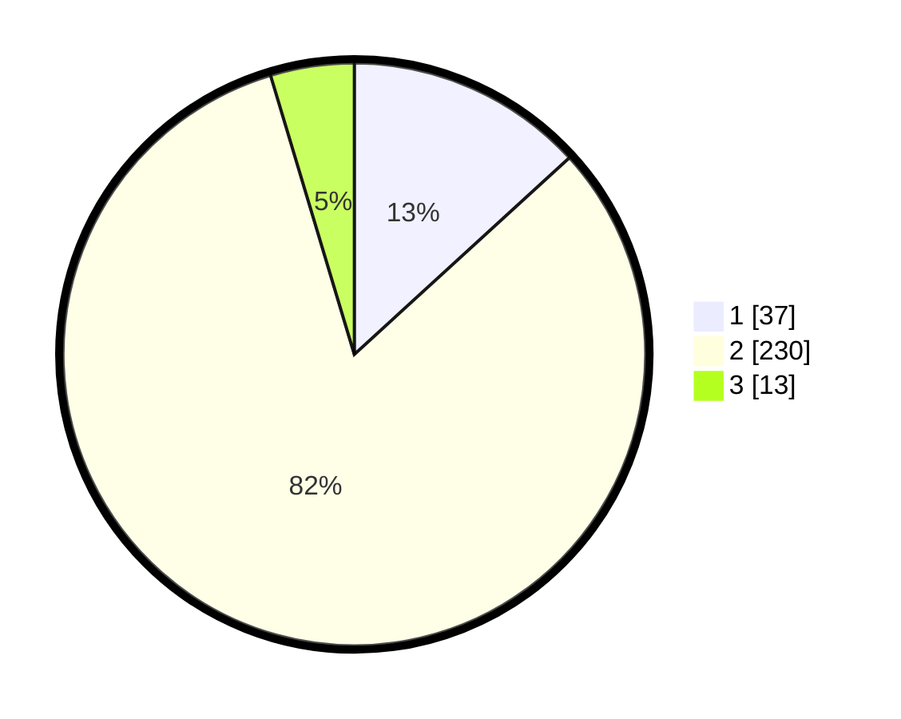

# Hasil

## Grafik

## Tabel

| No. | Nama Paslon    | Suara | Suara (raw) | Persentase |
|:--- |:-------------- | -----:| -----------:| ----------:|
| 1   | ANIES MUHAIMIN | 37    | [37][p-1]   | 13,21      |
| 2   | PRABOWO GIBRAN | 230   | [230][p-2]  | 82,14      |
| 3   | GANJAR MAHFUD  | 13    | [13][p-3]   | 4,64       |

[p-1]: https://github.com/gigit-pemilu/pemilu-2024-52-nusa-tenggara-barat/blob/main/pilpres/hitung-suara/sub/52-nusa-tenggara-barat/sub/02-lombok-tengah/sub/07-janapria/sub/2005-saba/sub/010-tps/sub/paslon-1.txt
[p-2]: https://github.com/gigit-pemilu/pemilu-2024-52-nusa-tenggara-barat/blob/main/pilpres/hitung-suara/sub/52-nusa-tenggara-barat/sub/02-lombok-tengah/sub/07-janapria/sub/2005-saba/sub/010-tps/sub/paslon-2.txt
[p-3]: https://github.com/gigit-pemilu/pemilu-2024-52-nusa-tenggara-barat/blob/main/pilpres/hitung-suara/sub/52-nusa-tenggara-barat/sub/02-lombok-tengah/sub/07-janapria/sub/2005-saba/sub/010-tps/sub/paslon-3.txt

## Foto C Plano

https://sirekap-obj-formc.kpu.go.id/e853/pemilu/ppwp/52/02/07/20/05/5202072005010-20240222-104120--af63536a-ecf2-4439-b90f-2709cca41ce6.jpg

https://sirekap-obj-formc.kpu.go.id/e853/pemilu/ppwp/52/02/07/20/05/5202072005010-20240222-104314--b0df1fa9-f490-4ca8-9f1a-b1ae465307a1.jpg

https://sirekap-obj-formc.kpu.go.id/e853/pemilu/ppwp/52/02/07/20/05/5202072005010-20240222-104345--ad69a7a3-9eb8-4659-8013-cf14383f0822.jpg

## Metadata

| Key        | Value               |
| ---------- | ------------------- |
| Time Stamp | 2024-02-22 11:00:00 |

## DATA PEMILIH TETAP

Jumlah pemilih dalam DPT: **222**.
 * L: **662**.
 * P: **622**.

## DATA PENGGUNA HAK PILIH

Jumlah pengguna hak pilih dalam DPT: **374**.
 * L: **644**.
 * P: **222**.

Jumlah pengguna hak pilih dalam DPTb: **0**.
 * L: **660**.
 * P: **0**.

Jumlah pengguna hak pilih dalam DPK: **3**.
 * L: **601**.
 * P: **2**.

Jumlah pengguna hak pilih: **177**.
 * L: **290**.
 * P: **87**.

## JUMLAH SUARA SAH DAN TIDAK SAH

JUMLAH SELURUH SUARA SAH: **174**.

JUMLAH SUARA TIDAK SAH: **3**.

JUMLAH SELURUH SUARA SAH DAN SUARA TIDAK SAH: **177**.

