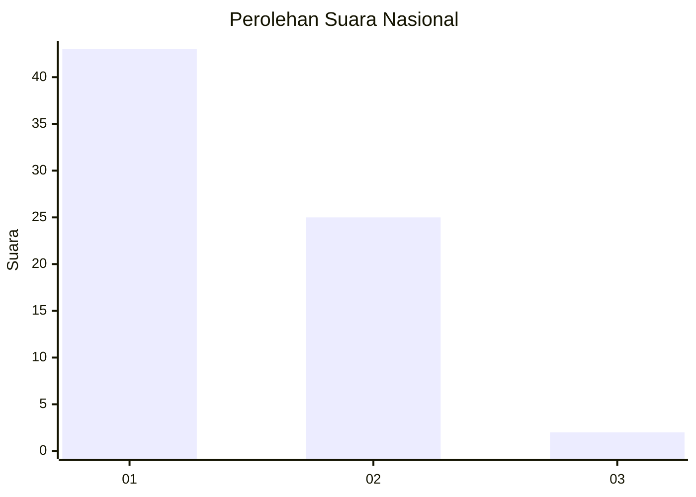
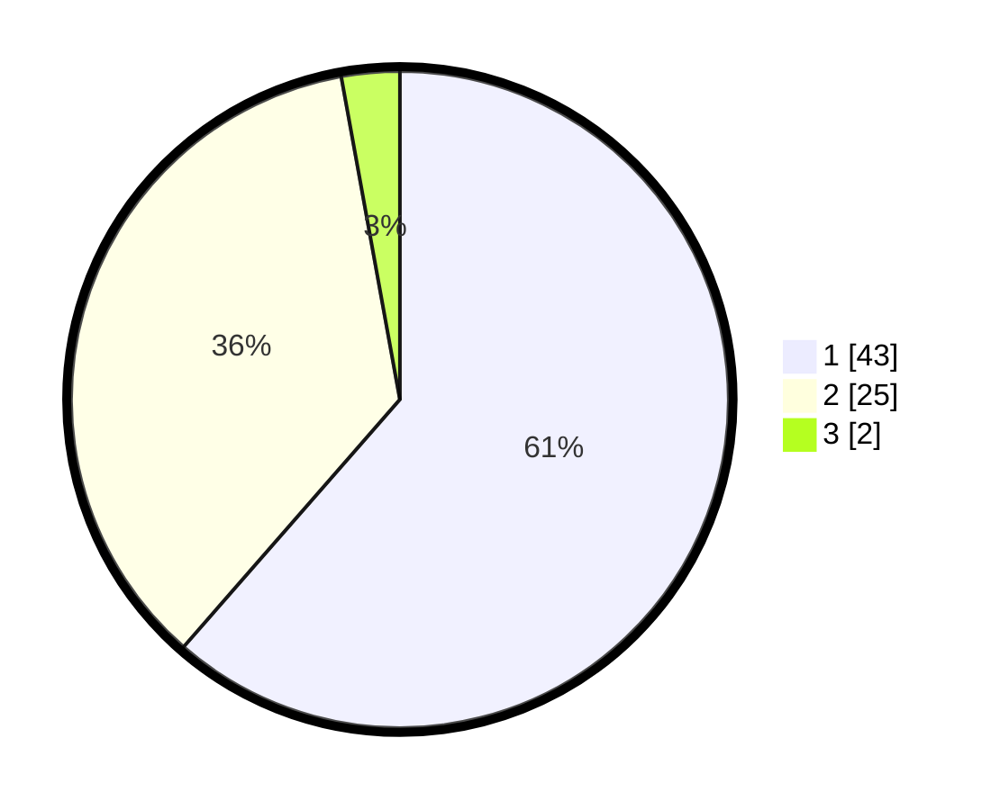

# Hasil

## Grafik

## Tabel

| No. | Nama Paslon    | Suara | Suara (raw) | Persentase |
|:--- |:-------------- | -----:| -----------:| ----------:|
| 1   | ANIES MUHAIMIN | 43    | [43][p-1]   | 61,43      |
| 2   | PRABOWO GIBRAN | 25    | [25][p-2]   | 35,71      |
| 3   | GANJAR MAHFUD  | 2     | [2][p-3]    | 2,86       |

[p-1]: https://github.com/gigit-pemilu/pemilu-2024/blob/main/pilpres/hitung-suara/sub/52-nusa-tenggara-barat/sub/02-lombok-tengah/sub/07-janapria/sub/2007-durian/sub/003-tps/sub/paslon-1.txt
[p-2]: https://github.com/gigit-pemilu/pemilu-2024/blob/main/pilpres/hitung-suara/sub/52-nusa-tenggara-barat/sub/02-lombok-tengah/sub/07-janapria/sub/2007-durian/sub/003-tps/sub/paslon-2.txt
[p-3]: https://github.com/gigit-pemilu/pemilu-2024/blob/main/pilpres/hitung-suara/sub/52-nusa-tenggara-barat/sub/02-lombok-tengah/sub/07-janapria/sub/2007-durian/sub/003-tps/sub/paslon-3.txt

## Foto C Plano

https://sirekap-obj-formc.kpu.go.id/387f/pemilu/ppwp/52/02/07/20/07/5202072007003-20240222-154822--c274f7b8-2d66-42c8-b771-1cddf624c6a4.jpg

https://sirekap-obj-formc.kpu.go.id/387f/pemilu/ppwp/52/02/07/20/07/5202072007003-20240222-154847--1d4eaaf9-6429-4883-973c-1d7d20a9a798.jpg

https://sirekap-obj-formc.kpu.go.id/387f/pemilu/ppwp/52/02/07/20/07/5202072007003-20240222-154910--c63af283-8134-4f4e-a9c0-8c8a91c6fbf3.jpg

## Metadata

| Key        | Value               |
| ---------- | ------------------- |
| Time Stamp | 2024-02-22 16:00:00 |

## DATA PEMILIH TETAP

Jumlah pemilih dalam DPT: **205**.
 * L: **92**.
 * P: **113**.

## DATA PENGGUNA HAK PILIH

Jumlah pengguna hak pilih dalam DPT: **175**.
 * L: **74**.
 * P: **502**.

Jumlah pengguna hak pilih dalam DPTb: **2**.
 * L: **0**.
 * P: **200**.

Jumlah pengguna hak pilih dalam DPK: **5**.
 * L: **0**.
 * P: **1**.

Jumlah pengguna hak pilih: **176**.
 * L: **74**.
 * P: **402**.

## JUMLAH SUARA SAH DAN TIDAK SAH

JUMLAH SELURUH SUARA SAH: **171**.

JUMLAH SUARA TIDAK SAH: **5**.

JUMLAH SELURUH SUARA SAH DAN SUARA TIDAK SAH: **176**.

