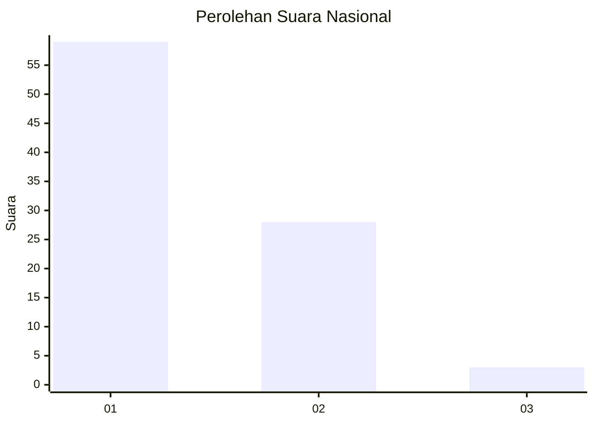
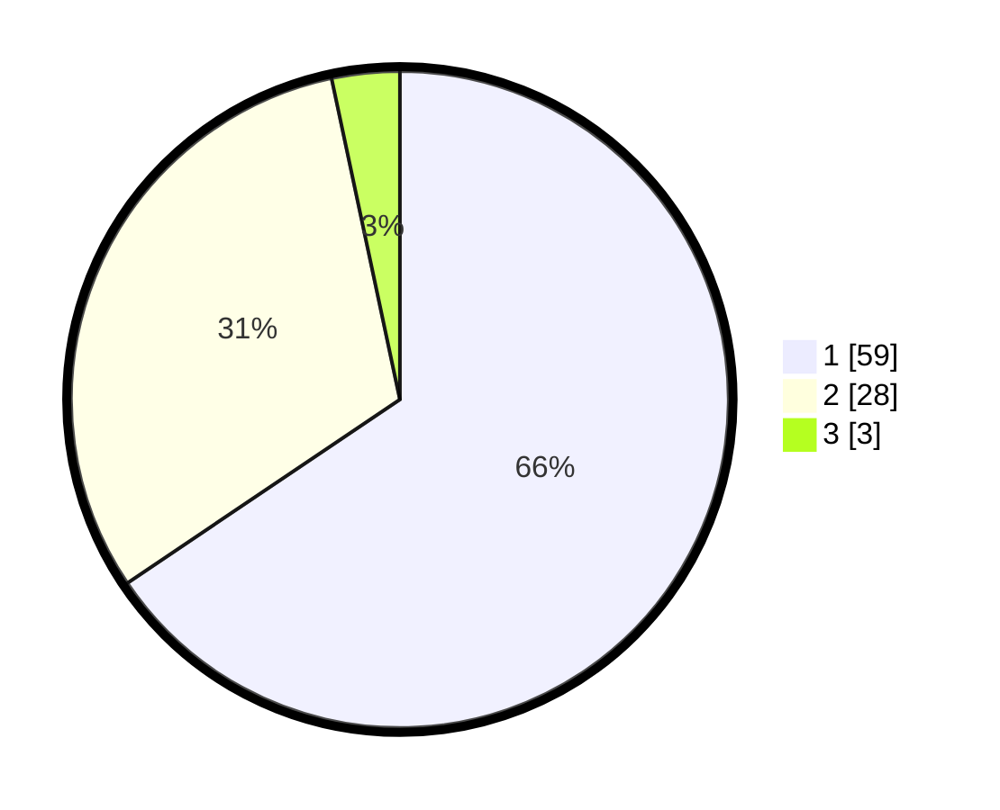

# Hasil

## Grafik

## Tabel

| No. | Nama Paslon    | Suara | Suara (raw) | Persentase |
|:--- |:-------------- | -----:| -----------:| ----------:|
| 1   | ANIES MUHAIMIN | 59    | [59][p-1]   | 65,56      |
| 2   | PRABOWO GIBRAN | 28    | [28][p-2]   | 31,11      |
| 3   | GANJAR MAHFUD  | 3     | [3][p-3]    | 3,33       |

[p-1]: https://github.com/gigit-pemilu/pemilu-2024/blob/main/pilpres/hitung-suara/sub/52-nusa-tenggara-barat/sub/02-lombok-tengah/sub/07-janapria/sub/2007-durian/sub/007-tps/sub/paslon-1.txt
[p-2]: https://github.com/gigit-pemilu/pemilu-2024/blob/main/pilpres/hitung-suara/sub/52-nusa-tenggara-barat/sub/02-lombok-tengah/sub/07-janapria/sub/2007-durian/sub/007-tps/sub/paslon-2.txt
[p-3]: https://github.com/gigit-pemilu/pemilu-2024/blob/main/pilpres/hitung-suara/sub/52-nusa-tenggara-barat/sub/02-lombok-tengah/sub/07-janapria/sub/2007-durian/sub/007-tps/sub/paslon-3.txt

## Foto C Plano

https://sirekap-obj-formc.kpu.go.id/3d23/pemilu/ppwp/52/02/07/20/07/5202072007007-20240222-171831--9b83d764-de03-47b9-9290-30c5351d60f6.jpg

https://sirekap-obj-formc.kpu.go.id/3d23/pemilu/ppwp/52/02/07/20/07/5202072007007-20240222-171535--3719c2bf-38a4-4f07-83af-4d4c16c3538f.jpg

https://sirekap-obj-formc.kpu.go.id/3d23/pemilu/ppwp/52/02/07/20/07/5202072007007-20240222-171631--ac2d6d7d-a747-41b5-8301-a73f7d0f8433.jpg

## Metadata

| Key        | Value               |
| ---------- | ------------------- |
| Time Stamp | 2024-02-22 18:00:00 |

## DATA PEMILIH TETAP

Jumlah pemilih dalam DPT: **0**.
 * L: **20**.
 * P: **0**.

## DATA PENGGUNA HAK PILIH

Jumlah pengguna hak pilih dalam DPT: **591**.
 * L: **0**.
 * P: **957**.

Jumlah pengguna hak pilih dalam DPTb: **551**.
 * L: **50**.
 * P: **575**.

Jumlah pengguna hak pilih dalam DPK: **551**.
 * L: **255**.
 * P: **555**.

Jumlah pengguna hak pilih: **1**.
 * L: **0**.
 * P: **0**.

## JUMLAH SUARA SAH DAN TIDAK SAH

JUMLAH SELURUH SUARA SAH: **189**.

JUMLAH SUARA TIDAK SAH: **23**.

JUMLAH SELURUH SUARA SAH DAN SUARA TIDAK SAH: **218**.

