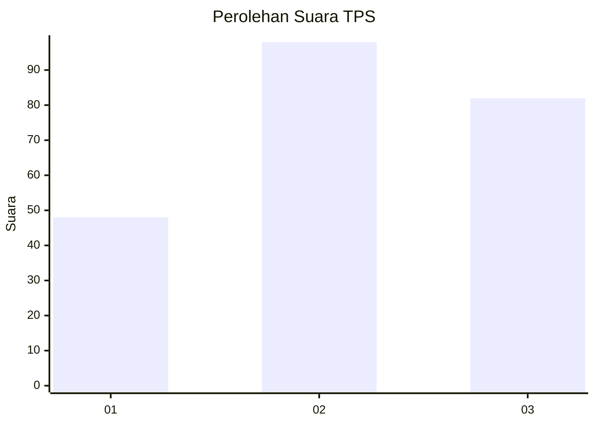
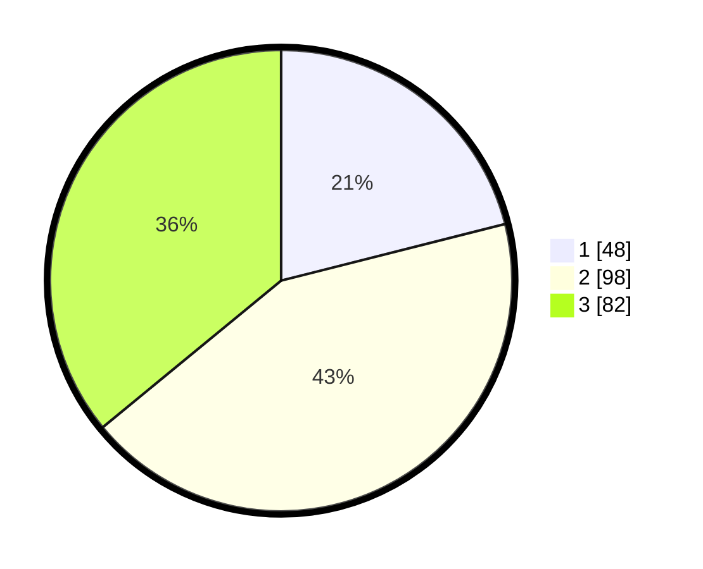

# Hasil

## Grafik

## Tabel

| No. | Nama Paslon    | Suara | Suara (raw) | Persentase |
|:--- |:-------------- | -----:| -----------:| ----------:|
| 1   | ANIES MUHAIMIN | 48    | [48][p-1]   | 21,05      |
| 2   | PRABOWO GIBRAN | 98    | [98][p-2]   | 42,98      |
| 3   | GANJAR MAHFUD  | 82    | [82][p-3]   | 35,96      |

[p-1]: https://github.com/gigit-pemilu/pemilu-2024-52-nusa-tenggara-barat/blob/main/pilpres/hitung-suara/sub/52-nusa-tenggara-barat/sub/02-lombok-tengah/sub/07-janapria/sub/2009-selebung-rembiga/sub/005-tps/sub/paslon-1.txt
[p-2]: https://github.com/gigit-pemilu/pemilu-2024-52-nusa-tenggara-barat/blob/main/pilpres/hitung-suara/sub/52-nusa-tenggara-barat/sub/02-lombok-tengah/sub/07-janapria/sub/2009-selebung-rembiga/sub/005-tps/sub/paslon-2.txt
[p-3]: https://github.com/gigit-pemilu/pemilu-2024-52-nusa-tenggara-barat/blob/main/pilpres/hitung-suara/sub/52-nusa-tenggara-barat/sub/02-lombok-tengah/sub/07-janapria/sub/2009-selebung-rembiga/sub/005-tps/sub/paslon-3.txt

## Foto C Plano

https://sirekap-obj-formc.kpu.go.id/17ed/pemilu/ppwp/52/02/07/20/09/5202072009005-20240224-133333--440911ac-64b8-4b61-a8a2-777fee1181b1.jpg

https://sirekap-obj-formc.kpu.go.id/17ed/pemilu/ppwp/52/02/07/20/09/5202072009005-20240224-133403--2388f5e1-0da2-499e-a531-c3c19d97b688.jpg

https://sirekap-obj-formc.kpu.go.id/17ed/pemilu/ppwp/52/02/07/20/09/5202072009005-20240224-133445--52165f6d-0511-4515-9d38-bef2e14e9134.jpg

## Metadata

| Key        | Value               |
| ---------- | ------------------- |
| Time Stamp | 2024-02-24 22:31:28 |

## DATA PEMILIH TETAP

Jumlah pemilih dalam DPT: **443**.
 * L: **832**.
 * P: **874**.

## DATA PENGGUNA HAK PILIH

Jumlah pengguna hak pilih dalam DPT: **443**.
 * L: **456**.
 * P: **261**.

Jumlah pengguna hak pilih dalam DPTb: **632**.
 * L: **884**.
 * P: **333**.

Jumlah pengguna hak pilih dalam DPK: **242**.
 * L: **244**.
 * P: **737**.

Jumlah pengguna hak pilih: **456**.
 * L: **555**.
 * P: **326**.

## JUMLAH SUARA SAH DAN TIDAK SAH

JUMLAH SELURUH SUARA SAH: **118**.

JUMLAH SUARA TIDAK SAH: **3**.

JUMLAH SELURUH SUARA SAH DAN SUARA TIDAK SAH: **724**.

