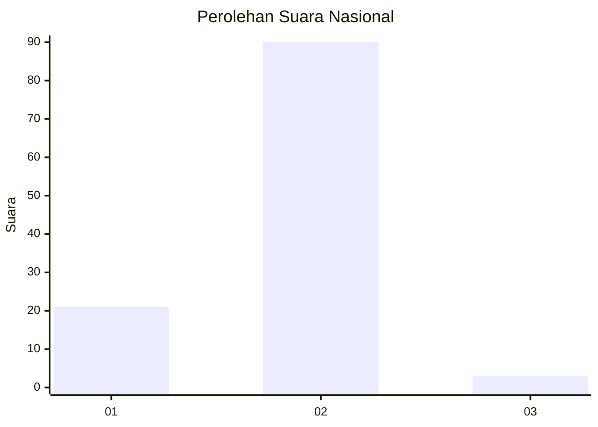
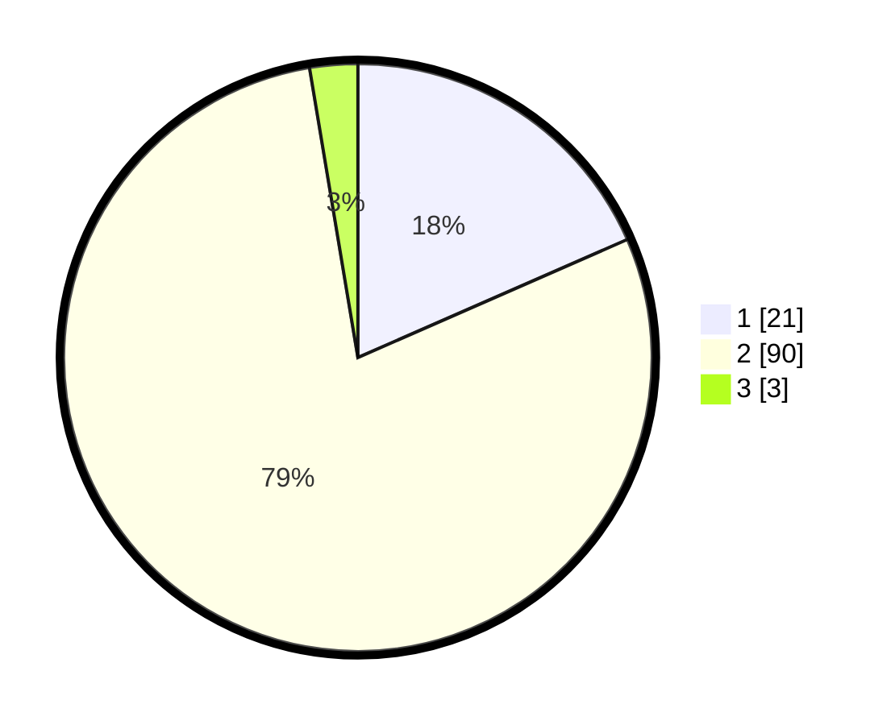

# Hasil

## Grafik

## Tabel

| No. | Nama Paslon    | Suara | Suara (raw) | Persentase |
|:--- |:-------------- | -----:| -----------:| ----------:|
| 1   | ANIES MUHAIMIN | 21    | [21][p-1]   | 18,42      |
| 2   | PRABOWO GIBRAN | 90    | [90][p-2]   | 78,95      |
| 3   | GANJAR MAHFUD  | 3     | [3][p-3]    | 2,63       |

[p-1]: https://github.com/gigit-pemilu/pemilu-2024/blob/main/pilpres/hitung-suara/sub/52-nusa-tenggara-barat/sub/02-lombok-tengah/sub/07-janapria/sub/2009-selebung-rembiga/sub/014-tps/sub/paslon-1.txt
[p-2]: https://github.com/gigit-pemilu/pemilu-2024/blob/main/pilpres/hitung-suara/sub/52-nusa-tenggara-barat/sub/02-lombok-tengah/sub/07-janapria/sub/2009-selebung-rembiga/sub/014-tps/sub/paslon-2.txt
[p-3]: https://github.com/gigit-pemilu/pemilu-2024/blob/main/pilpres/hitung-suara/sub/52-nusa-tenggara-barat/sub/02-lombok-tengah/sub/07-janapria/sub/2009-selebung-rembiga/sub/014-tps/sub/paslon-3.txt

## Foto C Plano

https://sirekap-obj-formc.kpu.go.id/fc7e/pemilu/ppwp/52/02/07/20/09/5202072009014-20240225-101903--4371f5e9-dfb0-4ed8-bd8e-fd243124fd9b.jpg

https://sirekap-obj-formc.kpu.go.id/fc7e/pemilu/ppwp/52/02/07/20/09/5202072009014-20240225-101932--480d2693-e13c-4b19-9bd6-a2911545b058.jpg

https://sirekap-obj-formc.kpu.go.id/fc7e/pemilu/ppwp/52/02/07/20/09/5202072009014-20240225-102004--d26c5fab-962e-4038-8ea1-8487c5cb3914.jpg

## Metadata

| Key        | Value               |
| ---------- | ------------------- |
| Time Stamp | 2024-02-25 16:00:00 |

## DATA PEMILIH TETAP

Jumlah pemilih dalam DPT: **434**.
 * L: **833**.
 * P: **275**.

## DATA PENGGUNA HAK PILIH

Jumlah pengguna hak pilih dalam DPT: **598**.
 * L: **843**.
 * P: **865**.

Jumlah pengguna hak pilih dalam DPTb: **851**.
 * L: **681**.
 * P: **878**.

Jumlah pengguna hak pilih dalam DPK: **883**.
 * L: **82**.
 * P: **23**.

Jumlah pengguna hak pilih: **644**.
 * L: **856**.
 * P: **866**.

## JUMLAH SUARA SAH DAN TIDAK SAH

JUMLAH SELURUH SUARA SAH: **114**.

JUMLAH SUARA TIDAK SAH: **2**.

JUMLAH SELURUH SUARA SAH DAN SUARA TIDAK SAH: **116**.

