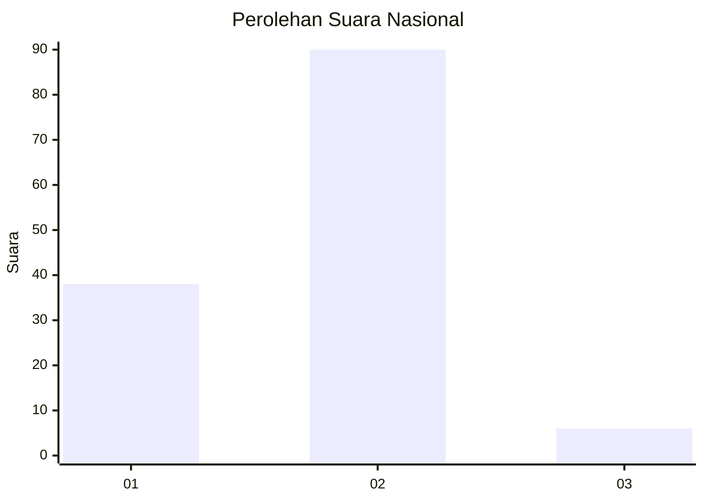
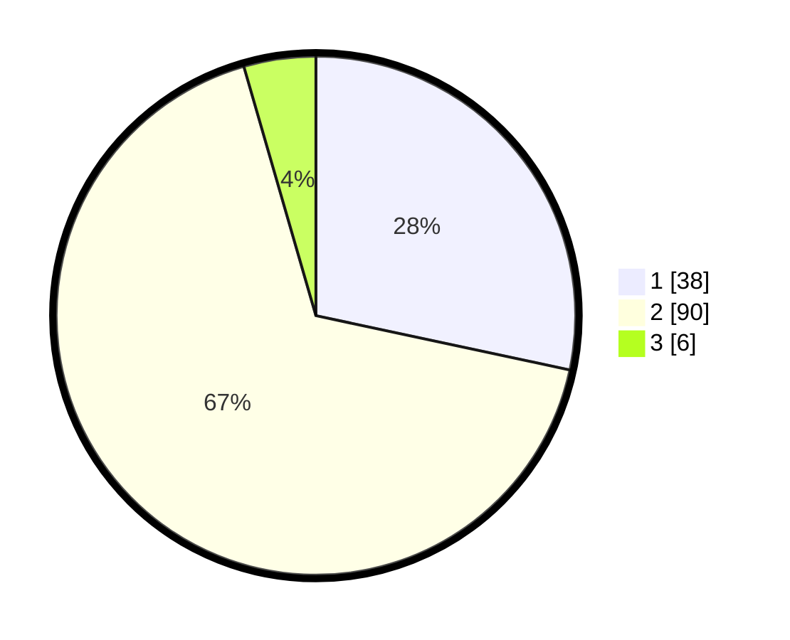

# Hasil

## Grafik

## Tabel

| No. | Nama Paslon    | Suara | Suara (raw) | Persentase |
|:--- |:-------------- | -----:| -----------:| ----------:|
| 1   | ANIES MUHAIMIN | 38    | [38][p-1]   | 28,36      |
| 2   | PRABOWO GIBRAN | 90    | [90][p-2]   | 67,16      |
| 3   | GANJAR MAHFUD  | 6     | [6][p-3]    | 4,48       |

[p-1]: https://github.com/gigit-pemilu/pemilu-2024/blob/main/pilpres/hitung-suara/sub/52-nusa-tenggara-barat/sub/02-lombok-tengah/sub/07-janapria/sub/2010-kerembong/sub/007-tps/sub/paslon-1.txt
[p-2]: https://github.com/gigit-pemilu/pemilu-2024/blob/main/pilpres/hitung-suara/sub/52-nusa-tenggara-barat/sub/02-lombok-tengah/sub/07-janapria/sub/2010-kerembong/sub/007-tps/sub/paslon-2.txt
[p-3]: https://github.com/gigit-pemilu/pemilu-2024/blob/main/pilpres/hitung-suara/sub/52-nusa-tenggara-barat/sub/02-lombok-tengah/sub/07-janapria/sub/2010-kerembong/sub/007-tps/sub/paslon-3.txt

## Foto C Plano

https://sirekap-obj-formc.kpu.go.id/9aa1/pemilu/ppwp/52/02/07/20/10/5202072010007-20240227-165058--5f71ec6c-a0a5-4660-88f9-5250acac163d.jpg

https://sirekap-obj-formc.kpu.go.id/9aa1/pemilu/ppwp/52/02/07/20/10/5202072010007-20240227-165654--d75510fe-0173-409d-be56-c379c4646187.jpg

https://sirekap-obj-formc.kpu.go.id/9aa1/pemilu/ppwp/52/02/07/20/10/5202072010007-20240227-165845--f8092cac-d9a5-4070-b46c-3df74727f3ab.jpg

## Metadata

| Key        | Value               |
| ---------- | ------------------- |
| Time Stamp | 2024-02-27 22:00:00 |

## DATA PEMILIH TETAP

Jumlah pemilih dalam DPT: **888**.
 * L: **884**.
 * P: **104**.

## DATA PENGGUNA HAK PILIH

Jumlah pengguna hak pilih dalam DPT: **142**.
 * L: **857**.
 * P: **884**.

Jumlah pengguna hak pilih dalam DPTb: **884**.
 * L: **888**.
 * P: **888**.

Jumlah pengguna hak pilih dalam DPK: **883**.
 * L: **882**.
 * P: **841**.

Jumlah pengguna hak pilih: **844**.
 * L: **858**.
 * P: **885**.

## JUMLAH SUARA SAH DAN TIDAK SAH

JUMLAH SELURUH SUARA SAH: **134**.

JUMLAH SUARA TIDAK SAH: **10**.

JUMLAH SELURUH SUARA SAH DAN SUARA TIDAK SAH: **144**.

