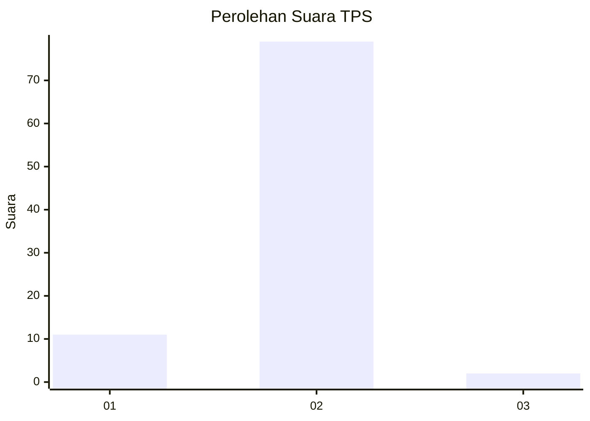
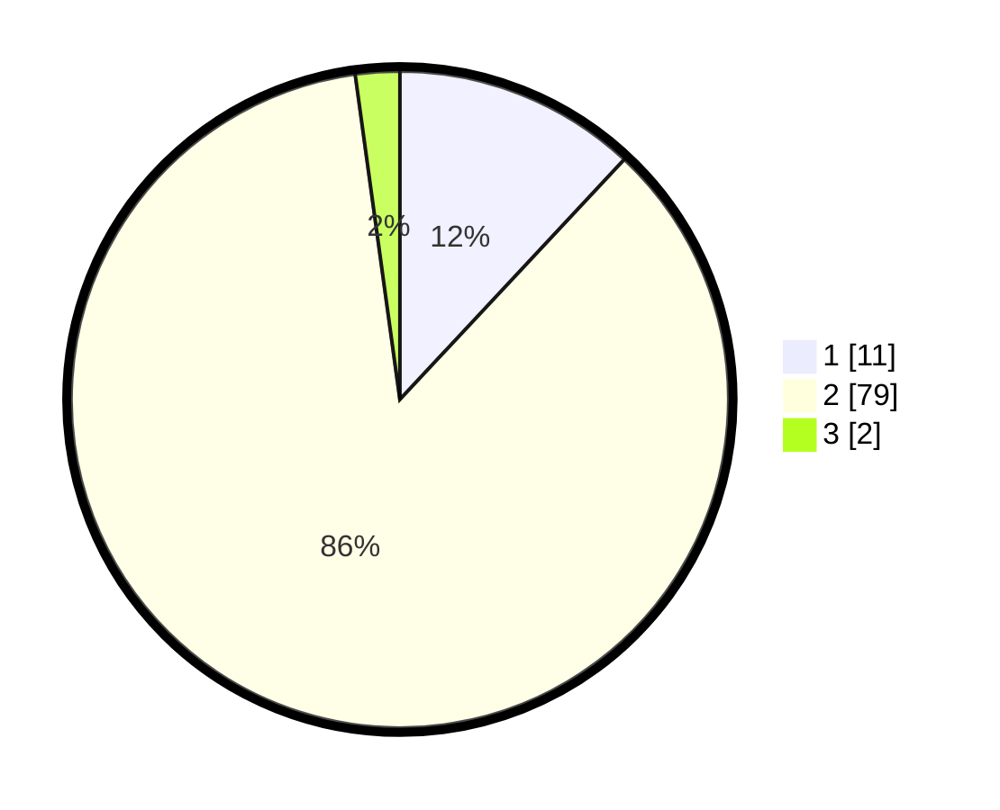

# Hasil

## Grafik

## Tabel

| No. | Nama Paslon    | Suara | Suara (raw) | Persentase |
|:--- |:-------------- | -----:| -----------:| ----------:|
| 1   | ANIES MUHAIMIN | 11    | [11][p-1]   | 11,96      |
| 2   | PRABOWO GIBRAN | 79    | [79][p-2]   | 85,87      |
| 3   | GANJAR MAHFUD  | 2     | [2][p-3]    | 2,17       |

[p-1]: https://github.com/gigit-pemilu/pemilu-2024-52-nusa-tenggara-barat/blob/main/pilpres/hitung-suara/sub/52-nusa-tenggara-barat/sub/02-lombok-tengah/sub/07-janapria/sub/2011-jango/sub/013-tps/sub/paslon-1.txt
[p-2]: https://github.com/gigit-pemilu/pemilu-2024-52-nusa-tenggara-barat/blob/main/pilpres/hitung-suara/sub/52-nusa-tenggara-barat/sub/02-lombok-tengah/sub/07-janapria/sub/2011-jango/sub/013-tps/sub/paslon-2.txt
[p-3]: https://github.com/gigit-pemilu/pemilu-2024-52-nusa-tenggara-barat/blob/main/pilpres/hitung-suara/sub/52-nusa-tenggara-barat/sub/02-lombok-tengah/sub/07-janapria/sub/2011-jango/sub/013-tps/sub/paslon-3.txt

## Foto C Plano

https://sirekap-obj-formc.kpu.go.id/2485/pemilu/ppwp/52/02/07/20/11/5202072011013-20240225-110101--f1899590-bbbf-4161-ab76-178797badc92.jpg

https://sirekap-obj-formc.kpu.go.id/2485/pemilu/ppwp/52/02/07/20/11/5202072011013-20240225-110037--c762b98c-3b4c-4062-8f5b-8eda06d3ebb7.jpg

https://sirekap-obj-formc.kpu.go.id/2485/pemilu/ppwp/52/02/07/20/11/5202072011013-20240225-110002--bcba2a09-1aeb-4d55-b70c-5fbedb835cc2.jpg

## Metadata

| Key        | Value               |
| ---------- | ------------------- |
| Time Stamp | 2024-02-28 21:00:00 |

