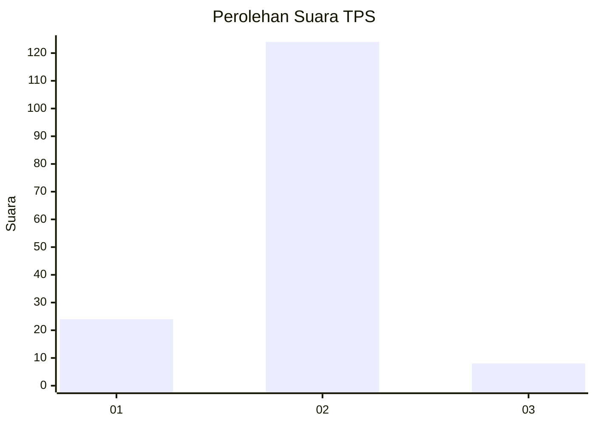
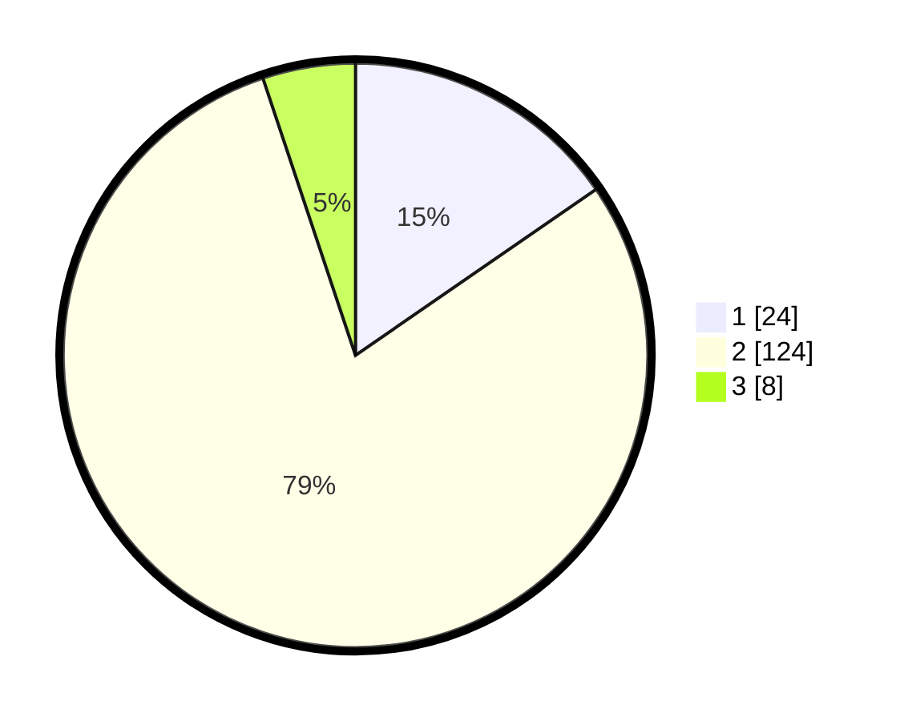

# Hasil

## Grafik

## Tabel

| No. | Nama Paslon    | Suara | Suara (raw) | Persentase |
|:--- |:-------------- | -----:| -----------:| ----------:|
| 1   | ANIES MUHAIMIN | 24    | [24][p-1]   | 15,38      |
| 2   | PRABOWO GIBRAN | 124   | [124][p-2]  | 79,49      |
| 3   | GANJAR MAHFUD  | 8     | [8][p-3]    | 5,13       |

[p-1]: https://github.com/gigit-pemilu/pemilu-2024-52-nusa-tenggara-barat/blob/main/pilpres/hitung-suara/sub/52-nusa-tenggara-barat/sub/02-lombok-tengah/sub/07-janapria/sub/2013-prako/sub/003-tps/sub/paslon-1.txt
[p-2]: https://github.com/gigit-pemilu/pemilu-2024-52-nusa-tenggara-barat/blob/main/pilpres/hitung-suara/sub/52-nusa-tenggara-barat/sub/02-lombok-tengah/sub/07-janapria/sub/2013-prako/sub/003-tps/sub/paslon-2.txt
[p-3]: https://github.com/gigit-pemilu/pemilu-2024-52-nusa-tenggara-barat/blob/main/pilpres/hitung-suara/sub/52-nusa-tenggara-barat/sub/02-lombok-tengah/sub/07-janapria/sub/2013-prako/sub/003-tps/sub/paslon-3.txt

## Foto C Plano

https://sirekap-obj-formc.kpu.go.id/7014/pemilu/ppwp/52/02/07/20/13/5202072013003-20240225-090810--928ee55e-de93-4071-a4e2-12b9daeab3c1.jpg

https://sirekap-obj-formc.kpu.go.id/7014/pemilu/ppwp/52/02/07/20/13/5202072013003-20240225-090846--dfb37f50-90e4-4ac5-8484-5af5d1bedda1.jpg

https://sirekap-obj-formc.kpu.go.id/7014/pemilu/ppwp/52/02/07/20/13/5202072013003-20240225-090931--768c447f-912a-46ba-8a26-c4f79117b064.jpg

## Metadata

| Key        | Value               |
| ---------- | ------------------- |
| Time Stamp | 2024-02-25 17:00:00 |

## DATA PEMILIH TETAP

Jumlah pemilih dalam DPT: **189**.
 * L: **483**.
 * P: **840**.

## DATA PENGGUNA HAK PILIH

Jumlah pengguna hak pilih dalam DPT: **153**.
 * L: **874**.
 * P: **484**.

Jumlah pengguna hak pilih dalam DPTb: **484**.
 * L: **883**.
 * P: **388**.

Jumlah pengguna hak pilih dalam DPK: **488**.
 * L: **334**.
 * P: **744**.

Jumlah pengguna hak pilih: **53**.
 * L: **874**.
 * P: **443**.

## JUMLAH SUARA SAH DAN TIDAK SAH

JUMLAH SELURUH SUARA SAH: **156**.

JUMLAH SUARA TIDAK SAH: **1**.

JUMLAH SELURUH SUARA SAH DAN SUARA TIDAK SAH: **157**.

