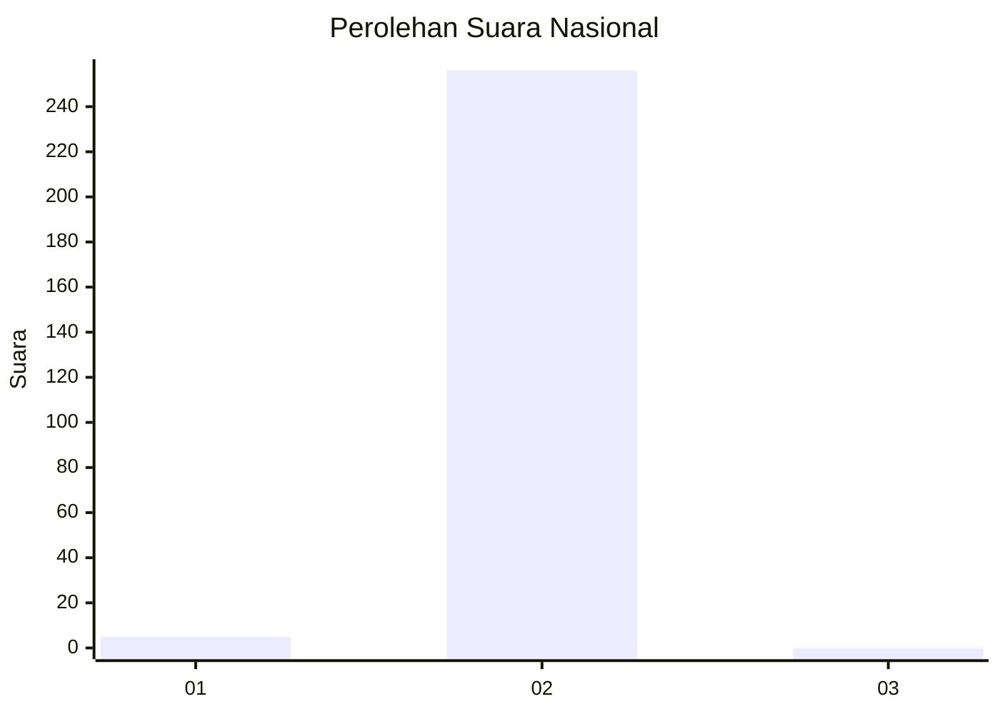
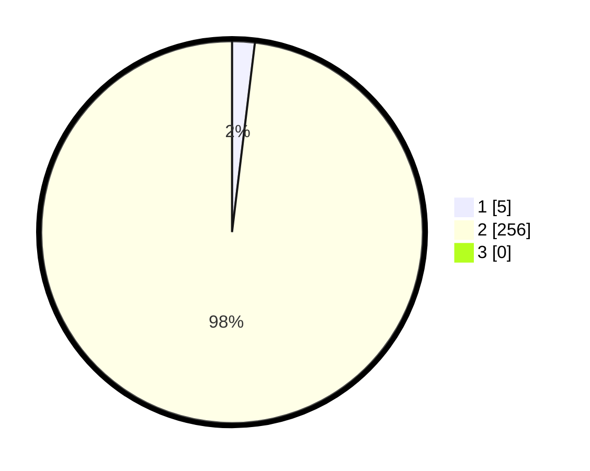

# Hasil

## Grafik

## Tabel

| No. | Nama Paslon    | Suara | Suara (raw) | Persentase |
|:--- |:-------------- | -----:| -----------:| ----------:|
| 1   | ANIES MUHAIMIN | 5     | [5][p-1]    | 1,92       |
| 2   | PRABOWO GIBRAN | 256   | [256][p-2]  | 98,08      |
| 3   | GANJAR MAHFUD  | 0     | [0][p-3]    | 0,00       |

[p-1]: https://github.com/gigit-pemilu/pemilu-2024/blob/main/pilpres/hitung-suara/sub/52-nusa-tenggara-barat/sub/02-lombok-tengah/sub/07-janapria/sub/2013-prako/sub/006-tps/sub/paslon-1.txt
[p-2]: https://github.com/gigit-pemilu/pemilu-2024/blob/main/pilpres/hitung-suara/sub/52-nusa-tenggara-barat/sub/02-lombok-tengah/sub/07-janapria/sub/2013-prako/sub/006-tps/sub/paslon-2.txt
[p-3]: https://github.com/gigit-pemilu/pemilu-2024/blob/main/pilpres/hitung-suara/sub/52-nusa-tenggara-barat/sub/02-lombok-tengah/sub/07-janapria/sub/2013-prako/sub/006-tps/sub/paslon-3.txt

## Foto C Plano

https://sirekap-obj-formc.kpu.go.id/04fc/pemilu/ppwp/52/02/07/20/13/5202072013006-20240225-112453--982d9f6e-173e-4e09-babc-ba0682bcffcc.jpg

https://sirekap-obj-formc.kpu.go.id/04fc/pemilu/ppwp/52/02/07/20/13/5202072013006-20240225-112657--cca8c81b-8652-4bfb-88f4-6d41e600c476.jpg

https://sirekap-obj-formc.kpu.go.id/04fc/pemilu/ppwp/52/02/07/20/13/5202072013006-20240225-112758--6ce43a96-f117-4577-b712-15294b585dd3.jpg

## Metadata

| Key        | Value               |
| ---------- | ------------------- |
| Time Stamp | 2024-02-25 12:00:00 |

## DATA PEMILIH TETAP

Jumlah pemilih dalam DPT: **241**.
 * L: **113**.
 * P: **128**.

## DATA PENGGUNA HAK PILIH

Jumlah pengguna hak pilih dalam DPT: **243**.
 * L: **463**.
 * P: **228**.

Jumlah pengguna hak pilih dalam DPTb: **44**.
 * L: **0**.
 * P: **470**.

Jumlah pengguna hak pilih dalam DPK: **4**.
 * L: **400**.
 * P: **408**.

Jumlah pengguna hak pilih: **241**.
 * L: **113**.
 * P: **128**.

## JUMLAH SUARA SAH DAN TIDAK SAH

JUMLAH SELURUH SUARA SAH: **225**.

JUMLAH SUARA TIDAK SAH: **206**.

JUMLAH SELURUH SUARA SAH DAN SUARA TIDAK SAH: **226**.

