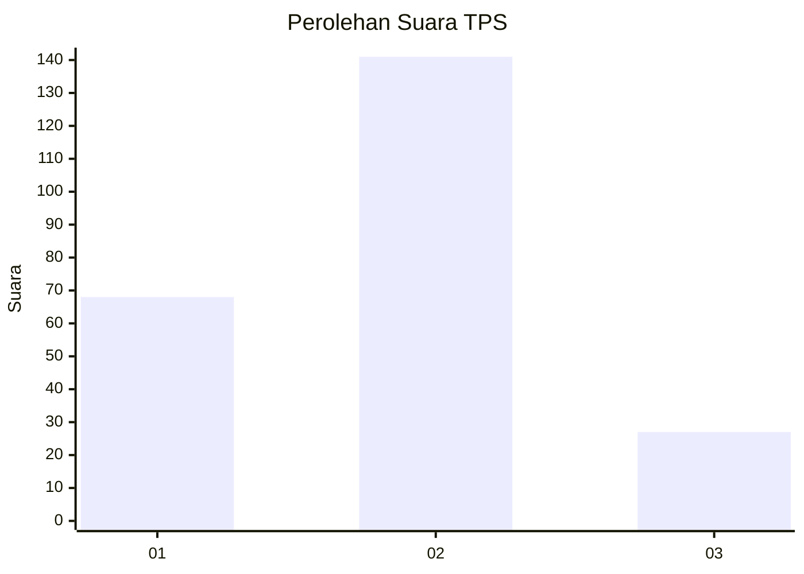
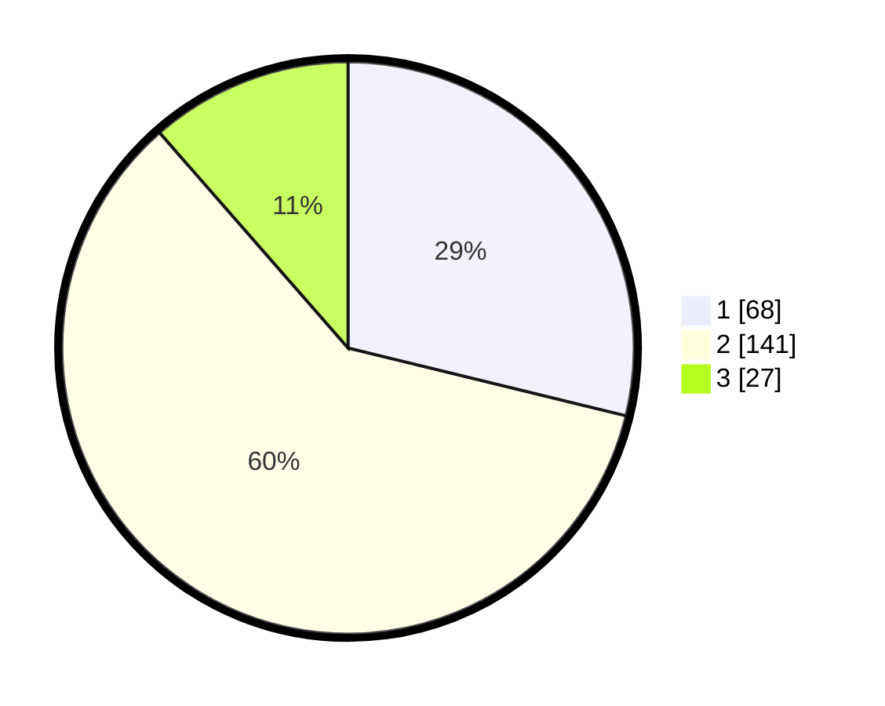

# Hasil

## Grafik

## Tabel

| No. | Nama Paslon    | Suara | Suara (raw) | Persentase |
|:--- |:-------------- | -----:| -----------:| ----------:|
| 1   | ANIES MUHAIMIN | 68    | [68][p-1]   | 28,81      |
| 2   | PRABOWO GIBRAN | 141   | [141][p-2]  | 59,75      |
| 3   | GANJAR MAHFUD  | 27    | [27][p-3]   | 11,44      |

[p-1]: https://github.com/gigit-pemilu/pemilu-2024-52-nusa-tenggara-barat/blob/main/pilpres/hitung-suara/sub/52-nusa-tenggara-barat/sub/02-lombok-tengah/sub/08-pringgarata/sub/2001-pringgarata/sub/002-tps/sub/paslon-1.txt
[p-2]: https://github.com/gigit-pemilu/pemilu-2024-52-nusa-tenggara-barat/blob/main/pilpres/hitung-suara/sub/52-nusa-tenggara-barat/sub/02-lombok-tengah/sub/08-pringgarata/sub/2001-pringgarata/sub/002-tps/sub/paslon-2.txt
[p-3]: https://github.com/gigit-pemilu/pemilu-2024-52-nusa-tenggara-barat/blob/main/pilpres/hitung-suara/sub/52-nusa-tenggara-barat/sub/02-lombok-tengah/sub/08-pringgarata/sub/2001-pringgarata/sub/002-tps/sub/paslon-3.txt

## Foto C Plano

https://sirekap-obj-formc.kpu.go.id/b420/pemilu/ppwp/52/02/08/20/01/5202082001002-20240214-212552--a5e8e9ef-1c5d-407f-a83b-2cb717cb1e21.jpg

https://sirekap-obj-formc.kpu.go.id/b420/pemilu/ppwp/52/02/08/20/01/5202082001002-20240214-213331--eb639369-2e9e-48f9-afb2-964006c66afa.jpg

https://sirekap-obj-formc.kpu.go.id/b420/pemilu/ppwp/52/02/08/20/01/5202082001002-20240214-214446--cb7a7da4-ddc2-49bd-90b2-4bd93dd9d8e1.jpg

## Metadata

| Key        | Value               |
| ---------- | ------------------- |
| Time Stamp | 2024-02-17 19:00:04 |

