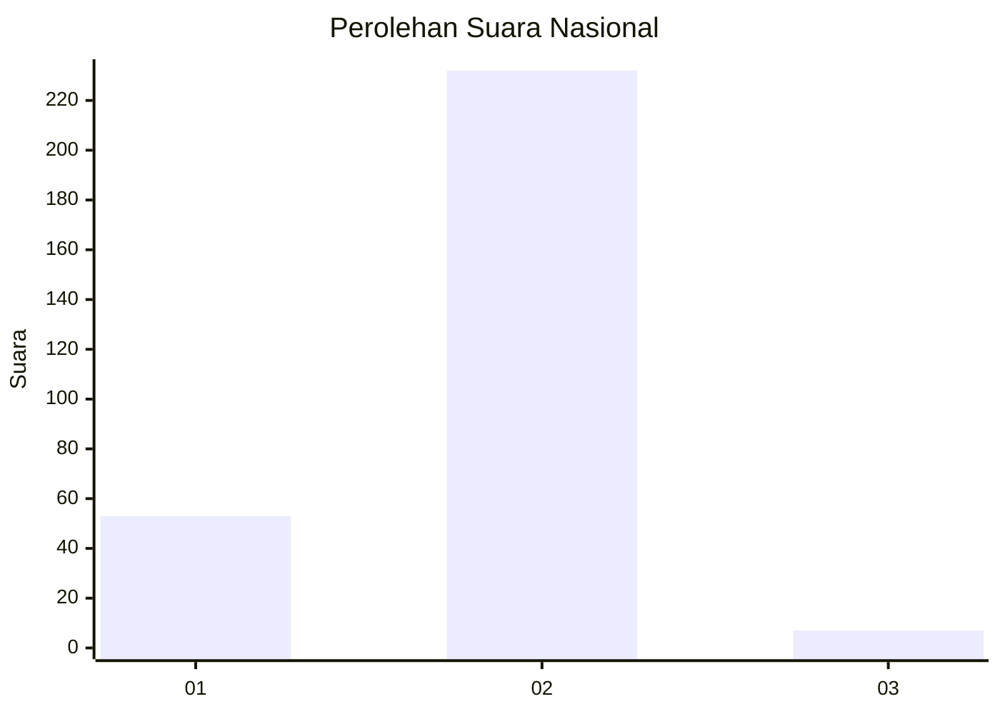
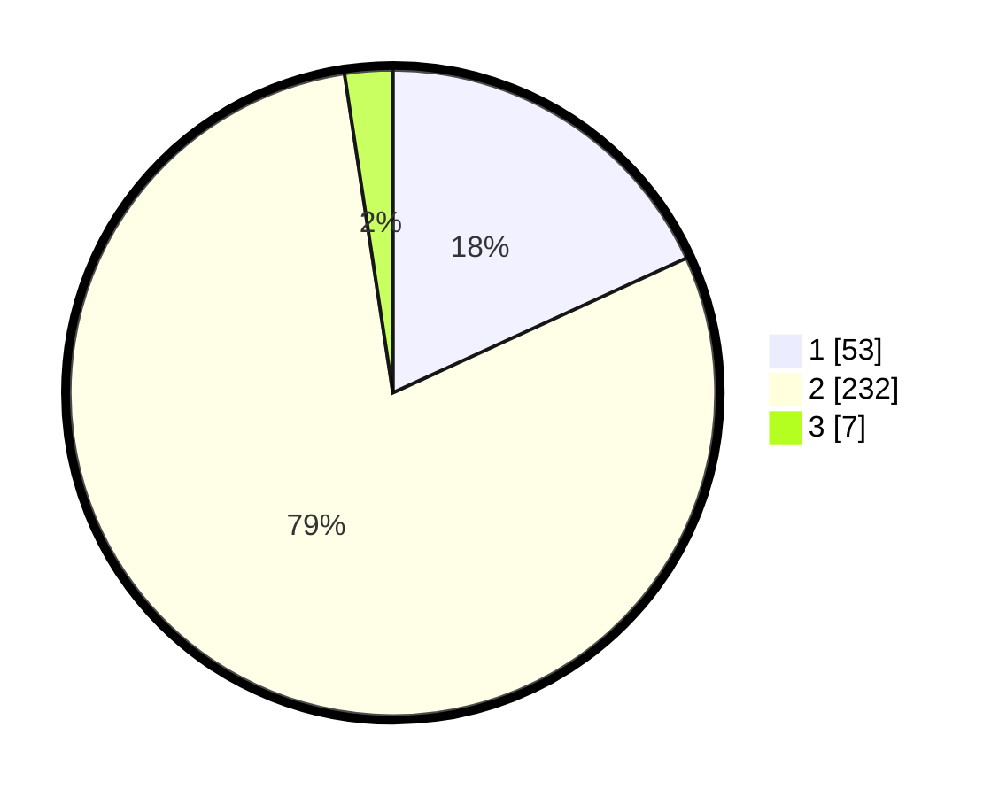

# Hasil

## Grafik

## Tabel

| No. | Nama Paslon    | Suara | Suara (raw) | Persentase |
|:--- |:-------------- | -----:| -----------:| ----------:|
| 1   | ANIES MUHAIMIN | 53    | [53][p-1]   | 18,15      |
| 2   | PRABOWO GIBRAN | 232   | [232][p-2]  | 79,45      |
| 3   | GANJAR MAHFUD  | 7     | [7][p-3]    | 2,40       |

[p-1]: https://github.com/gigit-pemilu/pemilu-2024/blob/main/pilpres/hitung-suara/sub/52-nusa-tenggara-barat/sub/02-lombok-tengah/sub/08-pringgarata/sub/2001-pringgarata/sub/016-tps/sub/paslon-1.txt
[p-2]: https://github.com/gigit-pemilu/pemilu-2024/blob/main/pilpres/hitung-suara/sub/52-nusa-tenggara-barat/sub/02-lombok-tengah/sub/08-pringgarata/sub/2001-pringgarata/sub/016-tps/sub/paslon-2.txt
[p-3]: https://github.com/gigit-pemilu/pemilu-2024/blob/main/pilpres/hitung-suara/sub/52-nusa-tenggara-barat/sub/02-lombok-tengah/sub/08-pringgarata/sub/2001-pringgarata/sub/016-tps/sub/paslon-3.txt

## Foto C Plano

https://sirekap-obj-formc.kpu.go.id/6efa/pemilu/ppwp/52/02/08/20/01/5202082001016-20240215-021836--2e40ea1f-c2ad-4838-9c91-deb510a37e2b.jpg

https://sirekap-obj-formc.kpu.go.id/6efa/pemilu/ppwp/52/02/08/20/01/5202082001016-20240215-022115--85fce9c5-1e08-462f-85be-229b4c28ec57.jpg

https://sirekap-obj-formc.kpu.go.id/6efa/pemilu/ppwp/52/02/08/20/01/5202082001016-20240215-022231--4fa29d52-57b8-44b7-ad1b-b3a71f27a46f.jpg

## Metadata

| Key        | Value               |
| ---------- | ------------------- |
| Time Stamp | 2024-02-17 19:00:04 |

