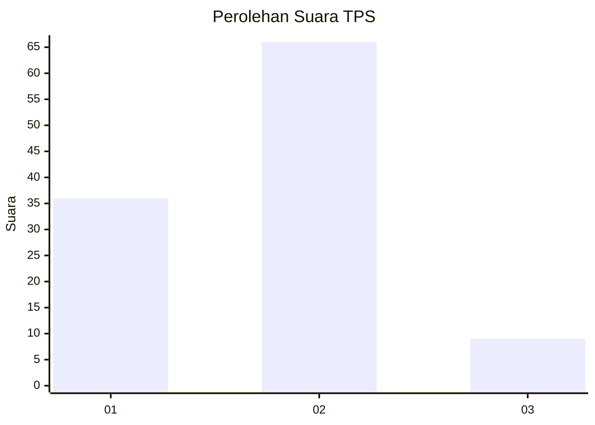
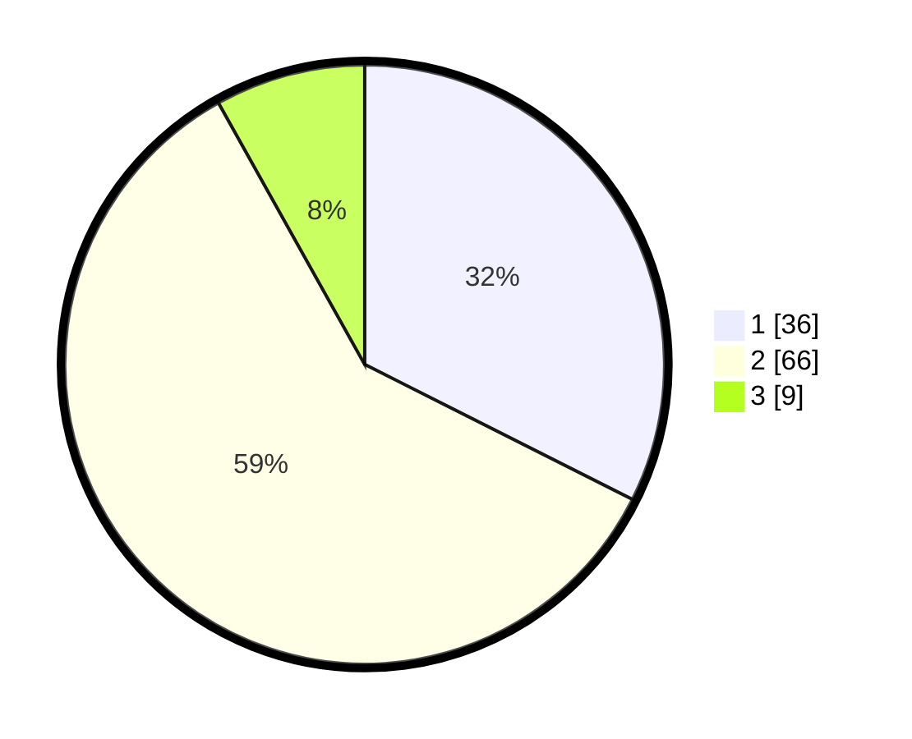

# Hasil

## Grafik

## Tabel

| No. | Nama Paslon    | Suara | Suara (raw) | Persentase |
|:--- |:-------------- | -----:| -----------:| ----------:|
| 1   | ANIES MUHAIMIN | 36    | [36][p-1]   | 32,43      |
| 2   | PRABOWO GIBRAN | 66    | [66][p-2]   | 59,46      |
| 3   | GANJAR MAHFUD  | 9     | [9][p-3]    | 8,11       |

[p-1]: https://github.com/gigit-pemilu/pemilu-2024-52-nusa-tenggara-barat/blob/main/pilpres/hitung-suara/sub/52-nusa-tenggara-barat/sub/02-lombok-tengah/sub/08-pringgarata/sub/2009-arjangka/sub/001-tps/sub/paslon-1.txt
[p-2]: https://github.com/gigit-pemilu/pemilu-2024-52-nusa-tenggara-barat/blob/main/pilpres/hitung-suara/sub/52-nusa-tenggara-barat/sub/02-lombok-tengah/sub/08-pringgarata/sub/2009-arjangka/sub/001-tps/sub/paslon-2.txt
[p-3]: https://github.com/gigit-pemilu/pemilu-2024-52-nusa-tenggara-barat/blob/main/pilpres/hitung-suara/sub/52-nusa-tenggara-barat/sub/02-lombok-tengah/sub/08-pringgarata/sub/2009-arjangka/sub/001-tps/sub/paslon-3.txt

## Foto C Plano

https://sirekap-obj-formc.kpu.go.id/ba13/pemilu/ppwp/52/02/08/20/09/5202082009001-20240214-213259--e2d6bcf2-5768-40e6-a4e9-b091e975ea81.jpg

https://sirekap-obj-formc.kpu.go.id/ba13/pemilu/ppwp/52/02/08/20/09/5202082009001-20240215-015805--b9995c4c-2457-4fc1-9799-0bc33a03774c.jpg

https://sirekap-obj-formc.kpu.go.id/ba13/pemilu/ppwp/52/02/08/20/09/5202082009001-20240214-213317--0e9eecfa-2ec4-4c71-b89f-28d04da80c3f.jpg

## Metadata

| Key        | Value               |
| ---------- | ------------------- |
| Time Stamp | 2024-02-17 19:00:04 |

