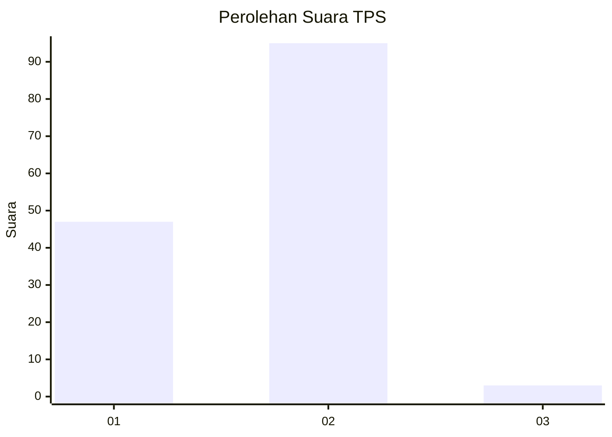
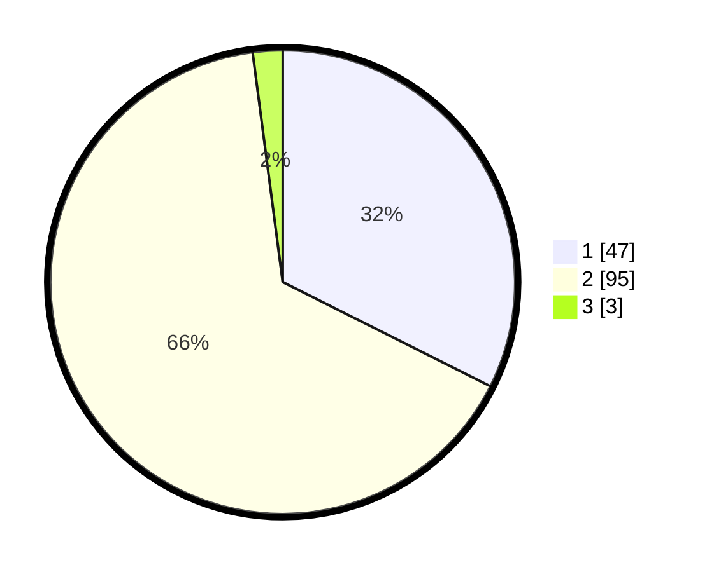

# Hasil

## Grafik

## Tabel

| No. | Nama Paslon    | Suara | Suara (raw) | Persentase |
|:--- |:-------------- | -----:| -----------:| ----------:|
| 1   | ANIES MUHAIMIN | 47    | [47][p-1]   | 32,41      |
| 2   | PRABOWO GIBRAN | 95    | [95][p-2]   | 65,52      |
| 3   | GANJAR MAHFUD  | 3     | [3][p-3]    | 2,07       |

[p-1]: https://github.com/gigit-pemilu/pemilu-2024-52-nusa-tenggara-barat/blob/main/pilpres/hitung-suara/sub/52-nusa-tenggara-barat/sub/02-lombok-tengah/sub/09-kopang/sub/2001-lendang-are/sub/002-tps/sub/paslon-1.txt
[p-2]: https://github.com/gigit-pemilu/pemilu-2024-52-nusa-tenggara-barat/blob/main/pilpres/hitung-suara/sub/52-nusa-tenggara-barat/sub/02-lombok-tengah/sub/09-kopang/sub/2001-lendang-are/sub/002-tps/sub/paslon-2.txt
[p-3]: https://github.com/gigit-pemilu/pemilu-2024-52-nusa-tenggara-barat/blob/main/pilpres/hitung-suara/sub/52-nusa-tenggara-barat/sub/02-lombok-tengah/sub/09-kopang/sub/2001-lendang-are/sub/002-tps/sub/paslon-3.txt

## Foto C Plano

https://sirekap-obj-formc.kpu.go.id/714e/pemilu/ppwp/52/02/09/20/01/5202092001002-20240214-232422--b83f62b2-89f4-40e2-8888-3fa03687bfa4.jpg

https://sirekap-obj-formc.kpu.go.id/714e/pemilu/ppwp/52/02/09/20/01/5202092001002-20240214-232449--c6e6a1a9-2cc3-4a2f-9c1f-c390abdb5a0d.jpg

https://sirekap-obj-formc.kpu.go.id/714e/pemilu/ppwp/52/02/09/20/01/5202092001002-20240214-232523--b11dd52c-5795-4cb4-bf09-2f0ccd52dddd.jpg

## Metadata

| Key        | Value               |
| ---------- | ------------------- |
| Time Stamp | 2024-02-15 20:00:44 |

