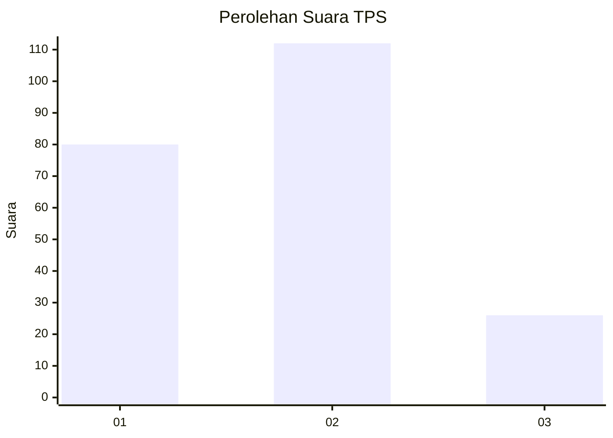
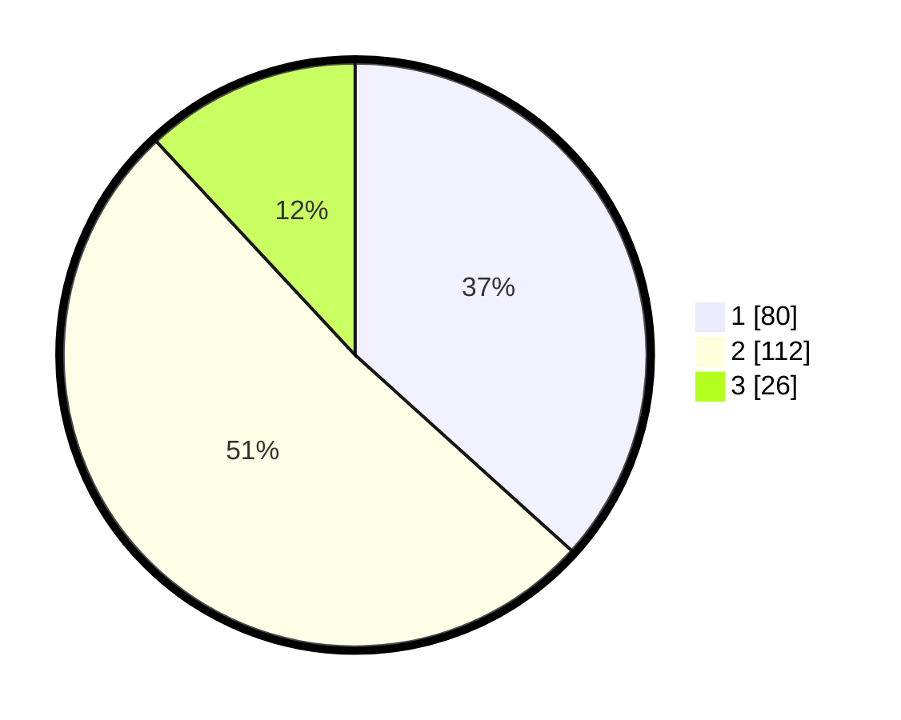

# Hasil

## Grafik

## Tabel

| No. | Nama Paslon    | Suara | Suara (raw) | Persentase |
|:--- |:-------------- | -----:| -----------:| ----------:|
| 1   | ANIES MUHAIMIN | 80    | [80][p-1]   | 36,70      |
| 2   | PRABOWO GIBRAN | 112   | [112][p-2]  | 51,38      |
| 3   | GANJAR MAHFUD  | 26    | [26][p-3]   | 11,93      |

[p-1]: https://github.com/gigit-pemilu/pemilu-2024-52-nusa-tenggara-barat/blob/main/pilpres/hitung-suara/sub/52-nusa-tenggara-barat/sub/02-lombok-tengah/sub/11-praya-barat-daya/sub/2001-montong-sapah/sub/003-tps/sub/paslon-1.txt
[p-2]: https://github.com/gigit-pemilu/pemilu-2024-52-nusa-tenggara-barat/blob/main/pilpres/hitung-suara/sub/52-nusa-tenggara-barat/sub/02-lombok-tengah/sub/11-praya-barat-daya/sub/2001-montong-sapah/sub/003-tps/sub/paslon-2.txt
[p-3]: https://github.com/gigit-pemilu/pemilu-2024-52-nusa-tenggara-barat/blob/main/pilpres/hitung-suara/sub/52-nusa-tenggara-barat/sub/02-lombok-tengah/sub/11-praya-barat-daya/sub/2001-montong-sapah/sub/003-tps/sub/paslon-3.txt

## Foto C Plano

https://sirekap-obj-formc.kpu.go.id/5249/pemilu/ppwp/52/02/11/20/01/5202112001003-20240215-100256--c82175da-85a0-4450-8a6d-a9929d50557e.jpg

https://sirekap-obj-formc.kpu.go.id/5249/pemilu/ppwp/52/02/11/20/01/5202112001003-20240215-100527--c9bdc9ff-6eb8-4bdc-ba5b-5f73682de785.jpg

https://sirekap-obj-formc.kpu.go.id/5249/pemilu/ppwp/52/02/11/20/01/5202112001003-20240215-100714--7630cdf9-18f8-4a5c-a0cd-4c2ebef33f78.jpg

## Metadata

| Key        | Value               |
| ---------- | ------------------- |
| Time Stamp | 2024-02-19 06:16:00 |

