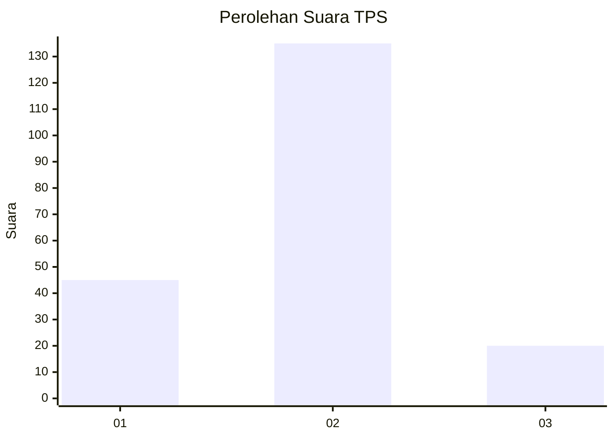

# Hasil

## Grafik

## Tabel

| No. | Nama Paslon    | Suara | Suara (raw) | Persentase |
|:--- |:-------------- | -----:| -----------:| ----------:|
| 1   | ANIES MUHAIMIN | 45    | [45][p-1]   | 22,50      |
| 2   | PRABOWO GIBRAN | 135   | [135][p-2]  | 67,50      |
| 3   | GANJAR MAHFUD  | 20    | [20][p-3]   | 10,00      |

[p-1]: https://github.com/gigit-pemilu/pemilu-2024-52-nusa-tenggara-barat/blob/main/pilpres/hitung-suara/sub/52-nusa-tenggara-barat/sub/02-lombok-tengah/sub/11-praya-barat-daya/sub/2001-montong-sapah/sub/007-tps/sub/paslon-1.txt
[p-2]: https://github.com/gigit-pemilu/pemilu-2024-52-nusa-tenggara-barat/blob/main/pilpres/hitung-suara/sub/52-nusa-tenggara-barat/sub/02-lombok-tengah/sub/11-praya-barat-daya/sub/2001-montong-sapah/sub/007-tps/sub/paslon-2.txt
[p-3]: https://github.com/gigit-pemilu/pemilu-2024-52-nusa-tenggara-barat/blob/main/pilpres/hitung-suara/sub/52-nusa-tenggara-barat/sub/02-lombok-tengah/sub/11-praya-barat-daya/sub/2001-montong-sapah/sub/007-tps/sub/paslon-3.txt

## Foto C Plano

https://sirekap-obj-formc.kpu.go.id/d237/pemilu/ppwp/52/02/11/20/01/5202112001007-20240215-073507--82fbc24f-8ce8-4c60-af00-fb619bedf8f0.jpg

https://sirekap-obj-formc.kpu.go.id/d237/pemilu/ppwp/52/02/11/20/01/5202112001007-20240215-073918--6e44df6b-bffe-49bf-a4cc-8982f1ee3997.jpg

https://sirekap-obj-formc.kpu.go.id/d237/pemilu/ppwp/52/02/11/20/01/5202112001007-20240215-074057--8007a210-5de6-4b3f-a133-53d3369a33d7.jpg

## Metadata

| Key        | Value               |
| ---------- | ------------------- |
| Time Stamp | 2024-02-19 06:16:00 |

