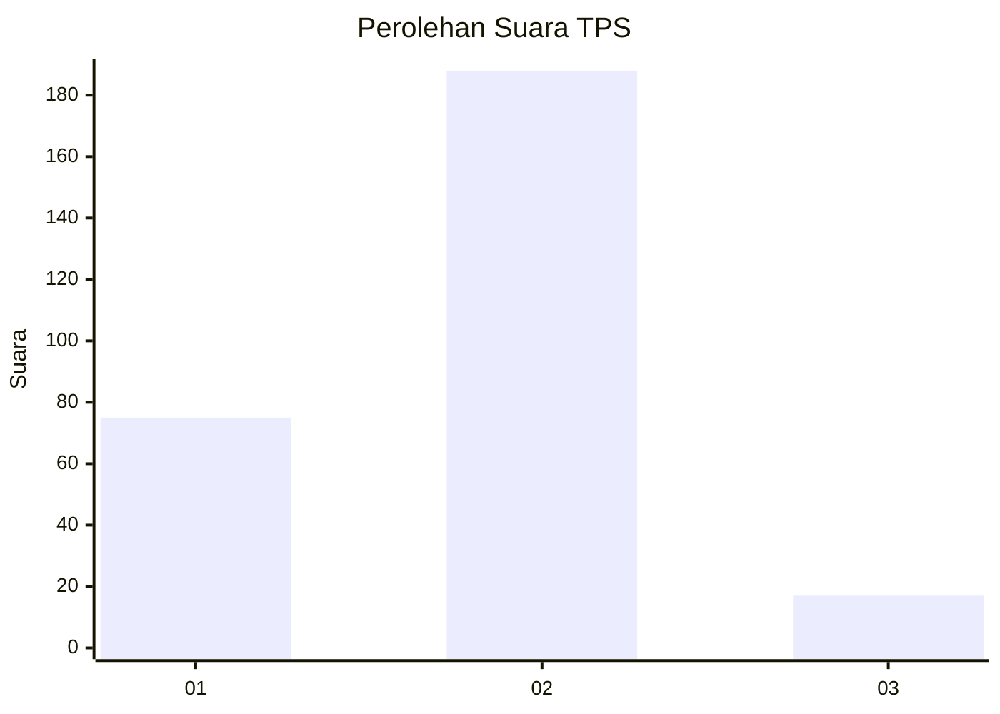
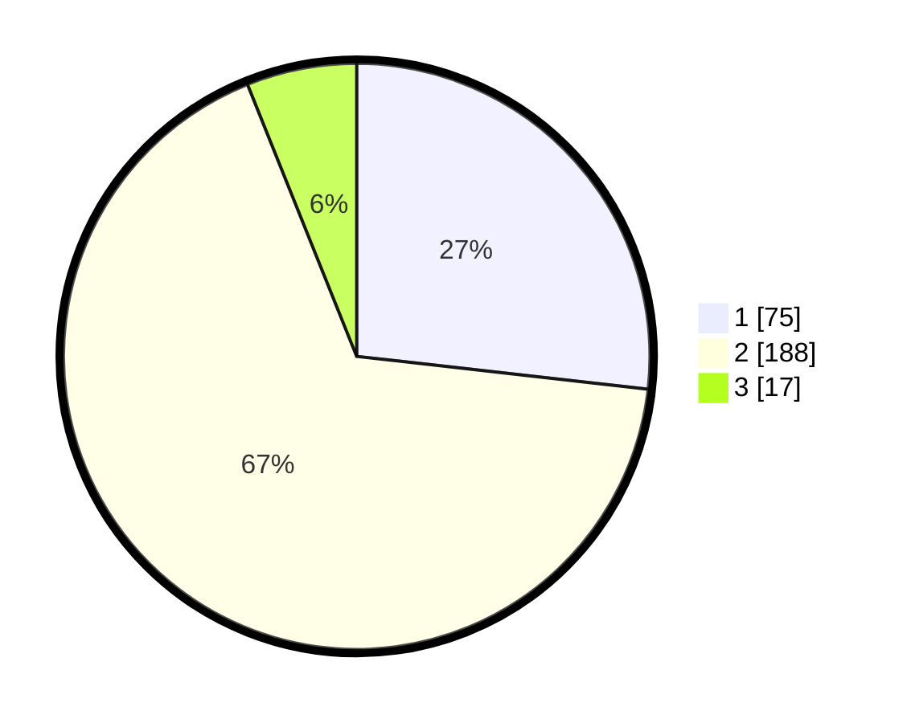

# Hasil

## Grafik

## Tabel

| No. | Nama Paslon    | Suara | Suara (raw) | Persentase |
|:--- |:-------------- | -----:| -----------:| ----------:|
| 1   | ANIES MUHAIMIN | 75    | [75][p-1]   | 26,79      |
| 2   | PRABOWO GIBRAN | 188   | [188][p-2]  | 67,14      |
| 3   | GANJAR MAHFUD  | 17    | [17][p-3]   | 6,07       |

[p-1]: https://github.com/gigit-pemilu/pemilu-2024-52-nusa-tenggara-barat/blob/main/pilpres/hitung-suara/sub/52-nusa-tenggara-barat/sub/02-lombok-tengah/sub/11-praya-barat-daya/sub/2001-montong-sapah/sub/009-tps/sub/paslon-1.txt
[p-2]: https://github.com/gigit-pemilu/pemilu-2024-52-nusa-tenggara-barat/blob/main/pilpres/hitung-suara/sub/52-nusa-tenggara-barat/sub/02-lombok-tengah/sub/11-praya-barat-daya/sub/2001-montong-sapah/sub/009-tps/sub/paslon-2.txt
[p-3]: https://github.com/gigit-pemilu/pemilu-2024-52-nusa-tenggara-barat/blob/main/pilpres/hitung-suara/sub/52-nusa-tenggara-barat/sub/02-lombok-tengah/sub/11-praya-barat-daya/sub/2001-montong-sapah/sub/009-tps/sub/paslon-3.txt

## Foto C Plano

https://sirekap-obj-formc.kpu.go.id/7011/pemilu/ppwp/52/02/11/20/01/5202112001009-20240215-115312--688f6b81-f91b-4479-8ded-cfdfea6beb78.jpg

https://sirekap-obj-formc.kpu.go.id/7011/pemilu/ppwp/52/02/11/20/01/5202112001009-20240215-115453--06bbd1a8-b410-4f0f-b5d9-a9f78aaac843.jpg

https://sirekap-obj-formc.kpu.go.id/7011/pemilu/ppwp/52/02/11/20/01/5202112001009-20240215-115558--cdfc71fe-9adb-4d33-9b02-732013892ee4.jpg

## Metadata

| Key        | Value               |
| ---------- | ------------------- |
| Time Stamp | 2024-02-19 06:16:00 |

