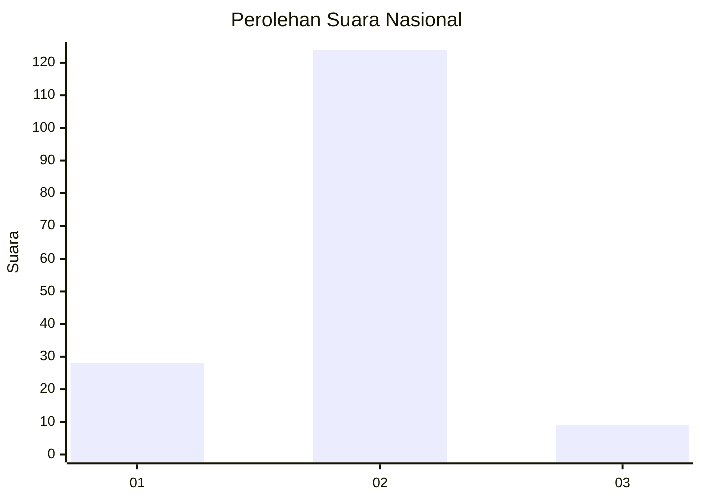
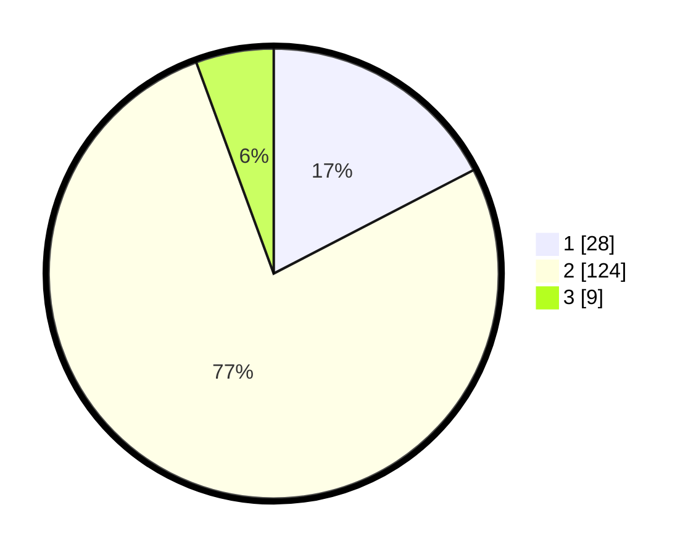

# Hasil

## Grafik

## Tabel

| No. | Nama Paslon    | Suara | Suara (raw) | Persentase |
|:--- |:-------------- | -----:| -----------:| ----------:|
| 1   | ANIES MUHAIMIN | 28    | [28][p-1]   | 17,39      |
| 2   | PRABOWO GIBRAN | 124   | [124][p-2]  | 77,02      |
| 3   | GANJAR MAHFUD  | 9     | [9][p-3]    | 5,59       |

[p-1]: https://github.com/gigit-pemilu/pemilu-2024/blob/main/pilpres/hitung-suara/sub/52-nusa-tenggara-barat/sub/03-lombok-timur/sub/01-keruak/sub/2013-setungkep-lingsar/sub/004-tps/sub/paslon-1.txt
[p-2]: https://github.com/gigit-pemilu/pemilu-2024/blob/main/pilpres/hitung-suara/sub/52-nusa-tenggara-barat/sub/03-lombok-timur/sub/01-keruak/sub/2013-setungkep-lingsar/sub/004-tps/sub/paslon-2.txt
[p-3]: https://github.com/gigit-pemilu/pemilu-2024/blob/main/pilpres/hitung-suara/sub/52-nusa-tenggara-barat/sub/03-lombok-timur/sub/01-keruak/sub/2013-setungkep-lingsar/sub/004-tps/sub/paslon-3.txt

## Foto C Plano

https://sirekap-obj-formc.kpu.go.id/4d56/pemilu/ppwp/52/03/01/20/13/5203012013004-20240214-210728--0ca403cb-4808-4d77-a5c5-955e9dff4699.jpg

https://sirekap-obj-formc.kpu.go.id/4d56/pemilu/ppwp/52/03/01/20/13/5203012013004-20240214-210945--4a30bfa4-4dc2-4750-808a-d8565085c40d.jpg

https://sirekap-obj-formc.kpu.go.id/4d56/pemilu/ppwp/52/03/01/20/13/5203012013004-20240214-211117--0b881f01-9601-4089-a3a7-5c2629b3f73c.jpg

## Metadata

| Key        | Value               |
| ---------- | ------------------- |
| Time Stamp | 2024-02-16 02:00:27 |

