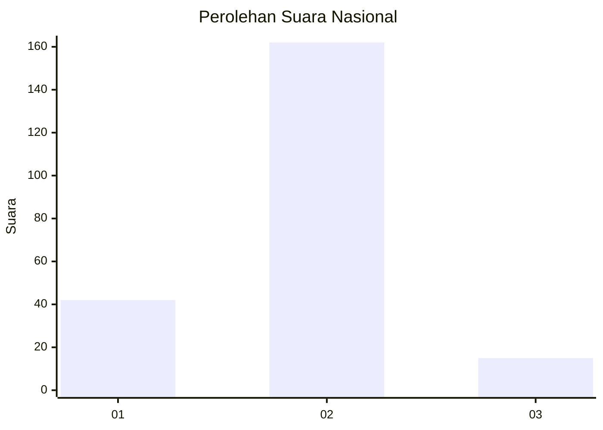
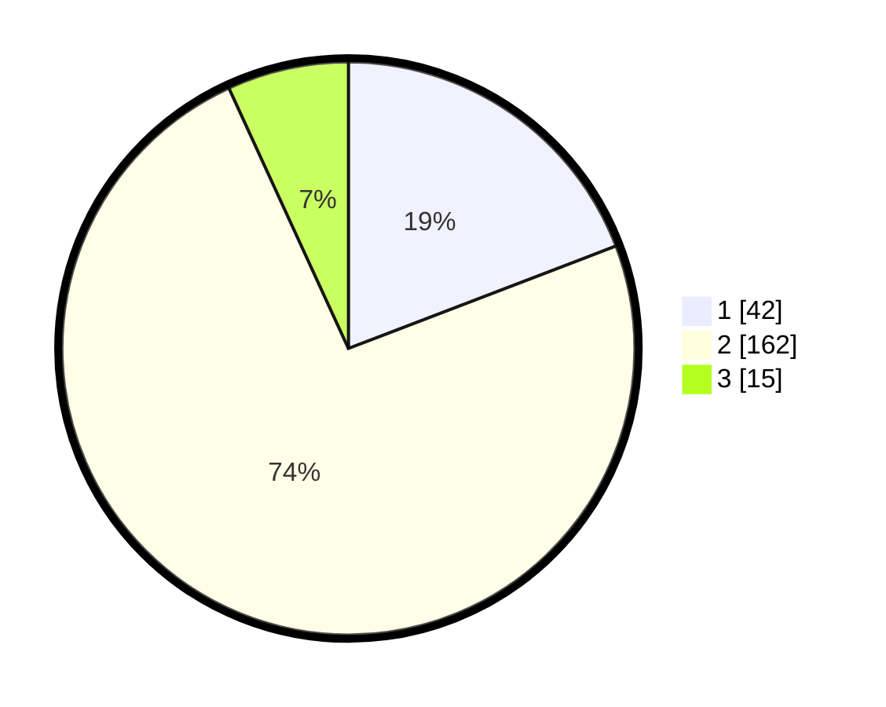

# Hasil

## Grafik

## Tabel

| No. | Nama Paslon    | Suara | Suara (raw) | Persentase |
|:--- |:-------------- | -----:| -----------:| ----------:|
| 1   | ANIES MUHAIMIN | 42    | [42][p-1]   | 19,18      |
| 2   | PRABOWO GIBRAN | 162   | [162][p-2]  | 73,97      |
| 3   | GANJAR MAHFUD  | 15    | [15][p-3]   | 6,85       |

[p-1]: https://github.com/gigit-pemilu/pemilu-2024/blob/main/pilpres/hitung-suara/sub/52-nusa-tenggara-barat/sub/03-lombok-timur/sub/02-sakra/sub/2001-suwangi/sub/004-tps/sub/paslon-1.txt
[p-2]: https://github.com/gigit-pemilu/pemilu-2024/blob/main/pilpres/hitung-suara/sub/52-nusa-tenggara-barat/sub/03-lombok-timur/sub/02-sakra/sub/2001-suwangi/sub/004-tps/sub/paslon-2.txt
[p-3]: https://github.com/gigit-pemilu/pemilu-2024/blob/main/pilpres/hitung-suara/sub/52-nusa-tenggara-barat/sub/03-lombok-timur/sub/02-sakra/sub/2001-suwangi/sub/004-tps/sub/paslon-3.txt

## Foto C Plano

https://sirekap-obj-formc.kpu.go.id/1a5a/pemilu/ppwp/52/03/02/20/01/5203022001004-20240215-013422--296eef7e-fc4d-4424-8964-ad6160b5f70d.jpg

https://sirekap-obj-formc.kpu.go.id/1a5a/pemilu/ppwp/52/03/02/20/01/5203022001004-20240215-013731--a9f6ece3-6836-4aeb-852c-1af774994d38.jpg

https://sirekap-obj-formc.kpu.go.id/1a5a/pemilu/ppwp/52/03/02/20/01/5203022001004-20240215-013832--3d2c8a91-83fa-48a8-a493-fd6fc3f73cb9.jpg

## Metadata

| Key        | Value               |
| ---------- | ------------------- |
| Time Stamp | 2024-02-15 12:00:28 |

