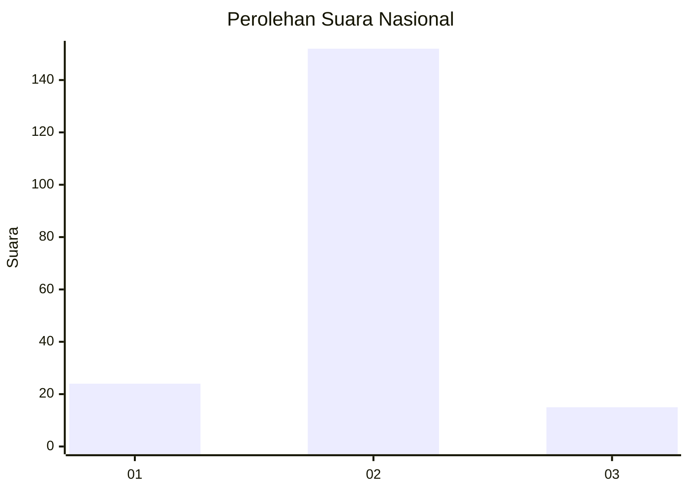
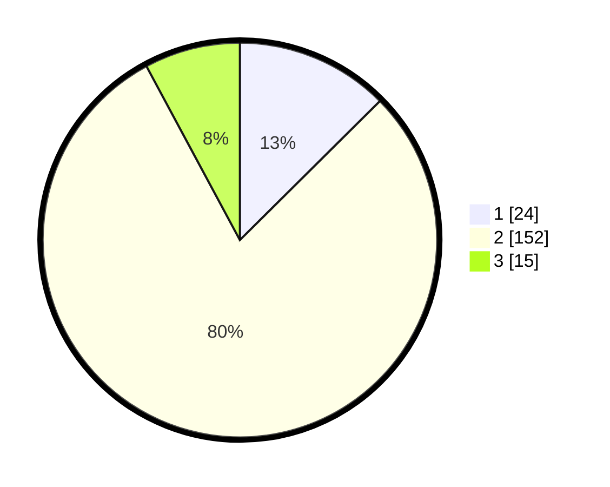

# Hasil

## Grafik

## Tabel

| No. | Nama Paslon    | Suara | Suara (raw) | Persentase |
|:--- |:-------------- | -----:| -----------:| ----------:|
| 1   | ANIES MUHAIMIN | 24    | [24][p-1]   | 12,57      |
| 2   | PRABOWO GIBRAN | 152   | [152][p-2]  | 79,58      |
| 3   | GANJAR MAHFUD  | 15    | [15][p-3]   | 7,85       |

[p-1]: https://github.com/gigit-pemilu/pemilu-2024/blob/main/pilpres/hitung-suara/sub/52-nusa-tenggara-barat/sub/03-lombok-timur/sub/02-sakra/sub/2001-suwangi/sub/006-tps/sub/paslon-1.txt
[p-2]: https://github.com/gigit-pemilu/pemilu-2024/blob/main/pilpres/hitung-suara/sub/52-nusa-tenggara-barat/sub/03-lombok-timur/sub/02-sakra/sub/2001-suwangi/sub/006-tps/sub/paslon-2.txt
[p-3]: https://github.com/gigit-pemilu/pemilu-2024/blob/main/pilpres/hitung-suara/sub/52-nusa-tenggara-barat/sub/03-lombok-timur/sub/02-sakra/sub/2001-suwangi/sub/006-tps/sub/paslon-3.txt

## Foto C Plano

https://sirekap-obj-formc.kpu.go.id/8959/pemilu/ppwp/52/03/02/20/01/5203022001006-20240215-031125--744593a8-8bdc-43d0-939e-985ad559f30b.jpg

https://sirekap-obj-formc.kpu.go.id/8959/pemilu/ppwp/52/03/02/20/01/5203022001006-20240215-031312--1fe8e7f4-33c7-4ce5-b0b7-db776a23814d.jpg

https://sirekap-obj-formc.kpu.go.id/8959/pemilu/ppwp/52/03/02/20/01/5203022001006-20240215-031522--ded57415-1846-44c4-827b-fba9f7b8766a.jpg

## Metadata

| Key        | Value               |
| ---------- | ------------------- |
| Time Stamp | 2024-02-15 09:00:24 |

