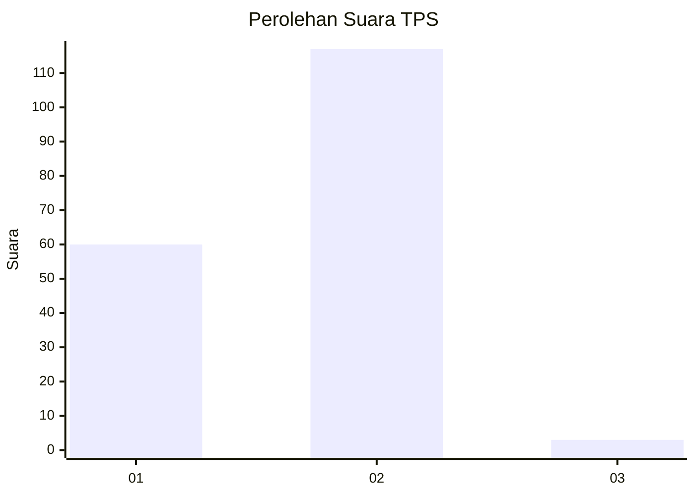
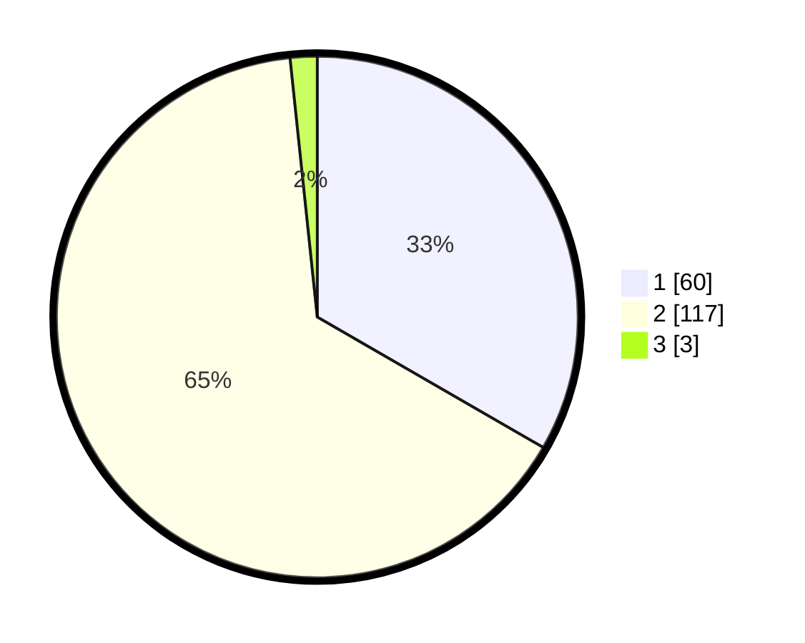

# Hasil

## Grafik

## Tabel

| No. | Nama Paslon    | Suara | Suara (raw) | Persentase |
|:--- |:-------------- | -----:| -----------:| ----------:|
| 1   | ANIES MUHAIMIN | 60    | [60][p-1]   | 33,33      |
| 2   | PRABOWO GIBRAN | 117   | [117][p-2]  | 65,00      |
| 3   | GANJAR MAHFUD  | 3     | [3][p-3]    | 1,67       |

[p-1]: https://github.com/gigit-pemilu/pemilu-2024-52-nusa-tenggara-barat/blob/main/pilpres/hitung-suara/sub/52-nusa-tenggara-barat/sub/03-lombok-timur/sub/03-terara/sub/2001-jenggik/sub/001-tps/sub/paslon-1.txt
[p-2]: https://github.com/gigit-pemilu/pemilu-2024-52-nusa-tenggara-barat/blob/main/pilpres/hitung-suara/sub/52-nusa-tenggara-barat/sub/03-lombok-timur/sub/03-terara/sub/2001-jenggik/sub/001-tps/sub/paslon-2.txt
[p-3]: https://github.com/gigit-pemilu/pemilu-2024-52-nusa-tenggara-barat/blob/main/pilpres/hitung-suara/sub/52-nusa-tenggara-barat/sub/03-lombok-timur/sub/03-terara/sub/2001-jenggik/sub/001-tps/sub/paslon-3.txt

## Foto C Plano

https://sirekap-obj-formc.kpu.go.id/d2ec/pemilu/ppwp/52/03/03/20/01/5203032001001-20240214-201827--dc0b7a4e-68ff-4178-a789-f78ddfc64686.jpg

https://sirekap-obj-formc.kpu.go.id/d2ec/pemilu/ppwp/52/03/03/20/01/5203032001001-20240214-202043--ee84fc77-9228-45fc-831f-ac82e10244ca.jpg

https://sirekap-obj-formc.kpu.go.id/d2ec/pemilu/ppwp/52/03/03/20/01/5203032001001-20240214-202152--389ac982-c284-4585-8071-2187828879c3.jpg

## Metadata

| Key        | Value               |
| ---------- | ------------------- |
| Time Stamp | 2024-02-19 16:00:00 |

