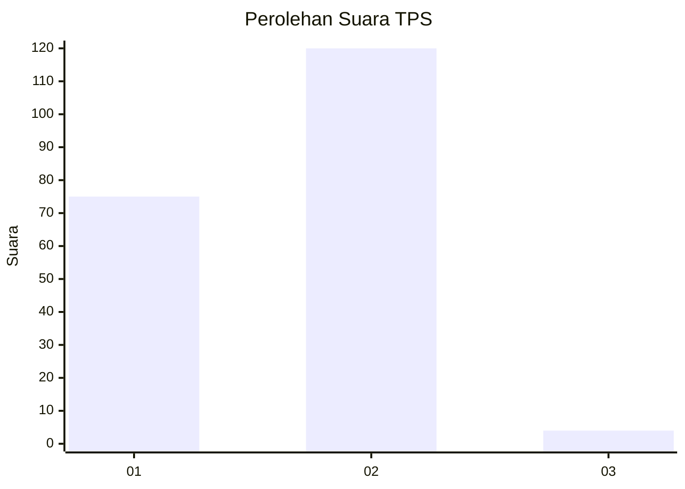
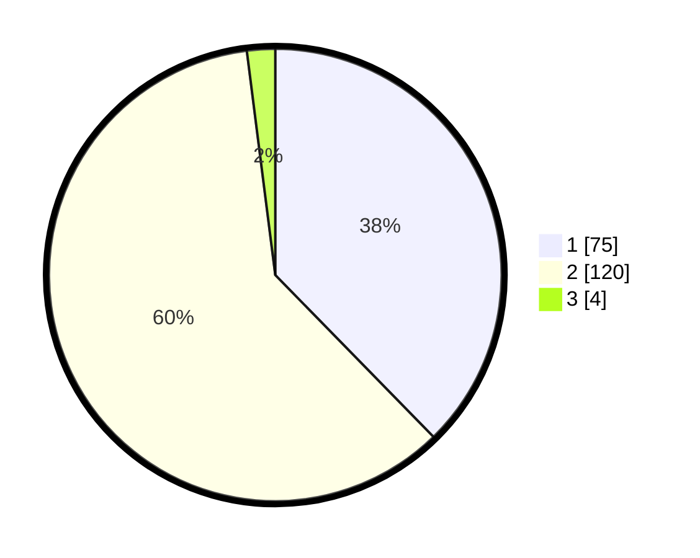

# Hasil

## Grafik

## Tabel

| No. | Nama Paslon    | Suara | Suara (raw) | Persentase |
|:--- |:-------------- | -----:| -----------:| ----------:|
| 1   | ANIES MUHAIMIN | 75    | [75][p-1]   | 37,69      |
| 2   | PRABOWO GIBRAN | 120   | [120][p-2]  | 60,30      |
| 3   | GANJAR MAHFUD  | 4     | [4][p-3]    | 2,01       |

[p-1]: https://github.com/gigit-pemilu/pemilu-2024-52-nusa-tenggara-barat/blob/main/pilpres/hitung-suara/sub/52-nusa-tenggara-barat/sub/03-lombok-timur/sub/03-terara/sub/2001-jenggik/sub/004-tps/sub/paslon-1.txt
[p-2]: https://github.com/gigit-pemilu/pemilu-2024-52-nusa-tenggara-barat/blob/main/pilpres/hitung-suara/sub/52-nusa-tenggara-barat/sub/03-lombok-timur/sub/03-terara/sub/2001-jenggik/sub/004-tps/sub/paslon-2.txt
[p-3]: https://github.com/gigit-pemilu/pemilu-2024-52-nusa-tenggara-barat/blob/main/pilpres/hitung-suara/sub/52-nusa-tenggara-barat/sub/03-lombok-timur/sub/03-terara/sub/2001-jenggik/sub/004-tps/sub/paslon-3.txt

## Foto C Plano

https://sirekap-obj-formc.kpu.go.id/9d55/pemilu/ppwp/52/03/03/20/01/5203032001004-20240215-031022--58d6751b-3c2e-4f18-8b76-6fd873be2b7d.jpg

https://sirekap-obj-formc.kpu.go.id/9d55/pemilu/ppwp/52/03/03/20/01/5203032001004-20240215-042145--c097b1fd-7c75-44fd-9488-49ebf7910906.jpg

https://sirekap-obj-formc.kpu.go.id/9d55/pemilu/ppwp/52/03/03/20/01/5203032001004-20240215-031604--c3862f44-b766-4da5-b823-f41994485560.jpg

## Metadata

| Key        | Value               |
| ---------- | ------------------- |
| Time Stamp | 2024-02-15 20:30:46 |

