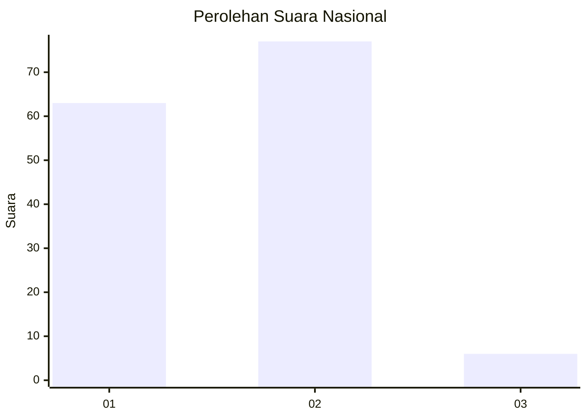
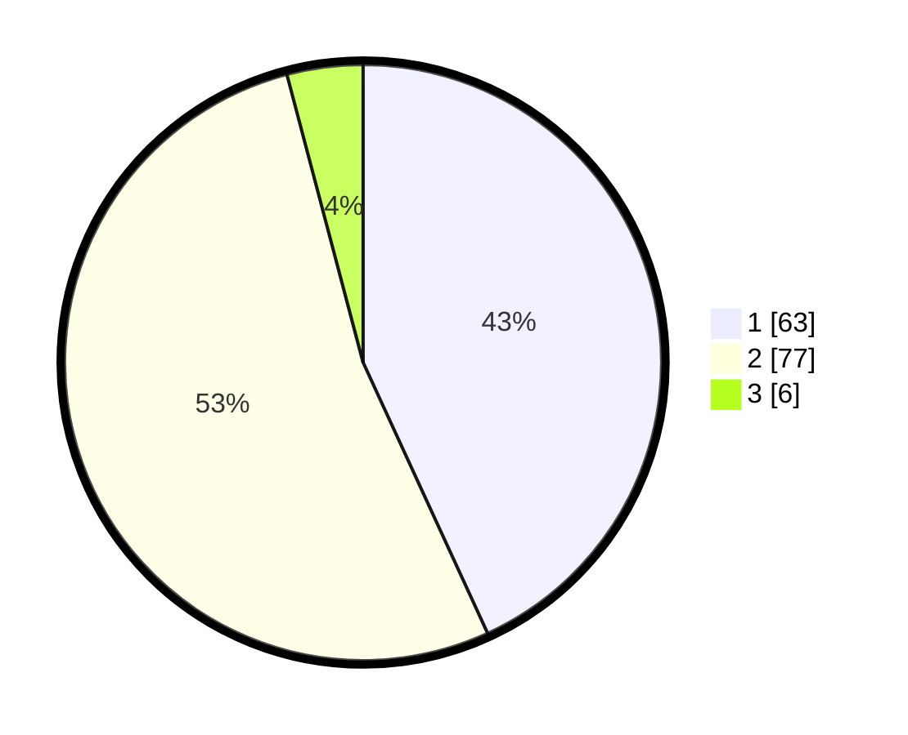

# Hasil

## Grafik

## Tabel

| No. | Nama Paslon    | Suara | Suara (raw) | Persentase |
|:--- |:-------------- | -----:| -----------:| ----------:|
| 1   | ANIES MUHAIMIN | 63    | [63][p-1]   | 43,15      |
| 2   | PRABOWO GIBRAN | 77    | [77][p-2]   | 52,74      |
| 3   | GANJAR MAHFUD  | 6     | [6][p-3]    | 4,11       |

[p-1]: https://github.com/gigit-pemilu/pemilu-2024/blob/main/pilpres/hitung-suara/sub/52-nusa-tenggara-barat/sub/03-lombok-timur/sub/03-terara/sub/2001-jenggik/sub/005-tps/sub/paslon-1.txt
[p-2]: https://github.com/gigit-pemilu/pemilu-2024/blob/main/pilpres/hitung-suara/sub/52-nusa-tenggara-barat/sub/03-lombok-timur/sub/03-terara/sub/2001-jenggik/sub/005-tps/sub/paslon-2.txt
[p-3]: https://github.com/gigit-pemilu/pemilu-2024/blob/main/pilpres/hitung-suara/sub/52-nusa-tenggara-barat/sub/03-lombok-timur/sub/03-terara/sub/2001-jenggik/sub/005-tps/sub/paslon-3.txt

## Foto C Plano

https://sirekap-obj-formc.kpu.go.id/7899/pemilu/ppwp/52/03/03/20/01/5203032001005-20240215-074830--9de5772f-a476-4dd2-9b00-5485b83c4757.jpg

https://sirekap-obj-formc.kpu.go.id/7899/pemilu/ppwp/52/03/03/20/01/5203032001005-20240215-074944--827e1b15-11e1-423e-8254-68172d590fbe.jpg

https://sirekap-obj-formc.kpu.go.id/7899/pemilu/ppwp/52/03/03/20/01/5203032001005-20240215-075021--60ac095b-c678-4e19-90df-586c45fe72a8.jpg

## Metadata

| Key        | Value               |
| ---------- | ------------------- |
| Time Stamp | 2024-02-15 15:00:29 |

