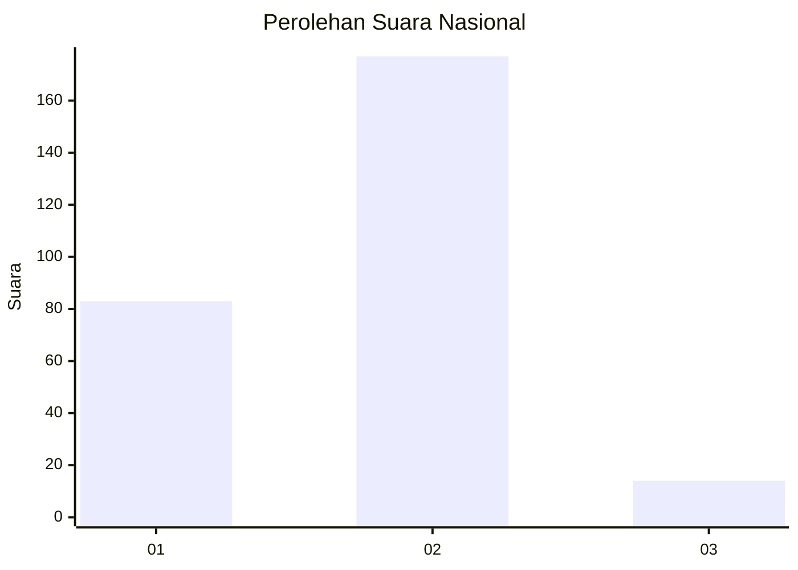
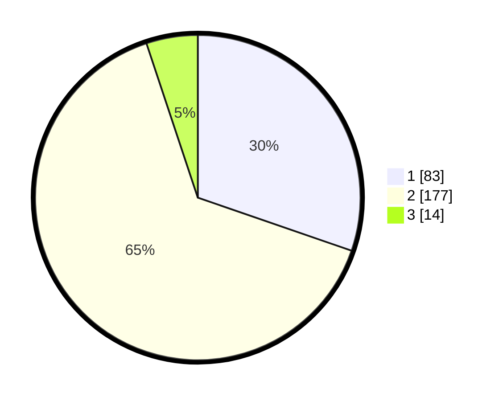

# Hasil

## Grafik

## Tabel

| No. | Nama Paslon    | Suara | Suara (raw) | Persentase |
|:--- |:-------------- | -----:| -----------:| ----------:|
| 1   | ANIES MUHAIMIN | 83    | [83][p-1]   | 30,29      |
| 2   | PRABOWO GIBRAN | 177   | [177][p-2]  | 64,60      |
| 3   | GANJAR MAHFUD  | 14    | [14][p-3]   | 5,11       |

[p-1]: https://github.com/gigit-pemilu/pemilu-2024/blob/main/pilpres/hitung-suara/sub/52-nusa-tenggara-barat/sub/03-lombok-timur/sub/05-masbagik/sub/2005-masbagik-utara/sub/005-tps/sub/paslon-1.txt
[p-2]: https://github.com/gigit-pemilu/pemilu-2024/blob/main/pilpres/hitung-suara/sub/52-nusa-tenggara-barat/sub/03-lombok-timur/sub/05-masbagik/sub/2005-masbagik-utara/sub/005-tps/sub/paslon-2.txt
[p-3]: https://github.com/gigit-pemilu/pemilu-2024/blob/main/pilpres/hitung-suara/sub/52-nusa-tenggara-barat/sub/03-lombok-timur/sub/05-masbagik/sub/2005-masbagik-utara/sub/005-tps/sub/paslon-3.txt

## Foto C Plano

https://sirekap-obj-formc.kpu.go.id/cac9/pemilu/ppwp/52/03/05/20/05/5203052005005-20240215-091418--73a449b2-8807-499d-9706-3cc267986269.jpg

https://sirekap-obj-formc.kpu.go.id/cac9/pemilu/ppwp/52/03/05/20/05/5203052005005-20240215-091731--269f927d-e73d-4684-bac1-30f17e5f2a00.jpg

https://sirekap-obj-formc.kpu.go.id/cac9/pemilu/ppwp/52/03/05/20/05/5203052005005-20240215-091905--065fd13f-7673-405d-9184-a869b6f192cf.jpg

## Metadata

| Key        | Value               |
| ---------- | ------------------- |
| Time Stamp | 2024-02-17 11:00:02 |

