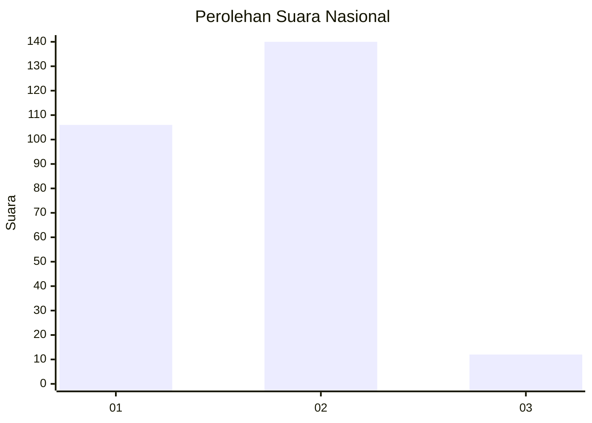
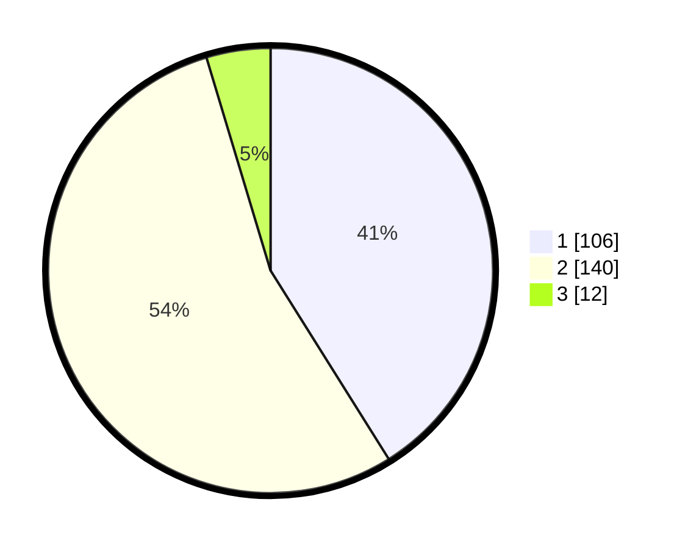

# Hasil

## Grafik

## Tabel

| No. | Nama Paslon    | Suara | Suara (raw) | Persentase |
|:--- |:-------------- | -----:| -----------:| ----------:|
| 1   | ANIES MUHAIMIN | 106   | [106][p-1]  | 41,09      |
| 2   | PRABOWO GIBRAN | 140   | [140][p-2]  | 54,26      |
| 3   | GANJAR MAHFUD  | 12    | [12][p-3]   | 4,65       |

[p-1]: https://github.com/gigit-pemilu/pemilu-2024/blob/main/pilpres/hitung-suara/sub/52-nusa-tenggara-barat/sub/03-lombok-timur/sub/05-masbagik/sub/2005-masbagik-utara/sub/011-tps/sub/paslon-1.txt
[p-2]: https://github.com/gigit-pemilu/pemilu-2024/blob/main/pilpres/hitung-suara/sub/52-nusa-tenggara-barat/sub/03-lombok-timur/sub/05-masbagik/sub/2005-masbagik-utara/sub/011-tps/sub/paslon-2.txt
[p-3]: https://github.com/gigit-pemilu/pemilu-2024/blob/main/pilpres/hitung-suara/sub/52-nusa-tenggara-barat/sub/03-lombok-timur/sub/05-masbagik/sub/2005-masbagik-utara/sub/011-tps/sub/paslon-3.txt

## Foto C Plano

https://sirekap-obj-formc.kpu.go.id/a4ce/pemilu/ppwp/52/03/05/20/05/5203052005011-20240215-011304--dd116670-df82-455d-8db5-b7a23a9edf36.jpg

https://sirekap-obj-formc.kpu.go.id/a4ce/pemilu/ppwp/52/03/05/20/05/5203052005011-20240215-060559--6ad4b003-9533-4f71-b126-f5ab2315816d.jpg

https://sirekap-obj-formc.kpu.go.id/a4ce/pemilu/ppwp/52/03/05/20/05/5203052005011-20240215-060820--a27f9c70-7e75-46c1-a56f-bb4e8e922993.jpg

## Metadata

| Key        | Value               |
| ---------- | ------------------- |
| Time Stamp | 2024-02-15 15:00:29 |

