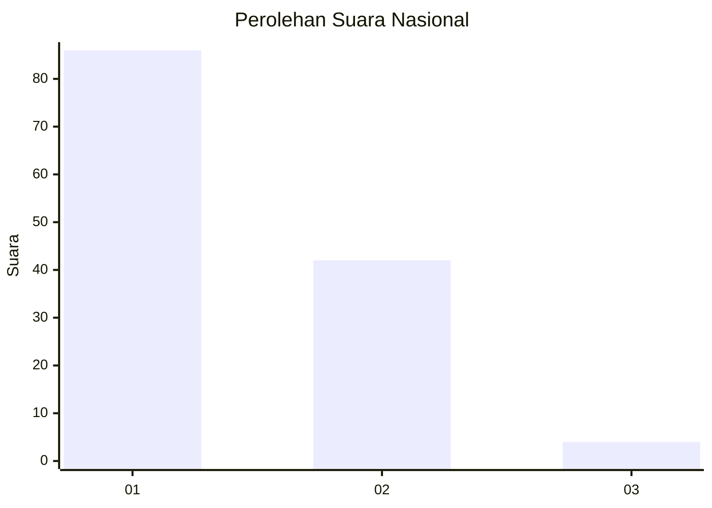
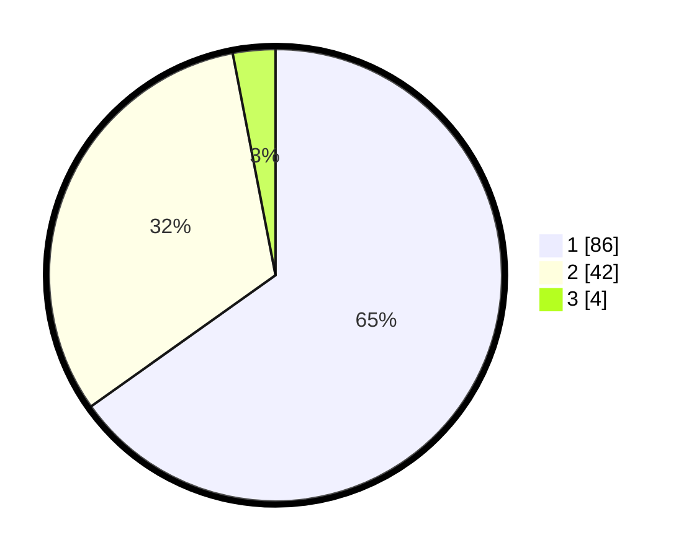

# Hasil

## Grafik

## Tabel

| No. | Nama Paslon    | Suara | Suara (raw) | Persentase |
|:--- |:-------------- | -----:| -----------:| ----------:|
| 1   | ANIES MUHAIMIN | 86    | [86][p-1]   | 65,15      |
| 2   | PRABOWO GIBRAN | 42    | [42][p-2]   | 31,82      |
| 3   | GANJAR MAHFUD  | 4     | [4][p-3]    | 3,03       |

[p-1]: https://github.com/gigit-pemilu/pemilu-2024/blob/main/pilpres/hitung-suara/sub/52-nusa-tenggara-barat/sub/03-lombok-timur/sub/05-masbagik/sub/2006-danger/sub/025-tps/sub/paslon-1.txt
[p-2]: https://github.com/gigit-pemilu/pemilu-2024/blob/main/pilpres/hitung-suara/sub/52-nusa-tenggara-barat/sub/03-lombok-timur/sub/05-masbagik/sub/2006-danger/sub/025-tps/sub/paslon-2.txt
[p-3]: https://github.com/gigit-pemilu/pemilu-2024/blob/main/pilpres/hitung-suara/sub/52-nusa-tenggara-barat/sub/03-lombok-timur/sub/05-masbagik/sub/2006-danger/sub/025-tps/sub/paslon-3.txt

## Foto C Plano

https://sirekap-obj-formc.kpu.go.id/9a19/pemilu/ppwp/52/03/05/20/06/5203052006025-20240314-122508--ecb8b368-c71c-4b01-bb94-012be63f966f.jpg

https://sirekap-obj-formc.kpu.go.id/9a19/pemilu/ppwp/52/03/05/20/06/5203052006025-20240314-122558--2cdefccf-daee-49b9-a438-d1456523ef95.jpg

https://sirekap-obj-formc.kpu.go.id/9a19/pemilu/ppwp/52/03/05/20/06/5203052006025-20240314-122654--82b4a857-f0bf-4bfd-8a91-d5128e8577d8.jpg

## Metadata

| Key        | Value               |
| ---------- | ------------------- |
| Time Stamp | 2024-03-14 12:30:00 |

## DATA PEMILIH TETAP

Jumlah pemilih dalam DPT: **235**.
 * L: **216**.
 * P: **119**.

## DATA PENGGUNA HAK PILIH

Jumlah pengguna hak pilih dalam DPT: **188**.
 * L: **484**.
 * P: **398**.

Jumlah pengguna hak pilih dalam DPTb: **0**.
 * L: **888**.
 * P: **0**.

Jumlah pengguna hak pilih dalam DPK: **4**.
 * L: **843**.
 * P: **881**.

Jumlah pengguna hak pilih: **482**.
 * L: **87**.
 * P: **195**.

## JUMLAH SUARA SAH DAN TIDAK SAH

JUMLAH SELURUH SUARA SAH: **187**.

JUMLAH SUARA TIDAK SAH: **5**.

JUMLAH SELURUH SUARA SAH DAN SUARA TIDAK SAH: **192**.

