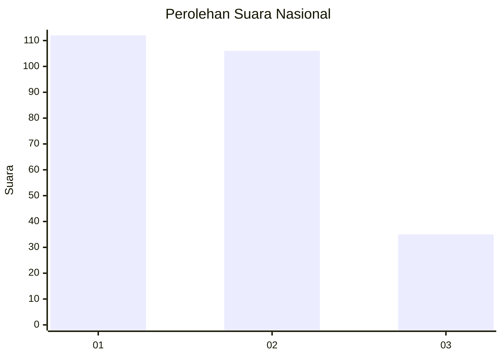
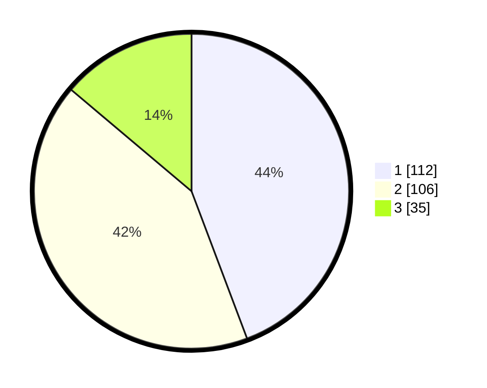

# Hasil

## Grafik

## Tabel

| No. | Nama Paslon    | Suara | Suara (raw) | Persentase |
|:--- |:-------------- | -----:| -----------:| ----------:|
| 1   | ANIES MUHAIMIN | 112   | [112][p-1]  | 44,27      |
| 2   | PRABOWO GIBRAN | 106   | [106][p-2]  | 41,90      |
| 3   | GANJAR MAHFUD  | 35    | [35][p-3]   | 13,83      |

[p-1]: https://github.com/gigit-pemilu/pemilu-2024/blob/main/pilpres/hitung-suara/sub/52-nusa-tenggara-barat/sub/03-lombok-timur/sub/07-selong/sub/1006-majidi/sub/012-tps/sub/paslon-1.txt
[p-2]: https://github.com/gigit-pemilu/pemilu-2024/blob/main/pilpres/hitung-suara/sub/52-nusa-tenggara-barat/sub/03-lombok-timur/sub/07-selong/sub/1006-majidi/sub/012-tps/sub/paslon-2.txt
[p-3]: https://github.com/gigit-pemilu/pemilu-2024/blob/main/pilpres/hitung-suara/sub/52-nusa-tenggara-barat/sub/03-lombok-timur/sub/07-selong/sub/1006-majidi/sub/012-tps/sub/paslon-3.txt

## Foto C Plano

https://sirekap-obj-formc.kpu.go.id/df23/pemilu/ppwp/52/03/07/10/06/5203071006012-20240214-210738--521aaffe-ac7f-42c8-b694-f81279d39ede.jpg

https://sirekap-obj-formc.kpu.go.id/df23/pemilu/ppwp/52/03/07/10/06/5203071006012-20240214-211823--2b04692d-4648-4fc5-9cc0-994cca1ff186.jpg

https://sirekap-obj-formc.kpu.go.id/df23/pemilu/ppwp/52/03/07/10/06/5203071006012-20240215-034546--a2eac7f0-e2dd-4a25-b7c7-21ae2a1df1c4.jpg

## Metadata

| Key        | Value               |
| ---------- | ------------------- |
| Time Stamp | 2024-02-15 23:29:50 |

