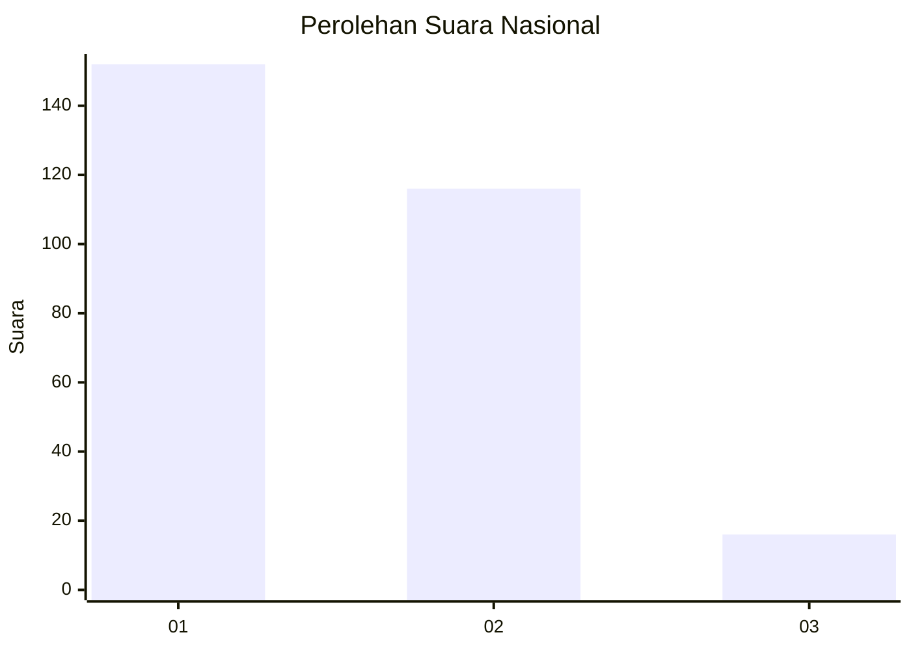
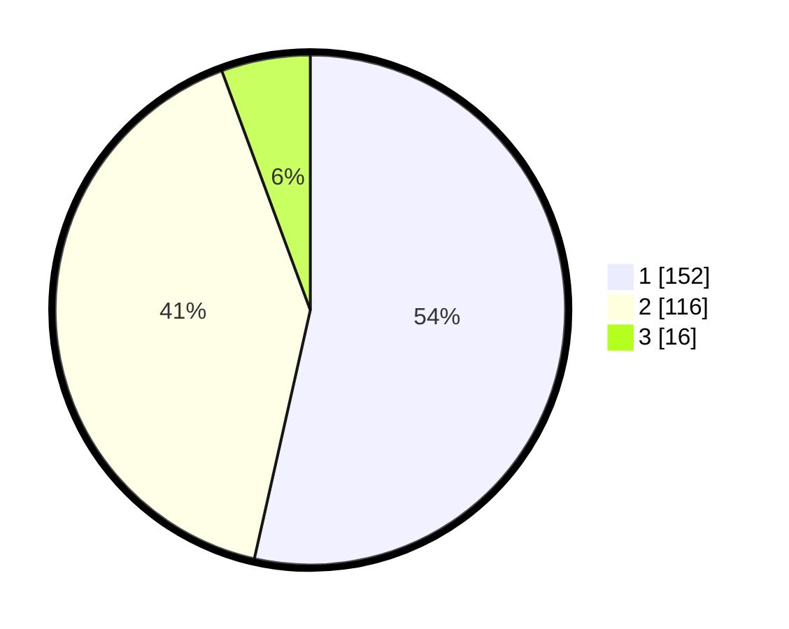

# Hasil

## Grafik

## Tabel

| No. | Nama Paslon    | Suara | Suara (raw) | Persentase |
|:--- |:-------------- | -----:| -----------:| ----------:|
| 1   | ANIES MUHAIMIN | 152   | [152][p-1]  | 53,52      |
| 2   | PRABOWO GIBRAN | 116   | [116][p-2]  | 40,85      |
| 3   | GANJAR MAHFUD  | 16    | [16][p-3]   | 5,63       |

[p-1]: https://github.com/gigit-pemilu/pemilu-2024/blob/main/pilpres/hitung-suara/sub/52-nusa-tenggara-barat/sub/03-lombok-timur/sub/07-selong/sub/1010-kelayu-utara/sub/008-tps/sub/paslon-1.txt
[p-2]: https://github.com/gigit-pemilu/pemilu-2024/blob/main/pilpres/hitung-suara/sub/52-nusa-tenggara-barat/sub/03-lombok-timur/sub/07-selong/sub/1010-kelayu-utara/sub/008-tps/sub/paslon-2.txt
[p-3]: https://github.com/gigit-pemilu/pemilu-2024/blob/main/pilpres/hitung-suara/sub/52-nusa-tenggara-barat/sub/03-lombok-timur/sub/07-selong/sub/1010-kelayu-utara/sub/008-tps/sub/paslon-3.txt

## Foto C Plano

https://sirekap-obj-formc.kpu.go.id/0b83/pemilu/ppwp/52/03/07/10/10/5203071010008-20240215-013743--902bdc33-b0aa-4ffb-b61b-35e81e60f518.jpg

https://sirekap-obj-formc.kpu.go.id/0b83/pemilu/ppwp/52/03/07/10/10/5203071010008-20240215-001327--21299ffe-c86f-4ac0-87ca-fa9f8aa08ce4.jpg

https://sirekap-obj-formc.kpu.go.id/0b83/pemilu/ppwp/52/03/07/10/10/5203071010008-20240215-013516--1c63f973-2b90-44c4-9194-4493cbd444e4.jpg

## Metadata

| Key        | Value               |
| ---------- | ------------------- |
| Time Stamp | 2024-02-25 21:00:00 |

