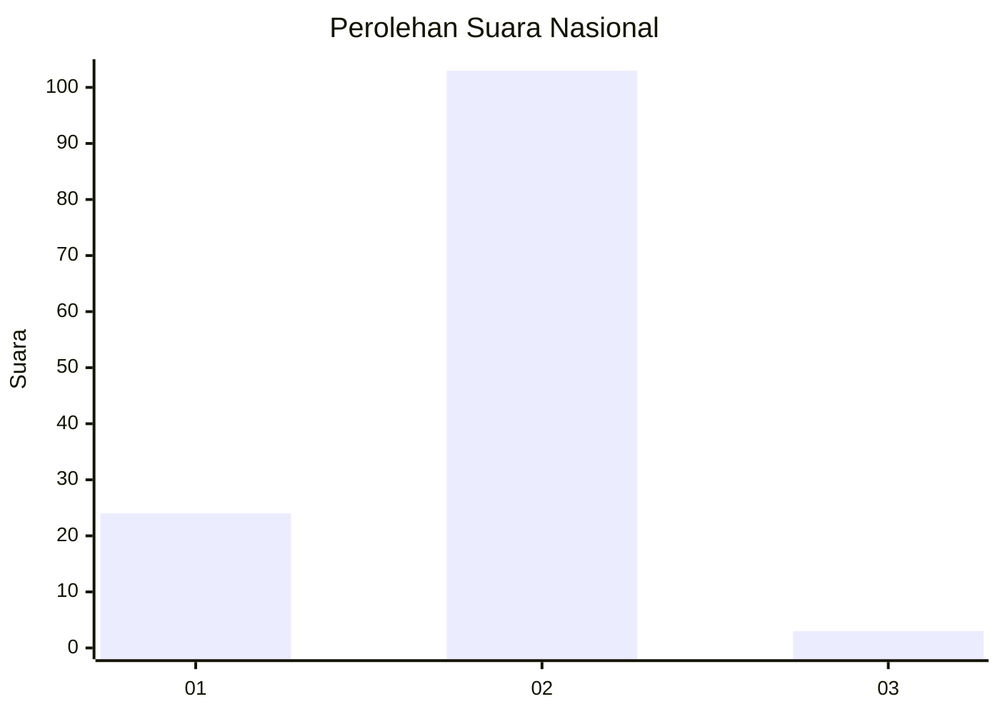
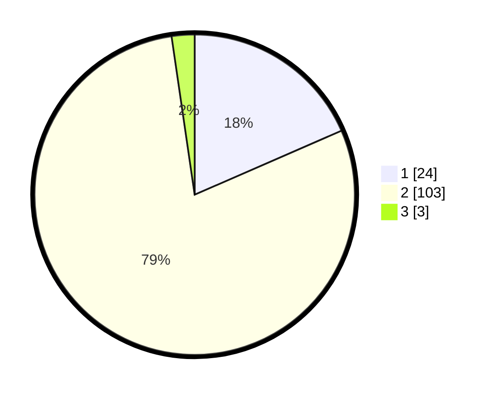

# Hasil

## Grafik

## Tabel

| No. | Nama Paslon    | Suara | Suara (raw) | Persentase |
|:--- |:-------------- | -----:| -----------:| ----------:|
| 1   | ANIES MUHAIMIN | 24    | [24][p-1]   | 18,46      |
| 2   | PRABOWO GIBRAN | 103   | [103][p-2]  | 79,23      |
| 3   | GANJAR MAHFUD  | 3     | [3][p-3]    | 2,31       |

[p-1]: https://github.com/gigit-pemilu/pemilu-2024/blob/main/pilpres/hitung-suara/sub/52-nusa-tenggara-barat/sub/03-lombok-timur/sub/08-pringgabaya/sub/2003-kerumut/sub/006-tps/sub/paslon-1.txt
[p-2]: https://github.com/gigit-pemilu/pemilu-2024/blob/main/pilpres/hitung-suara/sub/52-nusa-tenggara-barat/sub/03-lombok-timur/sub/08-pringgabaya/sub/2003-kerumut/sub/006-tps/sub/paslon-2.txt
[p-3]: https://github.com/gigit-pemilu/pemilu-2024/blob/main/pilpres/hitung-suara/sub/52-nusa-tenggara-barat/sub/03-lombok-timur/sub/08-pringgabaya/sub/2003-kerumut/sub/006-tps/sub/paslon-3.txt

## Foto C Plano

https://sirekap-obj-formc.kpu.go.id/1e5d/pemilu/ppwp/52/03/08/20/03/5203082003006-20240215-040826--d5e0db2d-a017-4f2a-a84e-d41aa914f669.jpg

https://sirekap-obj-formc.kpu.go.id/1e5d/pemilu/ppwp/52/03/08/20/03/5203082003006-20240215-041119--c34ee16d-07ee-43f4-97a0-666da32191af.jpg

https://sirekap-obj-formc.kpu.go.id/1e5d/pemilu/ppwp/52/03/08/20/03/5203082003006-20240215-041227--a6ba562a-cab4-42d7-83da-7f7e01d16e8c.jpg

## Metadata

| Key        | Value               |
| ---------- | ------------------- |
| Time Stamp | 2024-02-16 22:30:00 |

