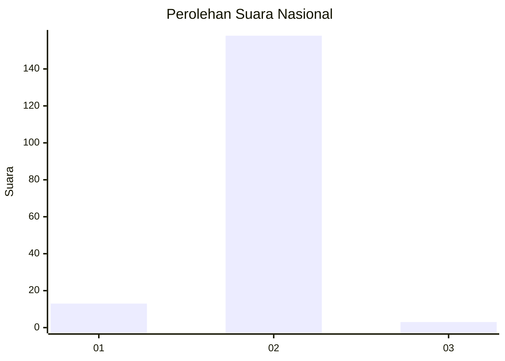
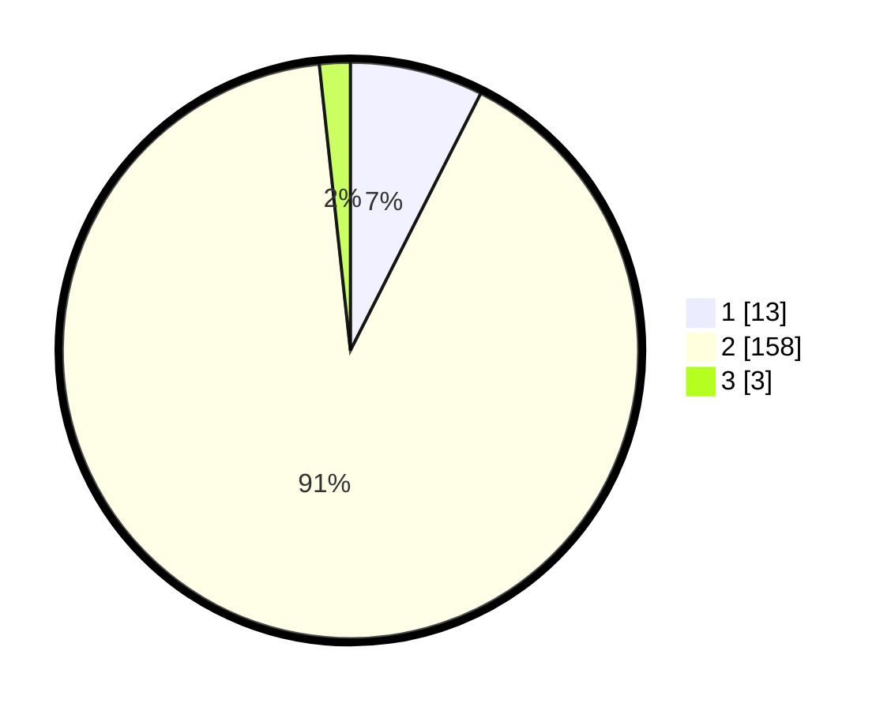

# Hasil

## Grafik

## Tabel

| No. | Nama Paslon    | Suara | Suara (raw) | Persentase |
|:--- |:-------------- | -----:| -----------:| ----------:|
| 1   | ANIES MUHAIMIN | 13    | [13][p-1]   | 7,47       |
| 2   | PRABOWO GIBRAN | 158   | [158][p-2]  | 90,80      |
| 3   | GANJAR MAHFUD  | 3     | [3][p-3]    | 1,72       |

[p-1]: https://github.com/gigit-pemilu/pemilu-2024/blob/main/pilpres/hitung-suara/sub/52-nusa-tenggara-barat/sub/03-lombok-timur/sub/08-pringgabaya/sub/2007-labuhan-lombok/sub/004-tps/sub/paslon-1.txt
[p-2]: https://github.com/gigit-pemilu/pemilu-2024/blob/main/pilpres/hitung-suara/sub/52-nusa-tenggara-barat/sub/03-lombok-timur/sub/08-pringgabaya/sub/2007-labuhan-lombok/sub/004-tps/sub/paslon-2.txt
[p-3]: https://github.com/gigit-pemilu/pemilu-2024/blob/main/pilpres/hitung-suara/sub/52-nusa-tenggara-barat/sub/03-lombok-timur/sub/08-pringgabaya/sub/2007-labuhan-lombok/sub/004-tps/sub/paslon-3.txt

## Foto C Plano

https://sirekap-obj-formc.kpu.go.id/dbae/pemilu/ppwp/52/03/08/20/07/5203082007004-20240215-102702--f7b96431-ea1b-40c4-8b44-14583457f5be.jpg

https://sirekap-obj-formc.kpu.go.id/dbae/pemilu/ppwp/52/03/08/20/07/5203082007004-20240215-102906--ea893f9e-e45a-48f5-989c-9fa05153dea9.jpg

https://sirekap-obj-formc.kpu.go.id/dbae/pemilu/ppwp/52/03/08/20/07/5203082007004-20240215-103015--9fbc02e3-3187-43e7-ab9c-c02d6e94dff5.jpg

## Metadata

| Key        | Value               |
| ---------- | ------------------- |
| Time Stamp | 2024-02-15 21:30:27 |

