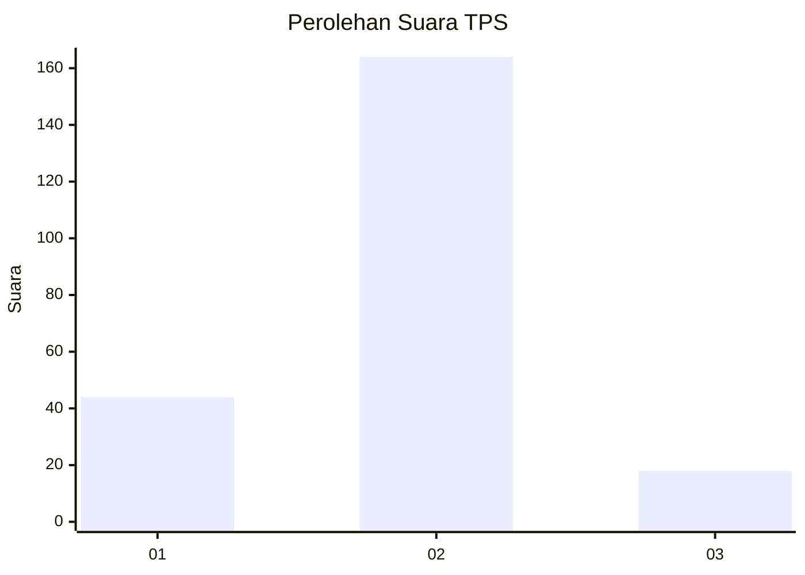
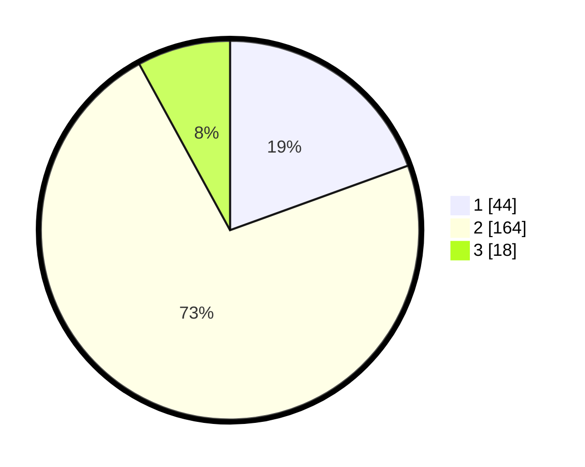

# Hasil

## Grafik

## Tabel

| No. | Nama Paslon    | Suara | Suara (raw) | Persentase |
|:--- |:-------------- | -----:| -----------:| ----------:|
| 1   | ANIES MUHAIMIN | 44    | [44][p-1]   | 19,47      |
| 2   | PRABOWO GIBRAN | 164   | [164][p-2]  | 72,57      |
| 3   | GANJAR MAHFUD  | 18    | [18][p-3]   | 7,96       |

[p-1]: https://github.com/gigit-pemilu/pemilu-2024-52-nusa-tenggara-barat/blob/main/pilpres/hitung-suara/sub/52-nusa-tenggara-barat/sub/03-lombok-timur/sub/09-aikmel/sub/2002-aikmel/sub/005-tps/sub/paslon-1.txt
[p-2]: https://github.com/gigit-pemilu/pemilu-2024-52-nusa-tenggara-barat/blob/main/pilpres/hitung-suara/sub/52-nusa-tenggara-barat/sub/03-lombok-timur/sub/09-aikmel/sub/2002-aikmel/sub/005-tps/sub/paslon-2.txt
[p-3]: https://github.com/gigit-pemilu/pemilu-2024-52-nusa-tenggara-barat/blob/main/pilpres/hitung-suara/sub/52-nusa-tenggara-barat/sub/03-lombok-timur/sub/09-aikmel/sub/2002-aikmel/sub/005-tps/sub/paslon-3.txt

## Foto C Plano

https://sirekap-obj-formc.kpu.go.id/6be8/pemilu/ppwp/52/03/09/20/02/5203092002005-20240215-082714--0d70855e-ec0a-4d84-8b0d-6ad94ce2ca91.jpg

https://sirekap-obj-formc.kpu.go.id/6be8/pemilu/ppwp/52/03/09/20/02/5203092002005-20240215-082830--194a3681-a145-4c5a-9018-d8c87344bc38.jpg

https://sirekap-obj-formc.kpu.go.id/6be8/pemilu/ppwp/52/03/09/20/02/5203092002005-20240216-133923--b021079f-0f11-4d87-bc1a-96900e9d02fa.jpg

## Metadata

| Key        | Value               |
| ---------- | ------------------- |
| Time Stamp | 2024-02-16 14:00:34 |

