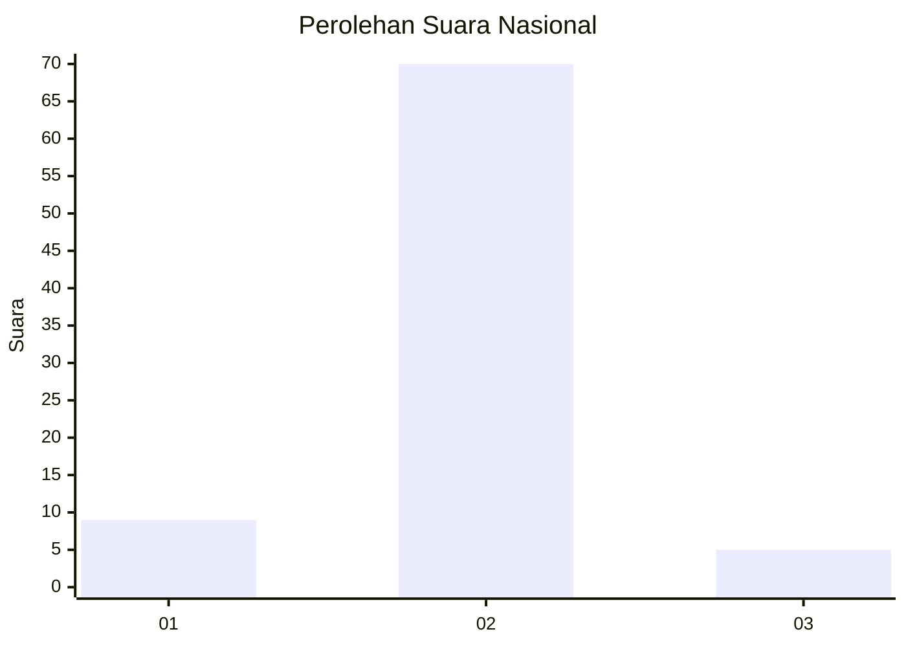
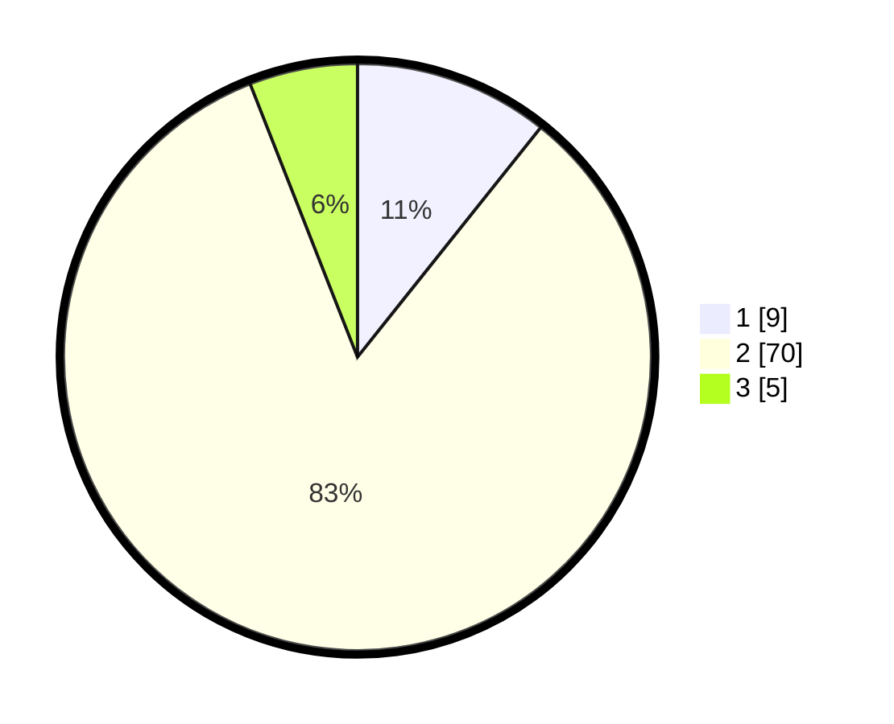

# Hasil

## Grafik

## Tabel

| No. | Nama Paslon    | Suara | Suara (raw) | Persentase |
|:--- |:-------------- | -----:| -----------:| ----------:|
| 1   | ANIES MUHAIMIN | 9     | [9][p-1]    | 10,71      |
| 2   | PRABOWO GIBRAN | 70    | [70][p-2]   | 83,33      |
| 3   | GANJAR MAHFUD  | 5     | [5][p-3]    | 5,95       |

[p-1]: https://github.com/gigit-pemilu/pemilu-2024/blob/main/pilpres/hitung-suara/sub/52-nusa-tenggara-barat/sub/03-lombok-timur/sub/10-sambelia/sub/2004-labuhan-pandan/sub/009-tps/sub/paslon-1.txt
[p-2]: https://github.com/gigit-pemilu/pemilu-2024/blob/main/pilpres/hitung-suara/sub/52-nusa-tenggara-barat/sub/03-lombok-timur/sub/10-sambelia/sub/2004-labuhan-pandan/sub/009-tps/sub/paslon-2.txt
[p-3]: https://github.com/gigit-pemilu/pemilu-2024/blob/main/pilpres/hitung-suara/sub/52-nusa-tenggara-barat/sub/03-lombok-timur/sub/10-sambelia/sub/2004-labuhan-pandan/sub/009-tps/sub/paslon-3.txt

## Foto C Plano

https://sirekap-obj-formc.kpu.go.id/c288/pemilu/ppwp/52/03/10/20/04/5203102004009-20240223-100719--7c6b6e83-fe62-42c9-bdd4-8c781bd6160c.jpg

https://sirekap-obj-formc.kpu.go.id/c288/pemilu/ppwp/52/03/10/20/04/5203102004009-20240223-100439--5353de4d-4621-4cb6-9dbd-07ca4134b3c9.jpg

https://sirekap-obj-formc.kpu.go.id/c288/pemilu/ppwp/52/03/10/20/04/5203102004009-20240223-100424--ed81ff60-f809-4ccf-aea1-8c942d4f9ec4.jpg

## Metadata

| Key        | Value               |
| ---------- | ------------------- |
| Time Stamp | 2024-02-25 15:00:00 |

