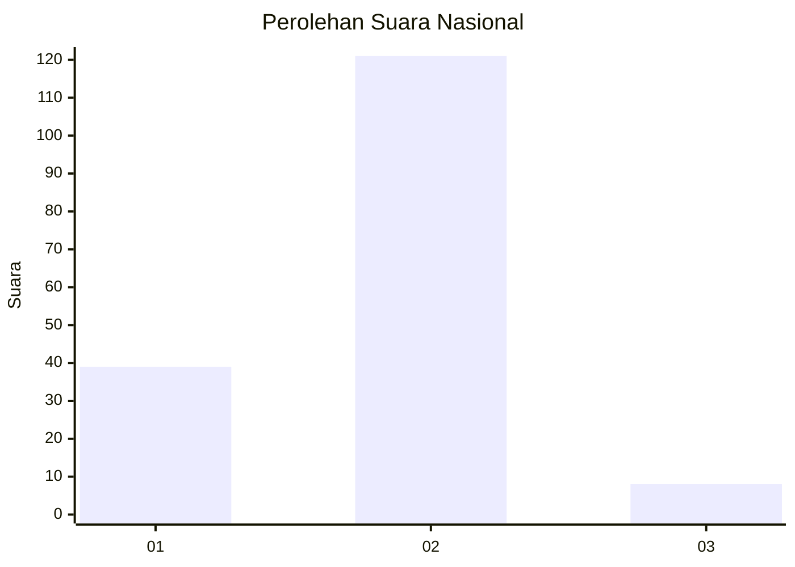
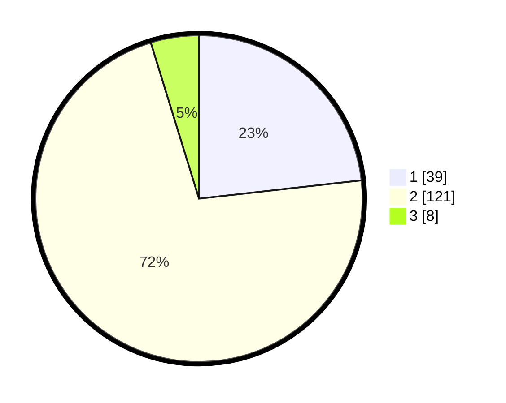

# Hasil

## Grafik

## Tabel

| No. | Nama Paslon    | Suara | Suara (raw) | Persentase |
|:--- |:-------------- | -----:| -----------:| ----------:|
| 1   | ANIES MUHAIMIN | 39    | [39][p-1]   | 23,21      |
| 2   | PRABOWO GIBRAN | 121   | [121][p-2]  | 72,02      |
| 3   | GANJAR MAHFUD  | 8     | [8][p-3]    | 4,76       |

[p-1]: https://github.com/gigit-pemilu/pemilu-2024/blob/main/pilpres/hitung-suara/sub/52-nusa-tenggara-barat/sub/03-lombok-timur/sub/11-montong-gading/sub/2001-pringga-jurang/sub/002-tps/sub/paslon-1.txt
[p-2]: https://github.com/gigit-pemilu/pemilu-2024/blob/main/pilpres/hitung-suara/sub/52-nusa-tenggara-barat/sub/03-lombok-timur/sub/11-montong-gading/sub/2001-pringga-jurang/sub/002-tps/sub/paslon-2.txt
[p-3]: https://github.com/gigit-pemilu/pemilu-2024/blob/main/pilpres/hitung-suara/sub/52-nusa-tenggara-barat/sub/03-lombok-timur/sub/11-montong-gading/sub/2001-pringga-jurang/sub/002-tps/sub/paslon-3.txt

## Foto C Plano

https://sirekap-obj-formc.kpu.go.id/cd9f/pemilu/ppwp/52/03/11/20/01/5203112001002-20240215-030530--f57707c8-a000-4b9b-bf67-19828c73622a.jpg

https://sirekap-obj-formc.kpu.go.id/cd9f/pemilu/ppwp/52/03/11/20/01/5203112001002-20240215-030611--566a3df2-95e0-4bd2-a0c4-c5b8a467f499.jpg

https://sirekap-obj-formc.kpu.go.id/cd9f/pemilu/ppwp/52/03/11/20/01/5203112001002-20240215-045536--cb89dabe-3c82-411e-b939-dc329c6dacf4.jpg

## Metadata

| Key        | Value               |
| ---------- | ------------------- |
| Time Stamp | 2024-02-16 00:00:26 |

