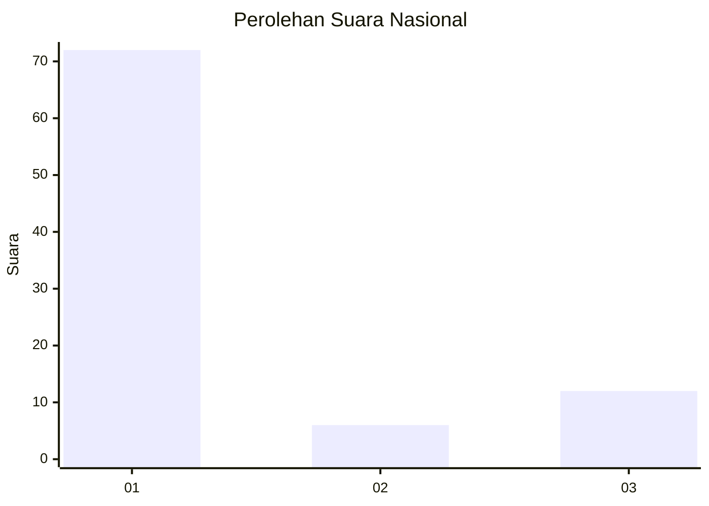
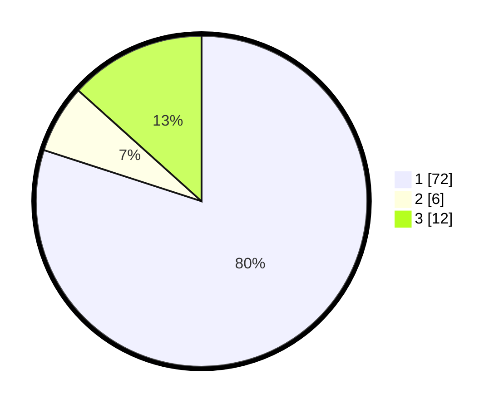

# Hasil

## Grafik

## Tabel

| No. | Nama Paslon    | Suara | Suara (raw) | Persentase |
|:--- |:-------------- | -----:| -----------:| ----------:|
| 1   | ANIES MUHAIMIN | 72    | [72][p-1]   | 80,00      |
| 2   | PRABOWO GIBRAN | 6     | [6][p-2]    | 6,67       |
| 3   | GANJAR MAHFUD  | 12    | [12][p-3]   | 13,33      |

[p-1]: https://github.com/gigit-pemilu/pemilu-2024/blob/main/pilpres/hitung-suara/sub/52-nusa-tenggara-barat/sub/03-lombok-timur/sub/11-montong-gading/sub/2003-kilang/sub/017-tps/sub/paslon-1.txt
[p-2]: https://github.com/gigit-pemilu/pemilu-2024/blob/main/pilpres/hitung-suara/sub/52-nusa-tenggara-barat/sub/03-lombok-timur/sub/11-montong-gading/sub/2003-kilang/sub/017-tps/sub/paslon-2.txt
[p-3]: https://github.com/gigit-pemilu/pemilu-2024/blob/main/pilpres/hitung-suara/sub/52-nusa-tenggara-barat/sub/03-lombok-timur/sub/11-montong-gading/sub/2003-kilang/sub/017-tps/sub/paslon-3.txt

## Foto C Plano

https://sirekap-obj-formc.kpu.go.id/1e67/pemilu/ppwp/52/03/11/20/03/5203112003017-20240214-232811--93a29c3d-c7e5-4cc7-a632-a26af57024ae.jpg

https://sirekap-obj-formc.kpu.go.id/1e67/pemilu/ppwp/52/03/11/20/03/5203112003017-20240214-224528--feacfae0-a14b-4861-a661-fefe0435dcc8.jpg

https://sirekap-obj-formc.kpu.go.id/1e67/pemilu/ppwp/52/03/11/20/03/5203112003017-20240214-224637--52051959-bde5-43a7-b733-597425dccf55.jpg

## Metadata

| Key        | Value               |
| ---------- | ------------------- |
| Time Stamp | 2024-02-15 23:29:50 |

