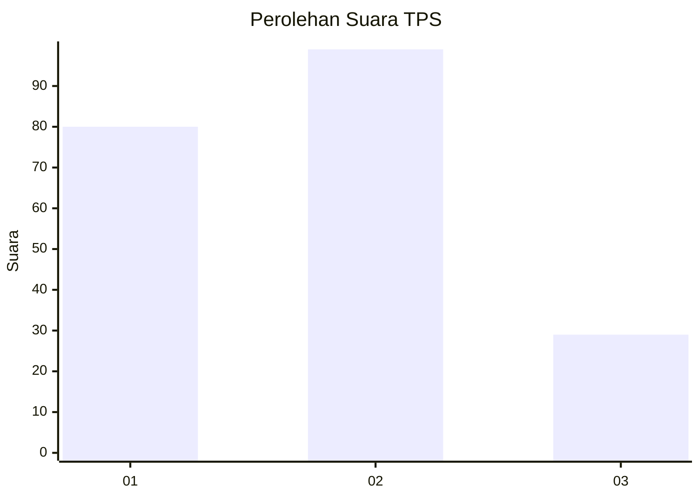
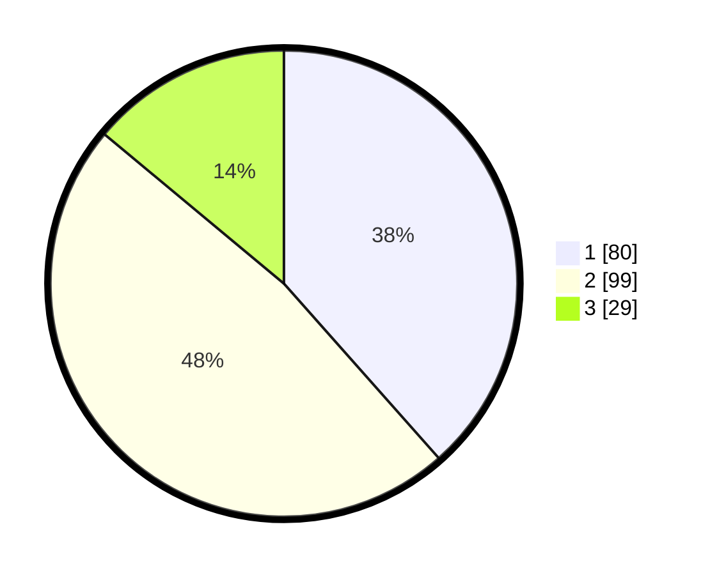

# Hasil

## Grafik

## Tabel

| No. | Nama Paslon    | Suara | Suara (raw) | Persentase |
|:--- |:-------------- | -----:| -----------:| ----------:|
| 1   | ANIES MUHAIMIN | 80    | [80][p-1]   | 38,46      |
| 2   | PRABOWO GIBRAN | 99    | [99][p-2]   | 47,60      |
| 3   | GANJAR MAHFUD  | 29    | [29][p-3]   | 13,94      |

[p-1]: https://github.com/gigit-pemilu/pemilu-2024-52-nusa-tenggara-barat/blob/main/pilpres/hitung-suara/sub/52-nusa-tenggara-barat/sub/03-lombok-timur/sub/12-pringgasela/sub/2001-rempung/sub/003-tps/sub/paslon-1.txt
[p-2]: https://github.com/gigit-pemilu/pemilu-2024-52-nusa-tenggara-barat/blob/main/pilpres/hitung-suara/sub/52-nusa-tenggara-barat/sub/03-lombok-timur/sub/12-pringgasela/sub/2001-rempung/sub/003-tps/sub/paslon-2.txt
[p-3]: https://github.com/gigit-pemilu/pemilu-2024-52-nusa-tenggara-barat/blob/main/pilpres/hitung-suara/sub/52-nusa-tenggara-barat/sub/03-lombok-timur/sub/12-pringgasela/sub/2001-rempung/sub/003-tps/sub/paslon-3.txt

## Foto C Plano

https://sirekap-obj-formc.kpu.go.id/5284/pemilu/ppwp/52/03/12/20/01/5203122001003-20240216-151010--d076d5f8-1fc0-43ba-b691-2ed8523deb83.jpg

https://sirekap-obj-formc.kpu.go.id/5284/pemilu/ppwp/52/03/12/20/01/5203122001003-20240214-232831--bfed801c-01ff-4836-b8bd-397738f81993.jpg

https://sirekap-obj-formc.kpu.go.id/5284/pemilu/ppwp/52/03/12/20/01/5203122001003-20240214-232840--5919cd32-a5ec-46b4-8669-c0d2fec47ad1.jpg

## Metadata

| Key        | Value               |
| ---------- | ------------------- |
| Time Stamp | 2024-02-16 16:25:10 |

