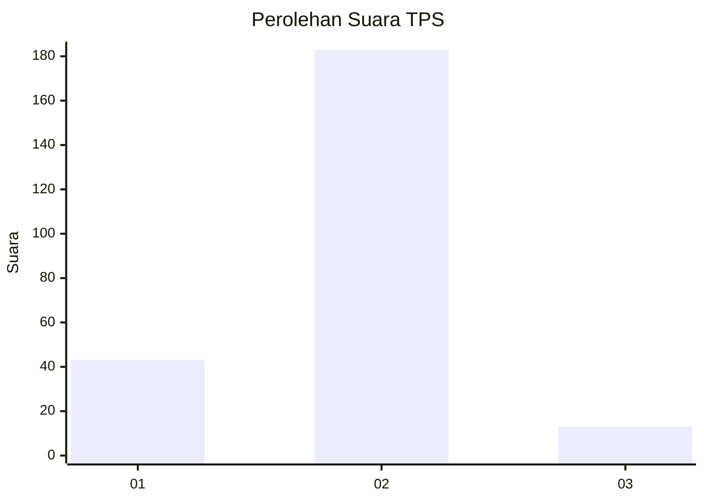
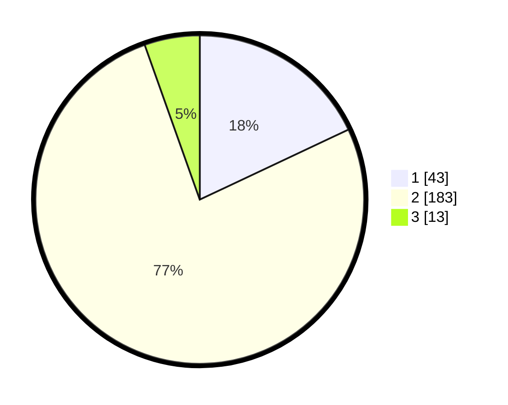

# Hasil

## Grafik

## Tabel

| No. | Nama Paslon    | Suara | Suara (raw) | Persentase |
|:--- |:-------------- | -----:| -----------:| ----------:|
| 1   | ANIES MUHAIMIN | 43    | [43][p-1]   | 17,99      |
| 2   | PRABOWO GIBRAN | 183   | [183][p-2]  | 76,57      |
| 3   | GANJAR MAHFUD  | 13    | [13][p-3]   | 5,44       |

[p-1]: https://github.com/gigit-pemilu/pemilu-2024-52-nusa-tenggara-barat/blob/main/pilpres/hitung-suara/sub/52-nusa-tenggara-barat/sub/03-lombok-timur/sub/15-sembalun/sub/2001-sembalun-bumbung/sub/003-tps/sub/paslon-1.txt
[p-2]: https://github.com/gigit-pemilu/pemilu-2024-52-nusa-tenggara-barat/blob/main/pilpres/hitung-suara/sub/52-nusa-tenggara-barat/sub/03-lombok-timur/sub/15-sembalun/sub/2001-sembalun-bumbung/sub/003-tps/sub/paslon-2.txt
[p-3]: https://github.com/gigit-pemilu/pemilu-2024-52-nusa-tenggara-barat/blob/main/pilpres/hitung-suara/sub/52-nusa-tenggara-barat/sub/03-lombok-timur/sub/15-sembalun/sub/2001-sembalun-bumbung/sub/003-tps/sub/paslon-3.txt

## Foto C Plano

https://sirekap-obj-formc.kpu.go.id/74ba/pemilu/ppwp/52/03/15/20/01/5203152001003-20240215-080328--40170c6b-ee4e-44b1-bb1c-62fd96cd9416.jpg

https://sirekap-obj-formc.kpu.go.id/74ba/pemilu/ppwp/52/03/15/20/01/5203152001003-20240215-080635--1f41995f-3b45-41ac-9600-27ae8ad7cf3e.jpg

https://sirekap-obj-formc.kpu.go.id/74ba/pemilu/ppwp/52/03/15/20/01/5203152001003-20240215-080520--48a358de-babc-4ae3-9f66-df73dd168fb9.jpg

## Metadata

| Key        | Value               |
| ---------- | ------------------- |
| Time Stamp | 2024-02-15 20:30:46 |

