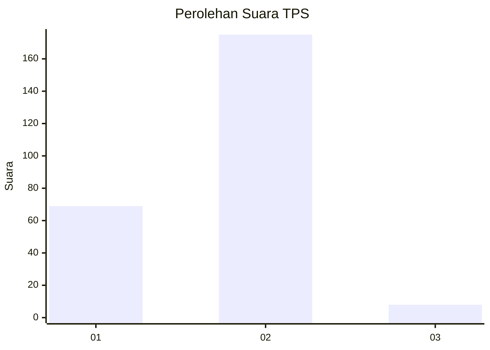
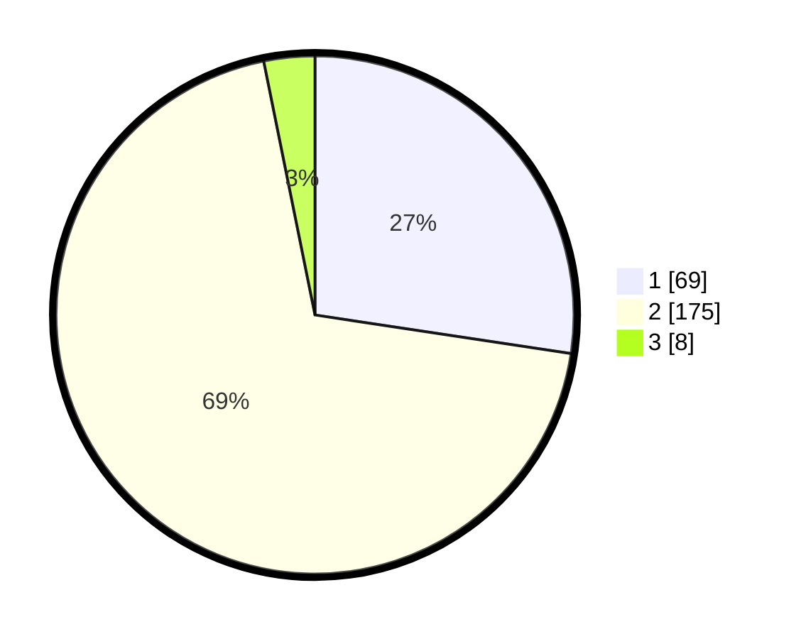

# Hasil

## Grafik

## Tabel

| No. | Nama Paslon    | Suara | Suara (raw) | Persentase |
|:--- |:-------------- | -----:| -----------:| ----------:|
| 1   | ANIES MUHAIMIN | 69    | [69][p-1]   | 27,38      |
| 2   | PRABOWO GIBRAN | 175   | [175][p-2]  | 69,44      |
| 3   | GANJAR MAHFUD  | 8     | [8][p-3]    | 3,17       |

[p-1]: https://github.com/gigit-pemilu/pemilu-2024-52-nusa-tenggara-barat/blob/main/pilpres/hitung-suara/sub/52-nusa-tenggara-barat/sub/03-lombok-timur/sub/15-sembalun/sub/2001-sembalun-bumbung/sub/004-tps/sub/paslon-1.txt
[p-2]: https://github.com/gigit-pemilu/pemilu-2024-52-nusa-tenggara-barat/blob/main/pilpres/hitung-suara/sub/52-nusa-tenggara-barat/sub/03-lombok-timur/sub/15-sembalun/sub/2001-sembalun-bumbung/sub/004-tps/sub/paslon-2.txt
[p-3]: https://github.com/gigit-pemilu/pemilu-2024-52-nusa-tenggara-barat/blob/main/pilpres/hitung-suara/sub/52-nusa-tenggara-barat/sub/03-lombok-timur/sub/15-sembalun/sub/2001-sembalun-bumbung/sub/004-tps/sub/paslon-3.txt

## Foto C Plano

https://sirekap-obj-formc.kpu.go.id/136b/pemilu/ppwp/52/03/15/20/01/5203152001004-20240215-083727--22e3e035-64ad-48ea-beb6-fdcde98c2272.jpg

https://sirekap-obj-formc.kpu.go.id/136b/pemilu/ppwp/52/03/15/20/01/5203152001004-20240215-083907--19e5601e-7b14-462f-82be-e07b4ce4df15.jpg

https://sirekap-obj-formc.kpu.go.id/136b/pemilu/ppwp/52/03/15/20/01/5203152001004-20240215-084116--813070ba-434e-44be-a18c-b2295ea45394.jpg

## Metadata

| Key        | Value               |
| ---------- | ------------------- |
| Time Stamp | 2024-02-15 20:30:46 |

