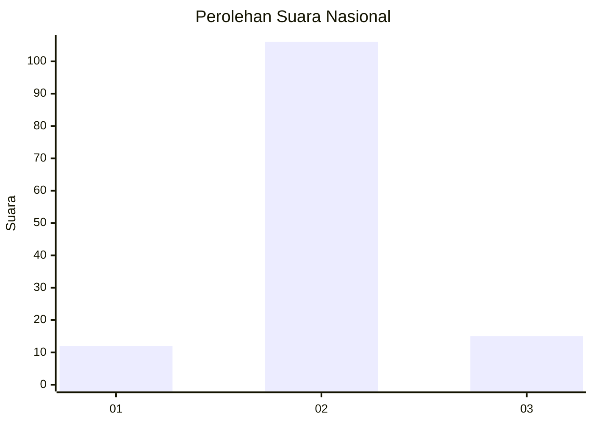
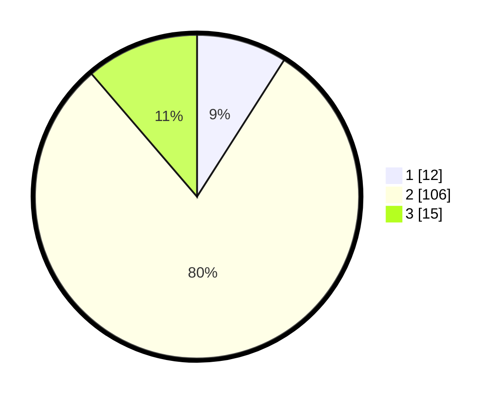

# Hasil

## Grafik

## Tabel

| No. | Nama Paslon    | Suara | Suara (raw) | Persentase |
|:--- |:-------------- | -----:| -----------:| ----------:|
| 1   | ANIES MUHAIMIN | 12    | [12][p-1]   | 9,02       |
| 2   | PRABOWO GIBRAN | 106   | [106][p-2]  | 79,70      |
| 3   | GANJAR MAHFUD  | 15    | [15][p-3]   | 11,28      |

[p-1]: https://github.com/gigit-pemilu/pemilu-2024/blob/main/pilpres/hitung-suara/sub/52-nusa-tenggara-barat/sub/03-lombok-timur/sub/17-labuhan-haji/sub/2008-kertasari/sub/005-tps/sub/paslon-1.txt
[p-2]: https://github.com/gigit-pemilu/pemilu-2024/blob/main/pilpres/hitung-suara/sub/52-nusa-tenggara-barat/sub/03-lombok-timur/sub/17-labuhan-haji/sub/2008-kertasari/sub/005-tps/sub/paslon-2.txt
[p-3]: https://github.com/gigit-pemilu/pemilu-2024/blob/main/pilpres/hitung-suara/sub/52-nusa-tenggara-barat/sub/03-lombok-timur/sub/17-labuhan-haji/sub/2008-kertasari/sub/005-tps/sub/paslon-3.txt

## Foto C Plano

https://sirekap-obj-formc.kpu.go.id/1162/pemilu/ppwp/52/03/17/20/08/5203172008005-20240214-221518--7c431b6f-5abc-43a7-acb8-5000c8738507.jpg

https://sirekap-obj-formc.kpu.go.id/1162/pemilu/ppwp/52/03/17/20/08/5203172008005-20240214-213333--6b3e4967-7447-49c4-91c4-729dfeb6a4b2.jpg

https://sirekap-obj-formc.kpu.go.id/1162/pemilu/ppwp/52/03/17/20/08/5203172008005-20240215-054135--57bbb2fa-a2a2-4493-b43b-1f78a19c8694.jpg

## Metadata

| Key        | Value               |
| ---------- | ------------------- |
| Time Stamp | 2024-02-17 13:37:34 |

