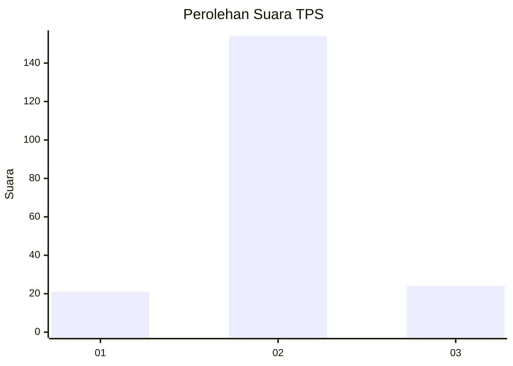
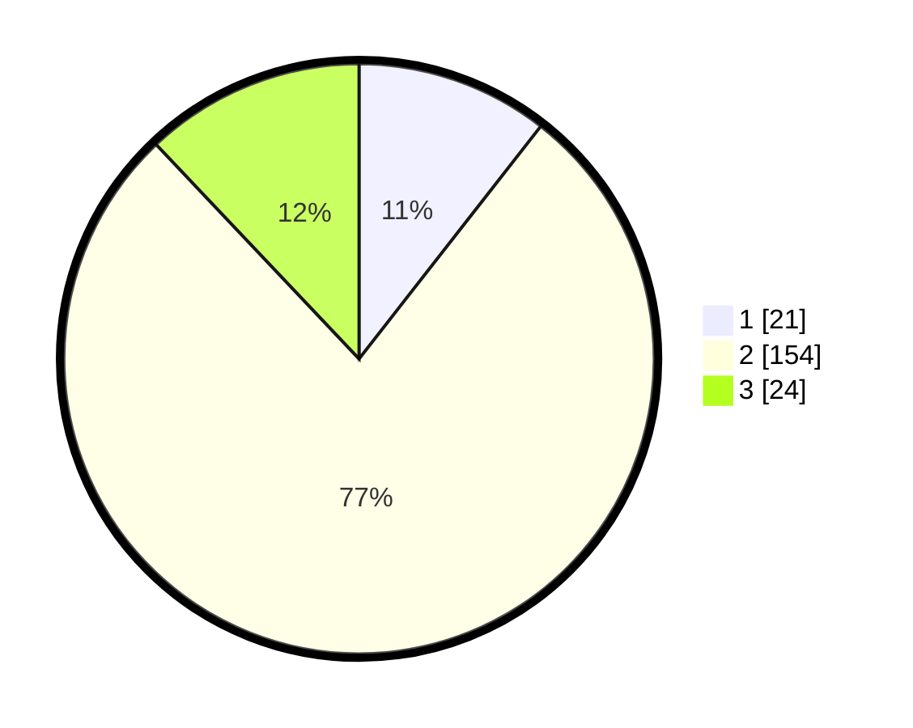

# Hasil

## Grafik

## Tabel

| No. | Nama Paslon    | Suara | Suara (raw) | Persentase |
|:--- |:-------------- | -----:| -----------:| ----------:|
| 1   | ANIES MUHAIMIN | 21    | [21][p-1]   | 10,55      |
| 2   | PRABOWO GIBRAN | 154   | [154][p-2]  | 77,39      |
| 3   | GANJAR MAHFUD  | 24    | [24][p-3]   | 12,06      |

[p-1]: https://github.com/gigit-pemilu/pemilu-2024-52-nusa-tenggara-barat/blob/main/pilpres/hitung-suara/sub/52-nusa-tenggara-barat/sub/03-lombok-timur/sub/18-sakra-timur/sub/2006-menceh/sub/010-tps/sub/paslon-1.txt
[p-2]: https://github.com/gigit-pemilu/pemilu-2024-52-nusa-tenggara-barat/blob/main/pilpres/hitung-suara/sub/52-nusa-tenggara-barat/sub/03-lombok-timur/sub/18-sakra-timur/sub/2006-menceh/sub/010-tps/sub/paslon-2.txt
[p-3]: https://github.com/gigit-pemilu/pemilu-2024-52-nusa-tenggara-barat/blob/main/pilpres/hitung-suara/sub/52-nusa-tenggara-barat/sub/03-lombok-timur/sub/18-sakra-timur/sub/2006-menceh/sub/010-tps/sub/paslon-3.txt

## Foto C Plano

https://sirekap-obj-formc.kpu.go.id/e923/pemilu/ppwp/52/03/18/20/06/5203182006010-20240217-154407--aab1407a-cde7-4471-9332-7dbcbb0f639c.jpg

https://sirekap-obj-formc.kpu.go.id/e923/pemilu/ppwp/52/03/18/20/06/5203182006010-20240217-154529--db9846a4-dbb8-4e3c-b41c-ce41b72bca44.jpg

https://sirekap-obj-formc.kpu.go.id/e923/pemilu/ppwp/52/03/18/20/06/5203182006010-20240217-154635--c1f28107-47b6-433b-9daa-b4dc9b49e67a.jpg

## Metadata

| Key        | Value               |
| ---------- | ------------------- |
| Time Stamp | 2024-02-17 16:52:47 |

## DATA PEMILIH TETAP

Jumlah pemilih dalam DPT: **245**.
 * L: **648**.
 * P: **542**.

## DATA PENGGUNA HAK PILIH

Jumlah pengguna hak pilih dalam DPT: **842**.
 * L: **58**.
 * P: **824**.

Jumlah pengguna hak pilih dalam DPTb: **6**.
 * L: **8**.
 * P: **6**.

Jumlah pengguna hak pilih dalam DPK: **60**.
 * L: **9**.
 * P: **5**.

Jumlah pengguna hak pilih: **208**.
 * L: **65**.
 * P: **840**.

## JUMLAH SUARA SAH DAN TIDAK SAH

JUMLAH SELURUH SUARA SAH: **199**.

JUMLAH SUARA TIDAK SAH: **7**.

JUMLAH SELURUH SUARA SAH DAN SUARA TIDAK SAH: **206**.

