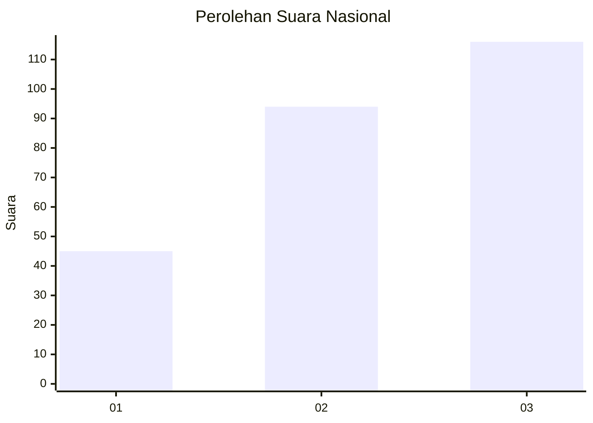
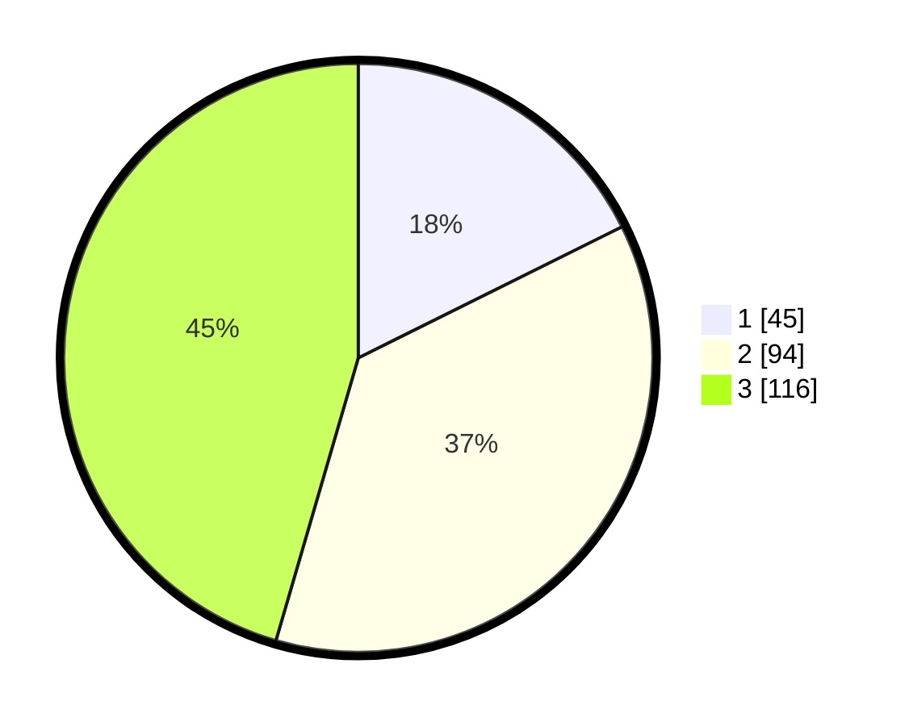

# Hasil

## Grafik

## Tabel

| No. | Nama Paslon    | Suara | Suara (raw) | Persentase |
|:--- |:-------------- | -----:| -----------:| ----------:|
| 1   | ANIES MUHAIMIN | 45    | [45][p-1]   | 17,65      |
| 2   | PRABOWO GIBRAN | 94    | [94][p-2]   | 36,86      |
| 3   | GANJAR MAHFUD  | 116   | [116][p-3]  | 45,49      |

[p-1]: https://github.com/gigit-pemilu/pemilu-2024/blob/main/pilpres/hitung-suara/sub/52-nusa-tenggara-barat/sub/03-lombok-timur/sub/19-sakra-barat/sub/2003-rensing/sub/009-tps/sub/paslon-1.txt
[p-2]: https://github.com/gigit-pemilu/pemilu-2024/blob/main/pilpres/hitung-suara/sub/52-nusa-tenggara-barat/sub/03-lombok-timur/sub/19-sakra-barat/sub/2003-rensing/sub/009-tps/sub/paslon-2.txt
[p-3]: https://github.com/gigit-pemilu/pemilu-2024/blob/main/pilpres/hitung-suara/sub/52-nusa-tenggara-barat/sub/03-lombok-timur/sub/19-sakra-barat/sub/2003-rensing/sub/009-tps/sub/paslon-3.txt

## Foto C Plano

https://sirekap-obj-formc.kpu.go.id/af72/pemilu/ppwp/52/03/19/20/03/5203192003009-20240225-165148--683c9588-0666-405d-b223-43aeafc6e49a.jpg

https://sirekap-obj-formc.kpu.go.id/af72/pemilu/ppwp/52/03/19/20/03/5203192003009-20240225-165240--8543ca31-6dc1-416e-81ea-d00e33d7b420.jpg

https://sirekap-obj-formc.kpu.go.id/af72/pemilu/ppwp/52/03/19/20/03/5203192003009-20240225-165331--9e01c14f-8041-4657-a3c5-0372229239d9.jpg

## Metadata

| Key        | Value               |
| ---------- | ------------------- |
| Time Stamp | 2024-02-28 20:00:00 |

