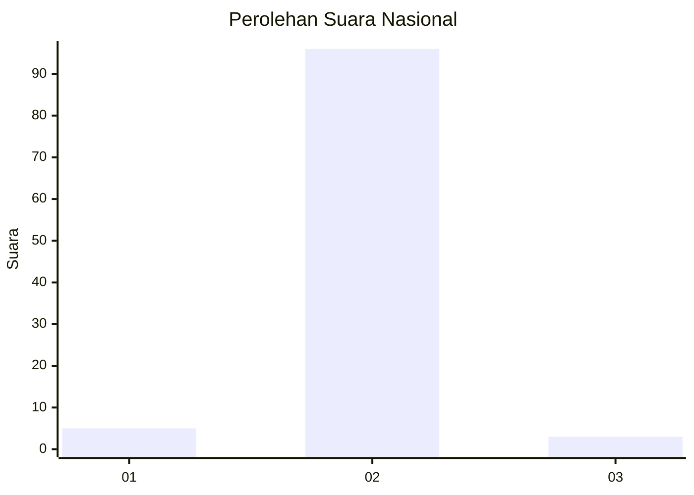
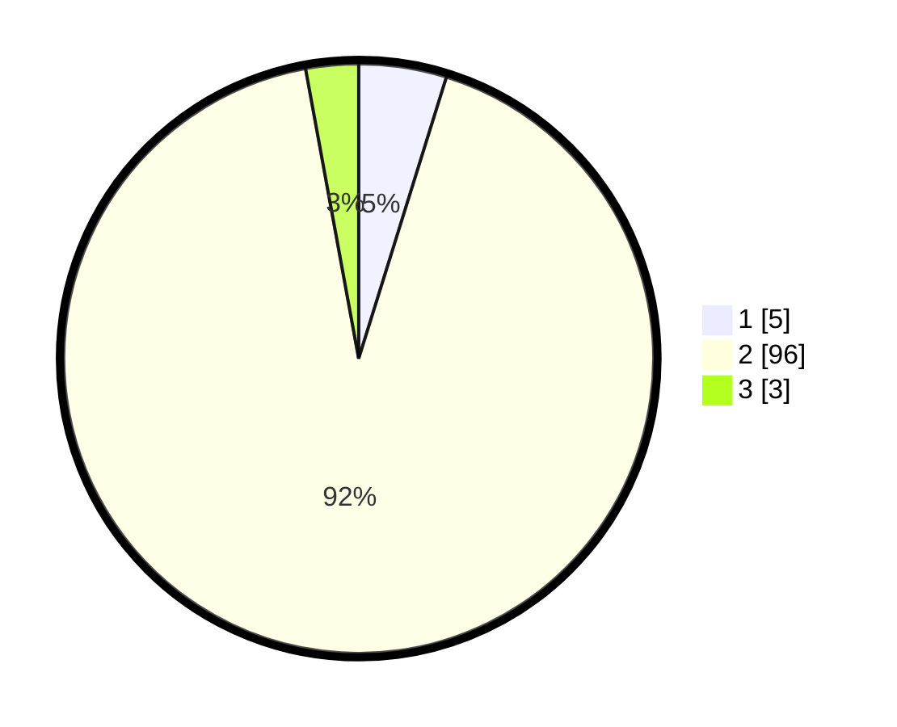

# Hasil

## Grafik

## Tabel

| No. | Nama Paslon    | Suara | Suara (raw) | Persentase |
|:--- |:-------------- | -----:| -----------:| ----------:|
| 1   | ANIES MUHAIMIN | 5     | [5][p-1]    | 4,81       |
| 2   | PRABOWO GIBRAN | 96    | [96][p-2]   | 92,31      |
| 3   | GANJAR MAHFUD  | 3     | [3][p-3]    | 2,88       |

[p-1]: https://github.com/gigit-pemilu/pemilu-2024/blob/main/pilpres/hitung-suara/sub/52-nusa-tenggara-barat/sub/03-lombok-timur/sub/20-jerowaru/sub/2009-ekas-buana/sub/007-tps/sub/paslon-1.txt
[p-2]: https://github.com/gigit-pemilu/pemilu-2024/blob/main/pilpres/hitung-suara/sub/52-nusa-tenggara-barat/sub/03-lombok-timur/sub/20-jerowaru/sub/2009-ekas-buana/sub/007-tps/sub/paslon-2.txt
[p-3]: https://github.com/gigit-pemilu/pemilu-2024/blob/main/pilpres/hitung-suara/sub/52-nusa-tenggara-barat/sub/03-lombok-timur/sub/20-jerowaru/sub/2009-ekas-buana/sub/007-tps/sub/paslon-3.txt

## Foto C Plano

https://sirekap-obj-formc.kpu.go.id/0de5/pemilu/ppwp/52/03/20/20/09/5203202009007-20240215-015241--c6046984-e0fb-4de9-93c3-11787c1ad11c.jpg

https://sirekap-obj-formc.kpu.go.id/0de5/pemilu/ppwp/52/03/20/20/09/5203202009007-20240215-061326--60b9b648-4c43-4bb4-8dae-3f3a48a66f77.jpg

https://sirekap-obj-formc.kpu.go.id/0de5/pemilu/ppwp/52/03/20/20/09/5203202009007-20240215-021745--921b8bc2-9c55-4b73-8693-74e91e7ad726.jpg

## Metadata

| Key        | Value               |
| ---------- | ------------------- |
| Time Stamp | 2024-02-15 15:30:25 |

