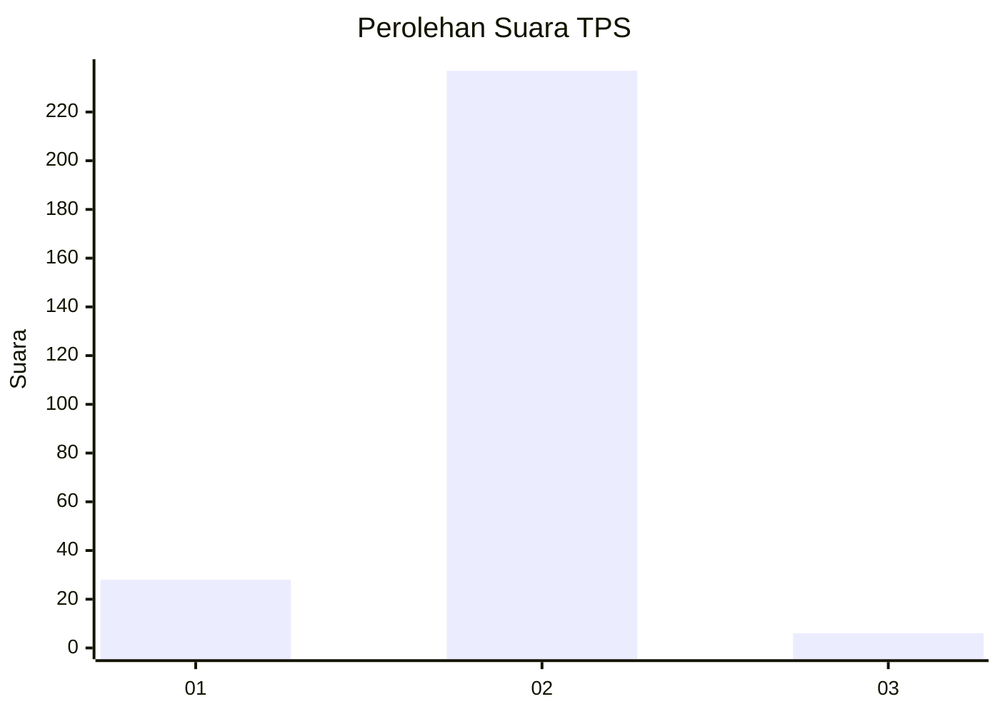
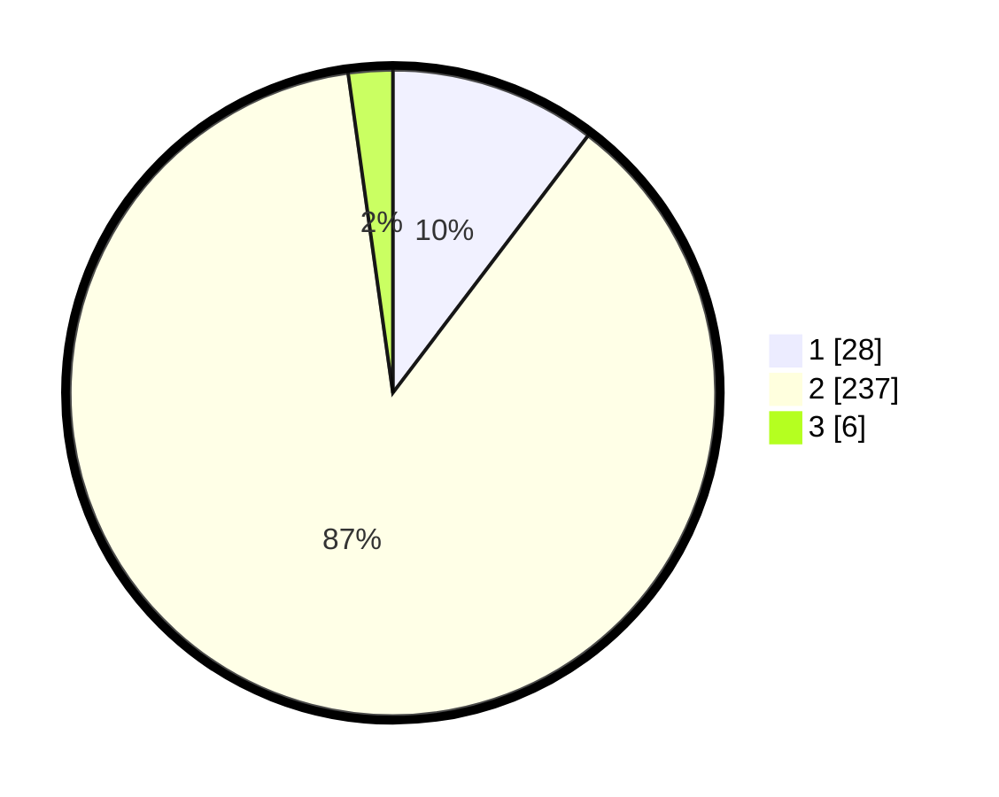

# Hasil

## Grafik

## Tabel

| No. | Nama Paslon    | Suara | Suara (raw) | Persentase |
|:--- |:-------------- | -----:| -----------:| ----------:|
| 1   | ANIES MUHAIMIN | 28    | [28][p-1]   | 10,33      |
| 2   | PRABOWO GIBRAN | 237   | [237][p-2]  | 87,45      |
| 3   | GANJAR MAHFUD  | 6     | [6][p-3]    | 2,21       |

[p-1]: https://github.com/gigit-pemilu/pemilu-2024-52-nusa-tenggara-barat/blob/main/pilpres/hitung-suara/sub/52-nusa-tenggara-barat/sub/03-lombok-timur/sub/20-jerowaru/sub/2014-sukadamai/sub/002-tps/sub/paslon-1.txt
[p-2]: https://github.com/gigit-pemilu/pemilu-2024-52-nusa-tenggara-barat/blob/main/pilpres/hitung-suara/sub/52-nusa-tenggara-barat/sub/03-lombok-timur/sub/20-jerowaru/sub/2014-sukadamai/sub/002-tps/sub/paslon-2.txt
[p-3]: https://github.com/gigit-pemilu/pemilu-2024-52-nusa-tenggara-barat/blob/main/pilpres/hitung-suara/sub/52-nusa-tenggara-barat/sub/03-lombok-timur/sub/20-jerowaru/sub/2014-sukadamai/sub/002-tps/sub/paslon-3.txt

## Foto C Plano

https://sirekap-obj-formc.kpu.go.id/3eb4/pemilu/ppwp/52/03/20/20/14/5203202014002-20240222-123110--61756e64-71c9-4788-b9af-500fa1974568.jpg

https://sirekap-obj-formc.kpu.go.id/3eb4/pemilu/ppwp/52/03/20/20/14/5203202014002-20240222-124205--604483b2-b36e-438e-8819-2c93a5aa1906.jpg

https://sirekap-obj-formc.kpu.go.id/3eb4/pemilu/ppwp/52/03/20/20/14/5203202014002-20240215-064146--75dd4494-67b6-4f84-961f-da8c443b8dcb.jpg

## Metadata

| Key        | Value               |
| ---------- | ------------------- |
| Time Stamp | 2024-02-25 18:00:00 |

