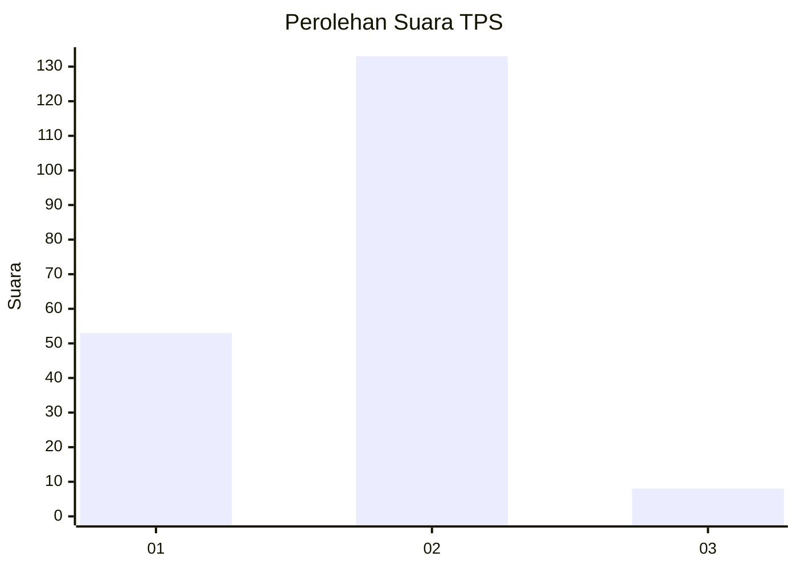
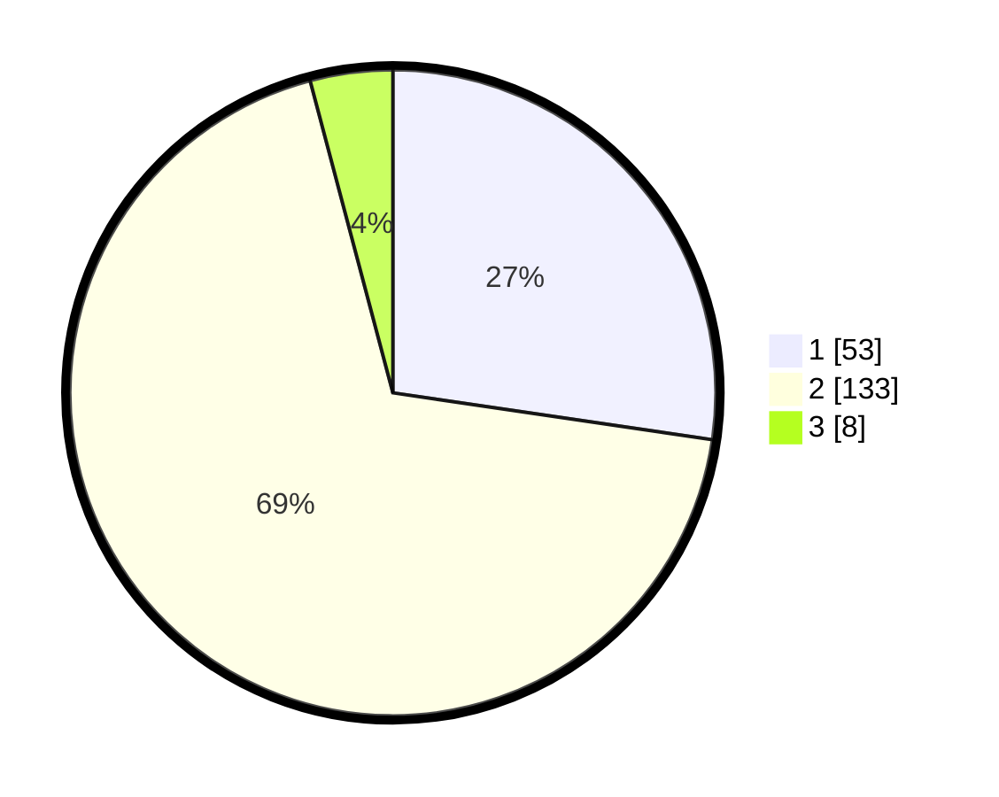

# Hasil

## Grafik

## Tabel

| No. | Nama Paslon    | Suara | Suara (raw) | Persentase |
|:--- |:-------------- | -----:| -----------:| ----------:|
| 1   | ANIES MUHAIMIN | 53    | [53][p-1]   | 27,32      |
| 2   | PRABOWO GIBRAN | 133   | [133][p-2]  | 68,56      |
| 3   | GANJAR MAHFUD  | 8     | [8][p-3]    | 4,12       |

[p-1]: https://github.com/gigit-pemilu/pemilu-2024-52-nusa-tenggara-barat/blob/main/pilpres/hitung-suara/sub/52-nusa-tenggara-barat/sub/03-lombok-timur/sub/21-lenek/sub/2001-lenek/sub/004-tps/sub/paslon-1.txt
[p-2]: https://github.com/gigit-pemilu/pemilu-2024-52-nusa-tenggara-barat/blob/main/pilpres/hitung-suara/sub/52-nusa-tenggara-barat/sub/03-lombok-timur/sub/21-lenek/sub/2001-lenek/sub/004-tps/sub/paslon-2.txt
[p-3]: https://github.com/gigit-pemilu/pemilu-2024-52-nusa-tenggara-barat/blob/main/pilpres/hitung-suara/sub/52-nusa-tenggara-barat/sub/03-lombok-timur/sub/21-lenek/sub/2001-lenek/sub/004-tps/sub/paslon-3.txt

## Foto C Plano

https://sirekap-obj-formc.kpu.go.id/a0ef/pemilu/ppwp/52/03/21/20/01/5203212001004-20240215-014125--2f49e75e-d265-4e52-9c90-4c3a69f09dc0.jpg

https://sirekap-obj-formc.kpu.go.id/a0ef/pemilu/ppwp/52/03/21/20/01/5203212001004-20240215-014244--456edc68-2384-4dc4-8721-e0fbec1936ef.jpg

https://sirekap-obj-formc.kpu.go.id/a0ef/pemilu/ppwp/52/03/21/20/01/5203212001004-20240215-014408--5b85d071-f855-4666-bca0-bee8eed1e1ad.jpg

## Metadata

| Key        | Value               |
| ---------- | ------------------- |
| Time Stamp | 2024-02-16 12:51:22 |

