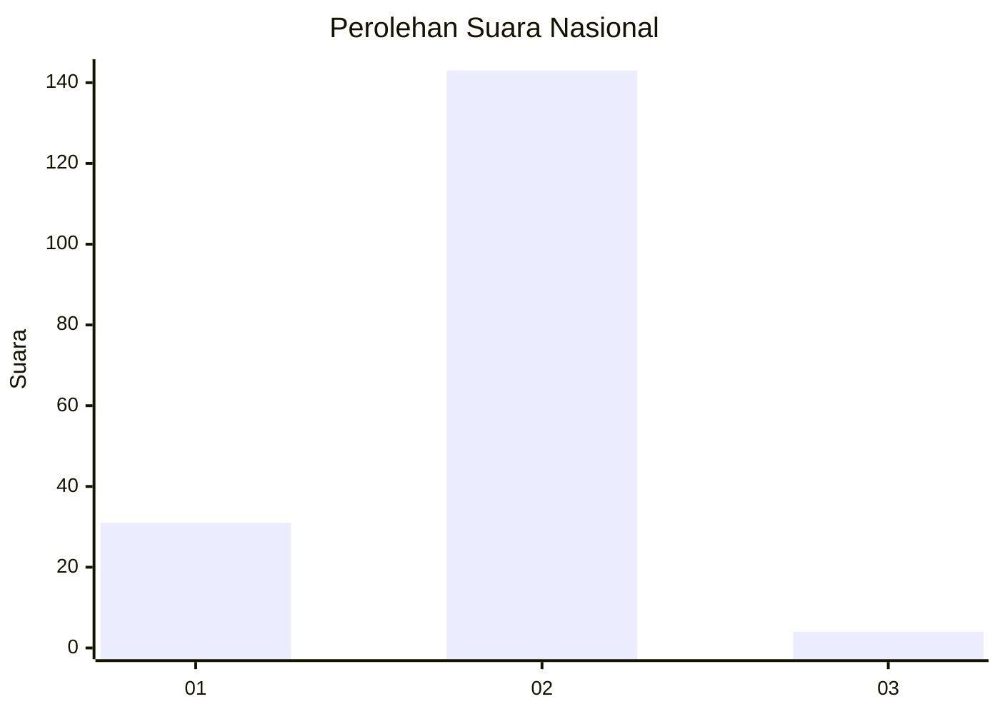
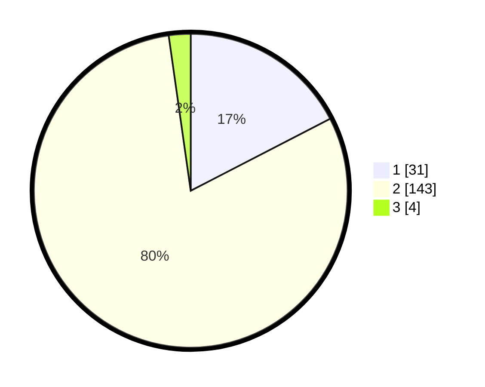

# Hasil

## Grafik

## Tabel

| No. | Nama Paslon    | Suara | Suara (raw) | Persentase |
|:--- |:-------------- | -----:| -----------:| ----------:|
| 1   | ANIES MUHAIMIN | 31    | [31][p-1]   | 17,42      |
| 2   | PRABOWO GIBRAN | 143   | [143][p-2]  | 80,34      |
| 3   | GANJAR MAHFUD  | 4     | [4][p-3]    | 2,25       |

[p-1]: https://github.com/gigit-pemilu/pemilu-2024/blob/main/pilpres/hitung-suara/sub/52-nusa-tenggara-barat/sub/03-lombok-timur/sub/21-lenek/sub/2001-lenek/sub/006-tps/sub/paslon-1.txt
[p-2]: https://github.com/gigit-pemilu/pemilu-2024/blob/main/pilpres/hitung-suara/sub/52-nusa-tenggara-barat/sub/03-lombok-timur/sub/21-lenek/sub/2001-lenek/sub/006-tps/sub/paslon-2.txt
[p-3]: https://github.com/gigit-pemilu/pemilu-2024/blob/main/pilpres/hitung-suara/sub/52-nusa-tenggara-barat/sub/03-lombok-timur/sub/21-lenek/sub/2001-lenek/sub/006-tps/sub/paslon-3.txt

## Foto C Plano

https://sirekap-obj-formc.kpu.go.id/dfd6/pemilu/ppwp/52/03/21/20/01/5203212001006-20240214-231446--0e44d53b-cccb-4469-8ac6-86a84bbb2dbe.jpg

https://sirekap-obj-formc.kpu.go.id/dfd6/pemilu/ppwp/52/03/21/20/01/5203212001006-20240215-004347--b1317f34-54b7-413c-bfcf-fbdb2ece71b3.jpg

https://sirekap-obj-formc.kpu.go.id/dfd6/pemilu/ppwp/52/03/21/20/01/5203212001006-20240215-004618--79898890-0c68-4183-8e29-f705a2365d5c.jpg

## Metadata

| Key        | Value               |
| ---------- | ------------------- |
| Time Stamp | 2024-02-16 12:51:22 |

