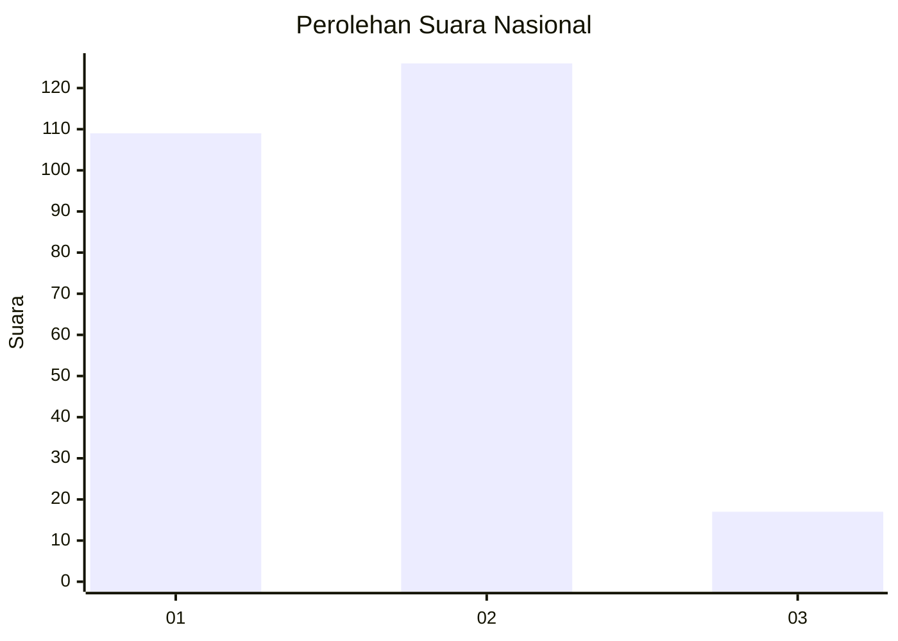
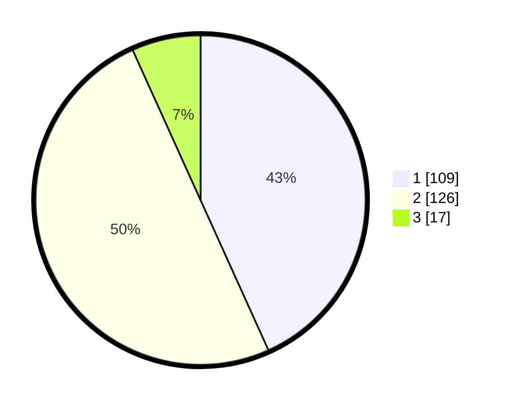

# Hasil

## Grafik

## Tabel

| No. | Nama Paslon    | Suara | Suara (raw) | Persentase |
|:--- |:-------------- | -----:| -----------:| ----------:|
| 1   | ANIES MUHAIMIN | 109   | [109][p-1]  | 43,25      |
| 2   | PRABOWO GIBRAN | 126   | [126][p-2]  | 50,00      |
| 3   | GANJAR MAHFUD  | 17    | [17][p-3]   | 6,75       |

[p-1]: https://github.com/gigit-pemilu/pemilu-2024/blob/main/pilpres/hitung-suara/sub/52-nusa-tenggara-barat/sub/04-sumbawa/sub/08-sumbawa/sub/1001-samapuin/sub/002-tps/sub/paslon-1.txt
[p-2]: https://github.com/gigit-pemilu/pemilu-2024/blob/main/pilpres/hitung-suara/sub/52-nusa-tenggara-barat/sub/04-sumbawa/sub/08-sumbawa/sub/1001-samapuin/sub/002-tps/sub/paslon-2.txt
[p-3]: https://github.com/gigit-pemilu/pemilu-2024/blob/main/pilpres/hitung-suara/sub/52-nusa-tenggara-barat/sub/04-sumbawa/sub/08-sumbawa/sub/1001-samapuin/sub/002-tps/sub/paslon-3.txt

## Foto C Plano

https://sirekap-obj-formc.kpu.go.id/11a6/pemilu/ppwp/52/04/08/10/01/5204081001002-20240215-091802--7b2fd838-8e34-4dea-afb4-51bd86731f80.jpg

https://sirekap-obj-formc.kpu.go.id/11a6/pemilu/ppwp/52/04/08/10/01/5204081001002-20240215-091948--d0487ec8-ffa9-45b5-b9ff-7dbe1f79c385.jpg

https://sirekap-obj-formc.kpu.go.id/11a6/pemilu/ppwp/52/04/08/10/01/5204081001002-20240215-092154--0bf89352-9338-4113-87b1-840cc7ba8014.jpg

## Metadata

| Key        | Value               |
| ---------- | ------------------- |
| Time Stamp | 2024-02-15 15:30:25 |

