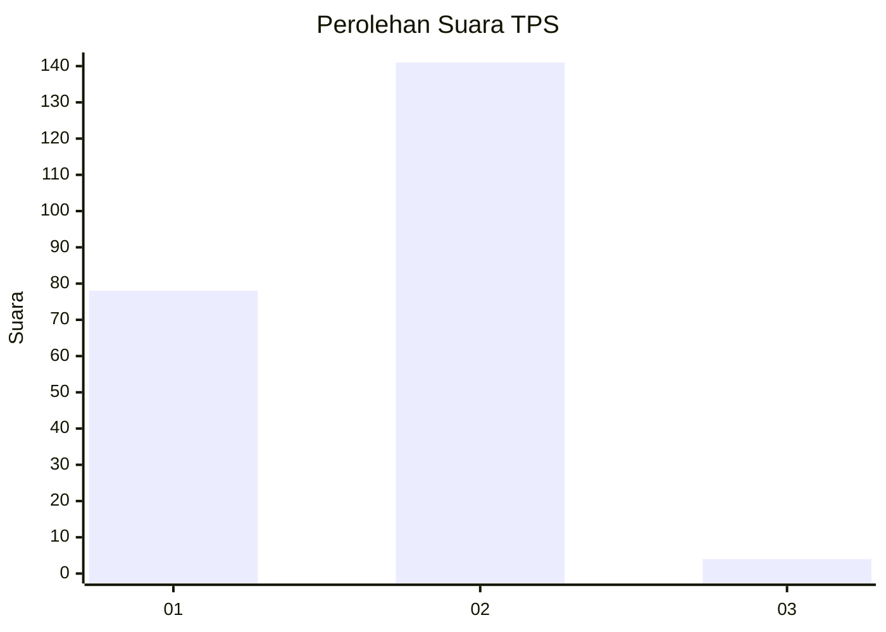
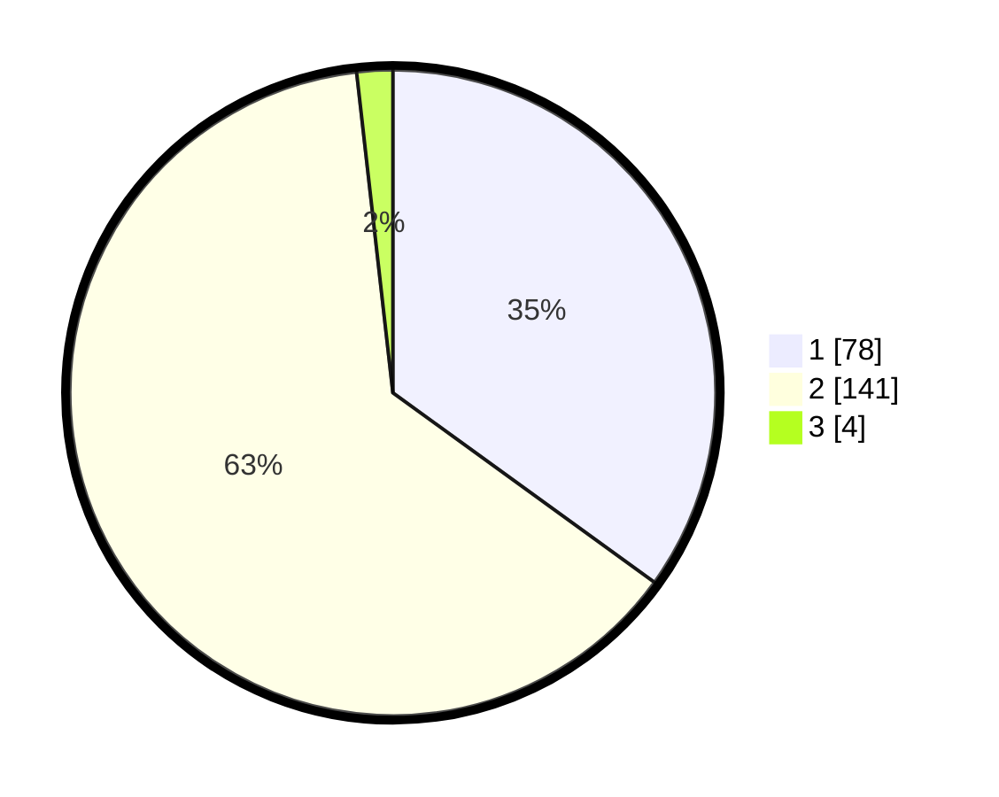

# Hasil

## Grafik

## Tabel

| No. | Nama Paslon    | Suara | Suara (raw) | Persentase |
|:--- |:-------------- | -----:| -----------:| ----------:|
| 1   | ANIES MUHAIMIN | 78    | [78][p-1]   | 34,98      |
| 2   | PRABOWO GIBRAN | 141   | [141][p-2]  | 63,23      |
| 3   | GANJAR MAHFUD  | 4     | [4][p-3]    | 1,79       |

[p-1]: https://github.com/gigit-pemilu/pemilu-2024-52-nusa-tenggara-barat/blob/main/pilpres/hitung-suara/sub/52-nusa-tenggara-barat/sub/04-sumbawa/sub/09-moyo-hilir/sub/2001-moyo/sub/003-tps/sub/paslon-1.txt
[p-2]: https://github.com/gigit-pemilu/pemilu-2024-52-nusa-tenggara-barat/blob/main/pilpres/hitung-suara/sub/52-nusa-tenggara-barat/sub/04-sumbawa/sub/09-moyo-hilir/sub/2001-moyo/sub/003-tps/sub/paslon-2.txt
[p-3]: https://github.com/gigit-pemilu/pemilu-2024-52-nusa-tenggara-barat/blob/main/pilpres/hitung-suara/sub/52-nusa-tenggara-barat/sub/04-sumbawa/sub/09-moyo-hilir/sub/2001-moyo/sub/003-tps/sub/paslon-3.txt

## Foto C Plano

https://sirekap-obj-formc.kpu.go.id/9ffc/pemilu/ppwp/52/04/09/20/01/5204092001003-20240215-031051--20fbbb47-f7d8-41d2-86dc-d63c5eda236d.jpg

https://sirekap-obj-formc.kpu.go.id/9ffc/pemilu/ppwp/52/04/09/20/01/5204092001003-20240215-031219--088e9ee8-549e-4ab6-81da-8b1b163b0505.jpg

https://sirekap-obj-formc.kpu.go.id/9ffc/pemilu/ppwp/52/04/09/20/01/5204092001003-20240214-155316--e45c8087-8a58-4e44-965c-cdbcc9f5d1da.jpg

## Metadata

| Key        | Value               |
| ---------- | ------------------- |
| Time Stamp | 2024-02-15 17:00:25 |

