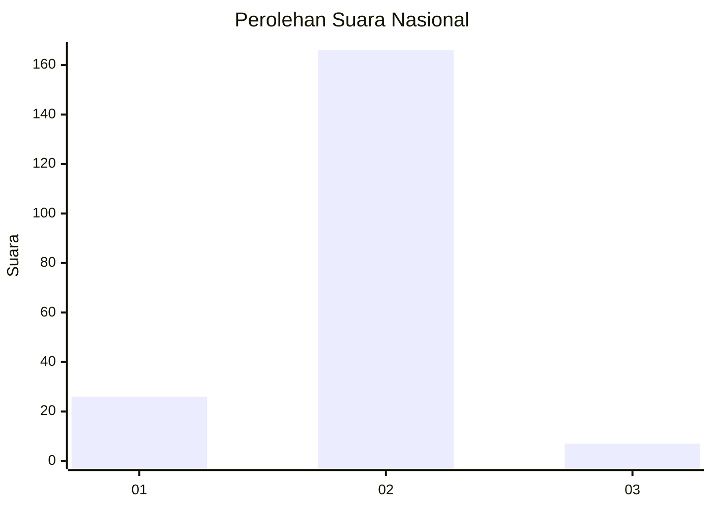
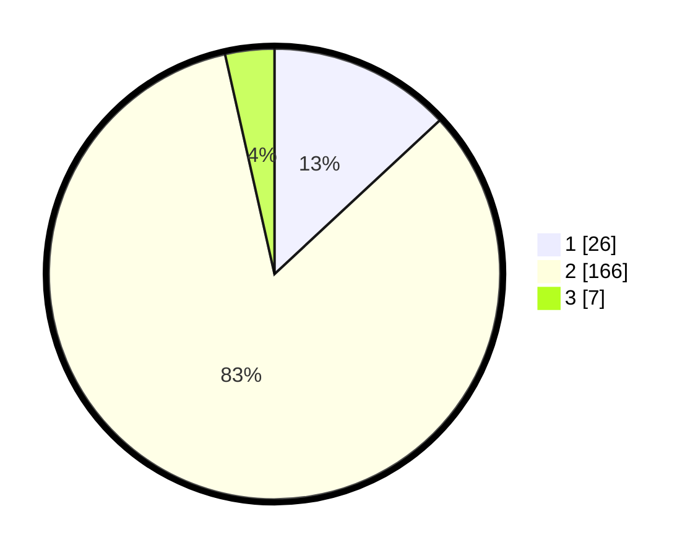

# Hasil

## Grafik

## Tabel

| No. | Nama Paslon    | Suara | Suara (raw) | Persentase |
|:--- |:-------------- | -----:| -----------:| ----------:|
| 1   | ANIES MUHAIMIN | 26    | [26][p-1]   | 13,07      |
| 2   | PRABOWO GIBRAN | 166   | [166][p-2]  | 83,42      |
| 3   | GANJAR MAHFUD  | 7     | [7][p-3]    | 3,52       |

[p-1]: https://github.com/gigit-pemilu/pemilu-2024/blob/main/pilpres/hitung-suara/sub/52-nusa-tenggara-barat/sub/04-sumbawa/sub/09-moyo-hilir/sub/2001-moyo/sub/005-tps/sub/paslon-1.txt
[p-2]: https://github.com/gigit-pemilu/pemilu-2024/blob/main/pilpres/hitung-suara/sub/52-nusa-tenggara-barat/sub/04-sumbawa/sub/09-moyo-hilir/sub/2001-moyo/sub/005-tps/sub/paslon-2.txt
[p-3]: https://github.com/gigit-pemilu/pemilu-2024/blob/main/pilpres/hitung-suara/sub/52-nusa-tenggara-barat/sub/04-sumbawa/sub/09-moyo-hilir/sub/2001-moyo/sub/005-tps/sub/paslon-3.txt

## Foto C Plano

https://sirekap-obj-formc.kpu.go.id/1925/pemilu/ppwp/52/04/09/20/01/5204092001005-20240214-231719--72f58818-ccbe-4473-8bd3-341f8cb26866.jpg

https://sirekap-obj-formc.kpu.go.id/1925/pemilu/ppwp/52/04/09/20/01/5204092001005-20240214-231802--6b1748fd-1fbe-4e21-939f-989a0275cc52.jpg

https://sirekap-obj-formc.kpu.go.id/1925/pemilu/ppwp/52/04/09/20/01/5204092001005-20240214-231833--ed66abf2-800c-48c9-9f6f-e13920c38627.jpg

## Metadata

| Key        | Value               |
| ---------- | ------------------- |
| Time Stamp | 2024-02-15 19:00:26 |

